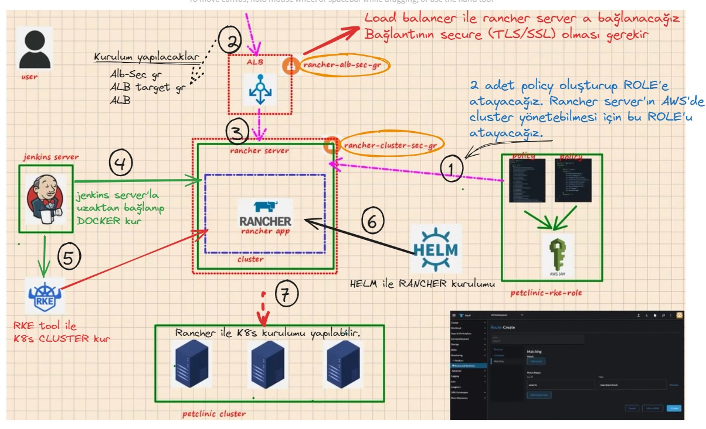
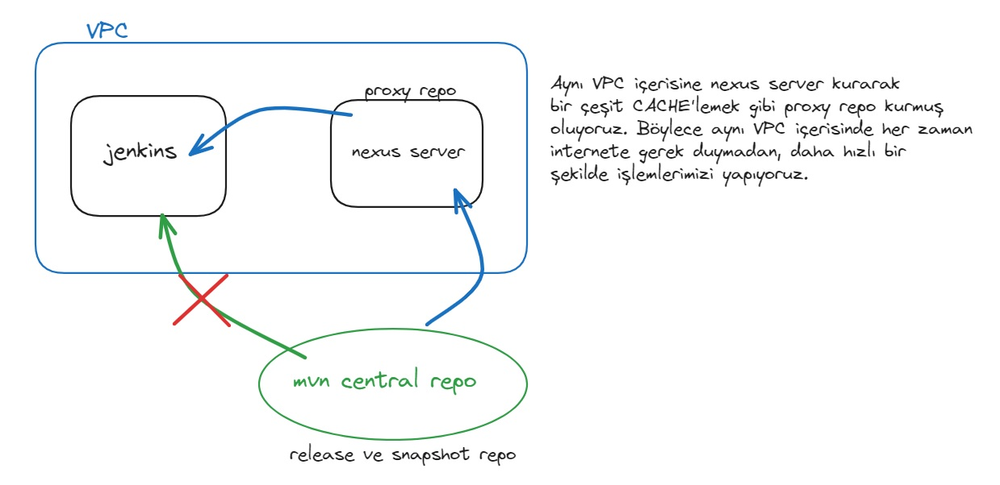

# Project 505: Microservices CI/CD Pipeline

## Genel bir şirket ortamı hakkında bilgilendirme:

- Developer'ların çalıştığı ---> development server. Developer kod yazımında Development server'a bilgisayarı ile SSH bağlanır. Bunun sebebi;
  - Developerların ürettiği kodun başkaları tarafından ele geçirilmemesi ---> güvenlik
  - Herkesin aynı envorinmentda çalışması böylece standartın sağlanması ----> standard envorinment
- Proje başlamadan önce proje için gereksinimler, ihtiyaçlar, gerekli toollar, vs çok ayrıntılı bir şekilde planlama yapılarak dokümante edilir. Bu dokumantasyonda developerlar için gerekli dependency'ler de yazar.
- JAVA gerektiren bu proje için gereken TOOLS --->

  - JDK (JRE-runtime, JDK -> JRE'yi de kapsar. compiler yapabilir.),
  - MAVEN (maven kurulmayacak, daha hafif yönetem olan Maven Wrapper (mvnw)),
  - GIT (pull ve push işlemleri için),
  - DOCKER (yazılan kodların test edilmesi için),
  - DOCKER-COMPOSE (multi-container'ın hızlı bir şekilde ayağa kaldırılıp destroy için... docker compose'ın en büyük kısıtı ---> TEK node'da çalışması yani high avaibility OLMAZ. bundan dolayı test, stage ve prod envorinment'da TERCİH EDİLMEZ.)

- Developer kodu belli bir seviyeye getirdiği zaman SOURCE CODE MANAGEMENT TOOL'a (git, bitbucket, gitlab (github+jenkins)) PUSH'lanması gerekir. (Gitlab sektörde yükselen değer olduğu için öğrenilmesi gerekir)
- PUSH işlemi sonrası DEVOPS ENGINEER işi başlar.
- gitflow workflow ---> https://www.youtube.com/watch?v=1SXpE08hvGs
  - main (master) branch ---> o an production da olan kaynak kodların SON hali (master branch'da kimse çalışmaz!!)
  - dev branch ---> developer'ların üzerinde çalıştığı, stable feature'ları barındıran branch.
    - stable feature --> unit test'i geçmiş source code.
    - unit test --> developerların hazırladığı, kaynak koddaki classları, fonksiyonları çalışıp çalışmadığını kontrol eden test.
    - code covarage --> unit teste tabi tutulan source koddaki satırların oranı.
  - feature branch --> uygulama geliştirirken müşteri ihtiyacı, rakip uygulamalardaki gelişmeler vs gibi nedenlerle yeni özellik getiren branch
  - integration test --> merge işlemi esnasında çalıştırışır, feature branch işlemi bittiğinde dev branche merge etmeden önce yapılan test
  - release branch ---> dev branch'te belli aşamaya gelen source codeların prod environment dan önce FUNCTIONAL testlerinin yapıldığı branch.
  - bugfix ---> release branchda funcional testler esnasında bulunan hataların düzeltilmesi.
  - hotfix ---> master branch'de production ortamında bulunan hataların düzeltimesi. (hotfix feature branch'de olur.)


- staging envorinment ---> user acceptance test'lerin yapıldığı prod envorinment ile birebir aynı özelliklere sahip envorinment.
- [Testler arasındaki farklar](https://www.geeksforgeeks.org/difference-between-unit-functional-acceptance-and-integration-tests/)

- Developer source code'u source code management tool'a göndermesi ile CI/CD kısmının Contionous Integration kısmı başlar. Bu bölümde uygulamanın çalışmasına gerek yok ve bu bölüm Unit test ile Integration test yapılır. Infrastructure kurulumana gerek yok ---> MAVEN ile yapılabilir.
- BEST PRACTICE ---> CI server (bu jenkins olabilir) içerisinde test yapılmaz, agent server üzerinde testler yapılır.
- Unit test ile integration test sonrası ortaya ARTIFACT çıkar. Artifact --> deploy edilmeye hazır ürün. (örnek: jar dosyası, docker image)
- artifact ortaya çıktıktan sonra artifact repoda saklanır. (artifact repo örnek --> Nexus, ECR, docker hub)
- artifact repoya gönderilen artifact ten sonra CI/CD'nin Continuous Delivery (CD) bölümü başlar. Bu bölümün envorinment kısmı DEV'den farklı olur (Test/staging envorinment)
- CD kısmında Automated functional testler yapılır. Bu testlerin yapılabilmesi için uygulamanın ÇALIŞIYOR olması gerekir.
- Automated functional testlerin bitmesi sonrası testler başarılı/fail de bitse test/staging envorinment destroy edilebilir.
- Automated functional testler sonrası test/staging envorinment kurularak manuel functional testler yapılır. Manuel functional test ---> çeşitli senaryolar üzerinde checklist ile yapılan testler.


- `CI job` ---> Dev, feauture ve bugfix branch'lerine yapılan her commit ile çalışacak. Böylece developer kodda sıkıntı olmadığını görerek kod yazmaya devam edilecek. Bu aşamada jacoco uygulması ile `UNIT TEST` yapılacak.
- `nigthly pipeline` --> dev branch'ında çalışan, cronjob ile her gece 23:59'da automated `Functional test`lerin yapıldığı aşama. (dev branch'de en güncel kodlarda yapılmak istendği için bu saatte yapılacak).
  - bu bölümde terraform, ansible ile kubernetes kullanılarak bir cluster kurulacak.
  - automated `Functional test`leri için docker ile oluşturulan selenium tool kullanılacak.
  - automated `Functional test`leri bitimine miteakip cluster destroy edilecek.
- `weekly pipeline` -->release branch'ında çalışan, cronjob ile her hafta pazar günü 23:59'da Manual QA (Quality Assurance) testlerin yapıldığı aşama.
  - bu bölümde terraform, ansible ile AWS EKS (içerisinde kubeadm-K8s kurulan) kullanılarak bir cluster kurulacak. (cluster kurulumu farklı çeşitlerde yapılarak farklı alternatifler gösterilmesi amaçlandı)
  - bu bölümde kurulan cluster destroy edilmeyecek ve her hafta manuel testler için hazır olacak.
- `staging pipeline` -->release branch'ında çalışan, cronjob ile her hafta pazar günü 23:59'da staging envorinment'da yer alan source code'un güncellendiği aşama.
  - bu bölümde rancher kullanılarak bir K8s cluster kurulacak. (cluster kurulumu farklı çeşitlerde yapılarak farklı alternatifler gösterilmesi amaçlandı)
- `prod pipeline` -->production branch'ında çalışan, webhook ile her commit ile produciton envorinment yer alan source code'un güncellendiği aşama.
  - bu bölümde rancher kullanılarak bir AWS EKS ile cluster kurulacak. (cluster kurulumu farklı çeşitlerde yapılarak farklı alternatifler gösterilmesi amaçlandı)
  - SSL sertifakası yüklenmesi yapılacak.


- Semantic Versioning ---> 2.0.0 --> MAJOR.MINOR.PATCH (https://semver.org)
  - MAJOR version when you make incompatible API changes
  - MINOR version when you add functionality in a backward compatible manner
  - PATCH version when you make backward compatible bug fixes
- Alpha test (kapalı ortamda, şirket içi yapılan test) --> Beta Test (açık ortamda, seçilen kişilere gönderilerek yapılan test) --> Release candidate (opsiyonel) --> Production
  - Pandemi sonrası alpha test ile beta test arasındaki fark azaldı.


- Discovery service mevcut durum ile olması gereken durumu devamlı olarak karşılaştırır. Örnek olarak visit-service OFF olması durumunda bu durumu discovery service tespit eder. Kullanıcıları karşılayan API GATEWAY'e visit service'e request GÖNDERMEMESİ gerektiğini bildirir. Böylece uygulmanın diğer microserviceleri çalışırken sadece visit service OFF durumda olur. Bu duruma `Circuit breaker` denir.

#

## MSP 1 - Prepare Development Server Manually on EC2 Instance

#

- Aşağıdaki komutları gir, `Docker`, `Docker-Compose`, `Java 11`, `Git` yüklü Amazon Linux 2023 (t3a.medium) DEVELOPMENT SERVER manuel olarak hazırla.
  - AWS > EC2 instance > Launch instance ---> Name: petclinic-dev-server, AMI: Amazon Linux 2023, instance type: t3a.medium, key pair: kendi key'ini gir, Sec group: new sec grup (only SSH), storage: 16 gib >>> LAUNCH instance.
  - VSCODE ile SSH bağlan.

```bash
#! /bin/bash
sudo dnf update -y
sudo hostnamectl set-hostname petclinic-dev-server
sudo dnf install docker -y
sudo systemctl start docker
sudo systemctl enable docker
sudo usermod -a -G docker ec2-user
sudo curl -SL https://github.com/docker/compose/releases/download/v2.20.3/docker-compose-linux-x86_64 -o /usr/local/bin/docker-compose
sudo chmod +x /usr/local/bin/docker-compose
sudo dnf install git -y
sudo dnf install java-11-amazon-corretto -y
newgrp docker
```

- `docker info` ile kullanıcının docker grubuna ekli olup olmadığını görebilirsin. `sudo usermod -a -G docker ec2-user` komutu ile ec2-user kullanıcısını DOCKER grubuna ekle. Böylece her komutta sudo girmek zorunda kalma.

#

## MSP 2 - Prepare GitHub Repository for the Project

#

- Development server içerisinde kullanacağımız repoyu locale clone'la --> `git clone https://github.com/clarusway/petclinic-microservices-with-db.git`
- `cd petclinic-microservices-with-db & rm -rf .git` ---> .git klasörünü sil ve uzak repo ile bağlantısını sil.
- Github hesabına git, `petclinic-microservice` isminde PUBLIC yeni repo oluştur.
  - yeni oluşturduğumuz reponun linkini kopyala, `git clone https://<your-token-number>@github.com/<github-user-name>/petclinic-microservices.git` komutu ile yeni oluşturduğun repoyu Development server'a clone'la.
  - Clarusway'den clone'ladığımız tüm dosyaları, kendi repomuza kopyala ---> `petclinic-microservices-with-db` klasörü içerisinde `mv * ../petclinic-microservice` komutunu gir.
    (gizli klasörler bu komutla kopyalanmaz, .mvn klsörünü elle taşı.)
- `petclinic-microservice` klasörü içerisinde;
  - `git config --global user.email "you@example.com" / git config --global user.name "Your Name"` komut ile uzak repo bilgilerini tanımlama.
  - `git add . && git commit -m "first commit" && git push origin main` komutu ile tüm dosyaları github uzak repoya gönder.
- Aşağıdaki komutları girerek `dev` ve `release` branch oluştur.

  ```bash
  git checkout main
  git branch dev
  git checkout dev
  git push --set-upstream origin dev

  git checkout dev
  git branch release
  git checkout release
  git push --set-upstream origin release
  ```

- branch ismini görebilmek için aşağıdaki komutu .bashrc'a kaydet. (komutta yer alan JenkinsServer ismini değiştir.)

```
parse_git_branch() {
  git branch 2> /dev/null | sed -e '/^[^*]/d' -e 's/* \(.*\)/(\1)/'
}
export PS1="\[\e[1;31m\]\u\[\e[1;36m\]\[\033[m\]@JenkinsServer:\[\e[0m\]\[\e[1;32m\][\W]>\$(parse_git_branch) \[\e[0m\]"
```

#

## MSP 3 - Check the Maven Build Setup on Dev Branch

#

- `dev` branch'a geç ---> `git checkout dev`
- mvnw --> maven'ın LIGHT versiyonu, daha az yer kaplar. Ancak Maven kadar fazla JAVA versiyonu desteklemez, bazı spesifik versiyonları destekler.
- Bu adımda elimizdeki source kodun compile edilip edilmediğini teyit etmemiz gerekir. ---> `./mvnw clean test` tüm microservices'lerde "BUILD SUCCESS" yazısını gör. Bu adımın amacı elimizdeki source kod ile ilgili sorun olup olmadığını, böylece diğer adımlara geçebileceğimizi görmek. Bunu maven test komutu ile yapacağız.
- `permission denied` hatası alırsan ---> `chmod +x mvnw`
- [maven lifecyle](https://maven.apache.org/guides/introduction/introduction-to-the-lifecycle.html)
  - Clean lifecycle ---> Her build işlemi ile target klasörü oluşur. target klasörünü boşaltır.
  - site lifecycle ---> raporları basit bir websitesi şeklinde görebilmek için.
  - default lifecycle ---> maven'ın asıl işlevi burada yapılır. herhangi bir adım ondan önceki tüm adımları kapsar.
- package komutu ---> compile edilip BYTE formatına çevrilen dosyaları paketleyerek Enterprise application archive –EAR, web application archive–WAR, Java archive-JAR gibi formatlara çevirme işlemini yapar. PARENT POM (ana klasör içerisinde)dosyasında JAVA versiyon, pluginler, profiller gibi bilgileri gör.
- `./mvnw clean package` ---> paketleme işlemini yap.
- `./mvnw clean install` --> paketlenen dosyaları local repoya (.m2 klasörü) indir.
- paketlenen dosyaları görmek için pom.xml --> GAV (groupId, artifactID, version) kısmında yazan klasör pathini takip et. herbir microservice ayrı ayrı paketlenir. (org.springframework.samples (groupId) > spring-petclinic-microservies (artifactId) > 2.1.2 (version)) (GAV (groupId, artifactID, version) ---> fully qualified artifact name)

#

## MSP 4 - Prepare a Script for Packaging the Application

#

- `feature/msp-4` adında branch oluştur ve o branch a geç ---> ` git checkout dev / git branch feature/msp-4 / git checkout feature/msp-4`
- oluşan branch ile kendimi izole ettim, böylece yapacağım işlerde dev branch daki kodlar etkilenmeyecek.
- süreci otomatize etmek için script yazılır.
- petclinic-microservices klasörü içerisinde `package-with-mvn-wrapper.sh` dosyası oluştur ve içerisinde `./mvnw clean package` yaz.
  - `chmod +x package-with-mvn-wrapper.sh` ---> dosyaya execute yetkisi ver.
- script'i uzak repoya gönder ---> `./mvnw clean / git add . / git commit -m 'added packaging script' / git push --set-upstream origin feature/msp-4 / git checkout dev / git merge feature/msp-4 / git push origin dev`

#

## MSP 5 - Prepare Development Server Terraform Files

#

- `feature/msp-5` adında branch oluştur ve o branch a geç ---> ` git checkout dev / git branch feature/msp-5 / git checkout feature/msp-5`
- `petclinic-microservices` klasörü altında `infrastructure` klasörü oluştur. Proje boyunca infrastructure ile ilgili dosyalar burada saklanacak.
- Dev server manuel olarak oluşturduk ancak normalde bu envorinment oluşturma işlemi terraform file gibi otomatize edilmiş olması gerekirdi. Bu terraform dosyalarının ise `infrastructure` klasörü altında muhafaza edilmesi gerekir. Böylece dev server'ın çökmesi durumunda bu dosyalar çalıştıralarak envorinment hemen ayağa kaldırılır.
- clarusway repossunda yer alan `msp-5-dev-server-of-petclinic` klasörünü `infrastructure` klasörüne kopyala ve uzak repoya PUSHla. ---> `git add . / git commit -m 'added terraform files for dev server' /git push --set-upstream origin feature/msp-5 / git checkout dev / git merge feature/msp-5 / git push origin dev`

#

## MSP 6 - Prepare Dockerfiles for Microservices

#

- `feature/msp-6` adında branch oluştur ve o branch a geç ---> ` git checkout dev / git branch feature/msp-6 / git checkout feature/msp-6`
- `git checkout -b feature/msp-6` ---> feature/msp-6 branch yok ise oluşturup o branch'e geçme komutu.
- `spring-petclinic-admin-server` klasörü altında `admin-server` microservice için Dockerfile oluştur.

```Dockerfile
FROM openjdk:11-jre
ARG DOCKERIZE_VERSION=v0.7.0
ENV SPRING_PROFILES_ACTIVE docker,mysql
ADD https://github.com/jwilder/dockerize/releases/download/${DOCKERIZE_VERSION}/dockerize-alpine-linux-amd64-${DOCKERIZE_VERSION}.tar.gz dockerize.tar.gz
RUN tar -xzf dockerize.tar.gz
RUN chmod +x dockerize
ADD ./target/*.jar /app.jar
EXPOSE 9090
ENTRYPOINT ["java", "-Djava.security.egd=file:/dev/./urandom","-jar","/app.jar"]
```

- DOCKERFILE ile ilgili olarak;

  - Yapacağımız işlem --> jar dosyası çalıştıracağız, bundan dolayı minumum isterleri yerine getirecek Base image seçmeliyiz. Bunun için JRE gerekli, JDK fazla olur.
  - X alpine seçerek içerisinde gerekli app leri yükleyeyim X --> yanlış düşünce. işlemleri uzatır ve gereksiz işlem.
  - image seçiminde official/verified ve boyutu en küçük isterleri karşılayan image seçmeliyiz.
  - proje dokümantasyonunda java-11 olduğu için `openjdk:11-jre` seçtim. openjdk kuruluş ismi. oracle firmasının imageları daha ağır. hangi image kullanacağız kısmı TECRÜBE ile oturur.
  - microservice'lerin ayağa kalkma sırasını sağlayabilmek için dependency oluşturmak gerekir. docker-compose'da bunu `depends_on` ile sağlayabiliriz. depends_on containerın sadece UP olduğuna bakar, containerın çalışıp çalışmadığını kontrol etmez. Bunu DOCKERIZE ile sağlarız.
  - [dockerize doc sayfası](https://github.com/jwilder/dockerize)
  - ADD komutu LOCALDEN ziplenmiş dosyayı (tar, gz formatında) kopyalayıp UNTAR(unzip) yapabilir. ancak bu durum link ile kopyalanan dosyalar için GEÇERLİ değil. COPY unzip özelliği yok.
  - EXPOSE ---> sadece bilgi amaçlı. uygulmanın dokümantasyon sayfasından PORT bilgisi öğrenilebilir.
  - `java -jar <filename>.jar ` ---> JAVA komutu. bunu ENTRYPOINT'de kullandık.
  - "-Djava.security.egd=file:/dev/./urandom" ---> sanal bir serverda (container, EC2, vs) java komutu için gerekli (teknik bir husus). JVM(Java Virtual Machine) için java programının çalıştığı platform ile java programı arasında soyut bir ara katman. bunun sağlıklı çalışabilmesi için gereken bir komut. sanal server kullanmıyorsak bu komuta gerek yok. `/dev/./urandom` sondaki bu kısım windows sanal server için geçerli değil.
  - spring-petclinic-admin-server> src > main > resources > bootstrap.yml içerisinde profile ayarları olur.
    - admin server içerisindeki bootstrap.yml dosyasına bakıldığında, config URL için localhost:8888, docker profile için config-server:8888 belirlendiği görülür.
    - tüm microserviceler containerdır ve container içerisinde localhost container içidir. admin-server config-server ile iletişime geçmesi için DNS ile iletişim kurması gerekir. containerlarda container ismi DNS ismidir. Profile ile containerlar arası iletişim sağlanır.
    - mysql profile ile database olarak default olarak belirlenmiş cache bellek değil MYSQL kullanılacağı belirtilir.
    - uygulamanın dokümantasyonunda ne zaman hangi profile kullandığı yazar ---> `ENV SPRING_PROFILES_ACTIVE docker,mysql`
    - `ARG DOCKERIZE_VERSION=v0.7.0` ---> docker version kısmı dinamik hale getirildi.
    - `docker build --arg DOCKERIZE_VERSION=v0.6.3` ---> komut girerken versiyon değiştirebiliriz.

- `spring-petclinic-api-gateway` klasörü altında `api-gateway` microservice için Dockerfile oluştur.

```Dockerfile
FROM openjdk:11-jre
ARG DOCKERIZE_VERSION=v0.7.0
ENV SPRING_PROFILES_ACTIVE docker,mysql
ADD https://github.com/jwilder/dockerize/releases/download/${DOCKERIZE_VERSION}/dockerize-alpine-linux-amd64-${DOCKERIZE_VERSION}.tar.gz dockerize.tar.gz
RUN tar -xzf dockerize.tar.gz
RUN chmod +x dockerize
ADD ./target/*.jar /app.jar
EXPOSE 8080
ENTRYPOINT ["java", "-Djava.security.egd=file:/dev/./urandom","-jar","/app.jar"]
```

- `spring-petclinic-config-server` klasörü altında `config-server` microservice için Dockerfile oluştur.

```Dockerfile
FROM openjdk:11-jre
ARG DOCKERIZE_VERSION=v0.7.0
ENV SPRING_PROFILES_ACTIVE docker,mysql
ADD https://github.com/jwilder/dockerize/releases/download/${DOCKERIZE_VERSION}/dockerize-alpine-linux-amd64-${DOCKERIZE_VERSION}.tar.gz dockerize.tar.gz
RUN tar -xzf dockerize.tar.gz
RUN chmod +x dockerize
ADD ./target/*.jar /app.jar
EXPOSE 8888
ENTRYPOINT ["java", "-Djava.security.egd=file:/dev/./urandom","-jar","/app.jar"]
```

- `spring-petclinic-customer-service` klasörü altında `customer-service` microservice için Dockerfile oluştur.

```Dockerfile
FROM openjdk:11-jre
ARG DOCKERIZE_VERSION=v0.7.0
ENV SPRING_PROFILES_ACTIVE docker,mysql
ADD https://github.com/jwilder/dockerize/releases/download/${DOCKERIZE_VERSION}/dockerize-alpine-linux-amd64-${DOCKERIZE_VERSION}.tar.gz dockerize.tar.gz
RUN tar -xzf dockerize.tar.gz
RUN chmod +x dockerize
ADD ./target/*.jar /app.jar
EXPOSE 8081
ENTRYPOINT ["java", "-Djava.security.egd=file:/dev/./urandom","-jar","/app.jar"]
```

- `spring-petclinic-discovery-server` klasörü altında `discovery-server` microservice için Dockerfile oluştur.

```Dockerfile
FROM openjdk:11-jre
ARG DOCKERIZE_VERSION=v0.7.0
ENV SPRING_PROFILES_ACTIVE docker,mysql
ADD https://github.com/jwilder/dockerize/releases/download/${DOCKERIZE_VERSION}/dockerize-alpine-linux-amd64-${DOCKERIZE_VERSION}.tar.gz dockerize.tar.gz
RUN tar -xzf dockerize.tar.gz
RUN chmod +x dockerize
ADD ./target/*.jar /app.jar
EXPOSE 8761
ENTRYPOINT ["java", "-Djava.security.egd=file:/dev/./urandom","-jar","/app.jar"]
```

- `spring-petclinic-hystrix-dashboard` klasörü altında `hystrix-dashboard` microservice için Dockerfile oluştur.

```Dockerfile
FROM openjdk:11-jre
ARG DOCKERIZE_VERSION=v0.7.0
ENV SPRING_PROFILES_ACTIVE docker,mysql
ADD https://github.com/jwilder/dockerize/releases/download/${DOCKERIZE_VERSION}/dockerize-alpine-linux-amd64-${DOCKERIZE_VERSION}.tar.gz dockerize.tar.gz
RUN tar -xzf dockerize.tar.gz
RUN chmod +x dockerize
ADD ./target/*.jar /app.jar
EXPOSE 7979
ENTRYPOINT ["java", "-Djava.security.egd=file:/dev/./urandom","-jar","/app.jar"]
```

- `spring-petclinic-vets-service` klasörü altında `vets-service` microservice için Dockerfile oluştur.

```Dockerfile
FROM openjdk:11-jre
ARG DOCKERIZE_VERSION=v0.7.0
ENV SPRING_PROFILES_ACTIVE docker,mysql
ADD https://github.com/jwilder/dockerize/releases/download/${DOCKERIZE_VERSION}/dockerize-alpine-linux-amd64-${DOCKERIZE_VERSION}.tar.gz dockerize.tar.gz
RUN tar -xzf dockerize.tar.gz
RUN chmod +x dockerize
ADD ./target/*.jar /app.jar
EXPOSE 8083
ENTRYPOINT ["java", "-Djava.security.egd=file:/dev/./urandom","-jar","/app.jar"]
```

- `spring-petclinic-visits-service` klasörü altında `visits-service` microservice için Dockerfile oluştur.

```Dockerfile
FROM openjdk:11-jre
ARG DOCKERIZE_VERSION=v0.7.0
ENV SPRING_PROFILES_ACTIVE docker,mysql
ADD https://github.com/jwilder/dockerize/releases/download/${DOCKERIZE_VERSION}/dockerize-alpine-linux-amd64-${DOCKERIZE_VERSION}.tar.gz dockerize.tar.gz
RUN tar -xzf dockerize.tar.gz
RUN chmod +x dockerize
ADD ./target/*.jar /app.jar
EXPOSE 8082
ENTRYPOINT ["java", "-Djava.security.egd=file:/dev/./urandom","-jar","/app.jar"]
```

- uzak repoya PUSHla. ---> `git add . / git commit -m 'added Dockerfiles for microservices' /git push --set-upstream origin feature/msp-6 / git checkout dev / git merge feature/msp-6 / git push origin dev`

#

## MSP 7 - Prepare Script for Building Docker Images

#

- `feature/msp-7` adında branch oluştur ve o branch a geç ---> ` git checkout dev / git branch feature/msp-7 / git checkout feature/msp-7`
- `git checkout -b feature/msp-7` ---> feature/msp-7 branch yok ise oluşturup o branch'e geçme komutu.
- `petclinic-microservices` klasörü altında `build-dev-docker-images.sh` dosya oluştur ve aşağıdaki komutları kopyala.

```bash
./mvnw clean package
docker build --force-rm -t "petclinic-admin-server:dev" ./spring-petclinic-admin-server
docker build --force-rm -t "petclinic-api-gateway:dev" ./spring-petclinic-api-gateway
docker build --force-rm -t "petclinic-config-server:dev" ./spring-petclinic-config-server
docker build --force-rm -t "petclinic-customers-service:dev" ./spring-petclinic-customers-service
docker build --force-rm -t "petclinic-discovery-server:dev" ./spring-petclinic-discovery-server
docker build --force-rm -t "petclinic-hystrix-dashboard:dev" ./spring-petclinic-hystrix-dashboard
docker build --force-rm -t "petclinic-vets-service:dev" ./spring-petclinic-vets-service
docker build --force-rm -t "petclinic-visits-service:dev" ./spring-petclinic-visits-service
docker build --force-rm -t "petclinic-grafana-server:dev" ./docker/grafana
docker build --force-rm -t "petclinic-prometheus-server:dev" ./docker/prometheus
```

- `--force-rm` ---> intermediate container'ları siler.
- `chmod +x build-dev-docker-images.sh` ---> execution yetkisi ver.
- `./build-dev-docker-images.sh` ---> image'ları build et. `docker image ls` komutu ile kontrol et.
- `petclinic-microservices` klasörü altında `.gitignore` dosya oluştur ve aşağıdaki komutları kopyala.

```
# Maven
target/
!.mvn/wrapper/maven-wrapper.jar

# Jenv
.java-version

# Eclipse
.settings/
.classpath
.project

# IntelliJ IDEA
.idea
*.iml

# Branch switching
generated/

#VS Code
.factorypath
.project

# Terraform
**/.terraform/
```

- uzak repoya PUSHla. ---> `git add . / git commit -m 'added script for building docker images' /git push --set-upstream origin feature/msp-7 / git checkout dev / git merge feature/msp-7 / git push origin dev`

#

## MSP 8 - Create Docker Compose File for Local Development

#

- `feature/msp-8` adında branch oluştur ve o branch a geç ---> ` git checkout dev / git branch feature/msp-8 / git checkout feature/msp-8`
- `git checkout -b feature/msp-8` ---> feature/msp-8 branch yok ise oluşturup o branch'e geçme komutu.
- `petclinic-microservices` klasörü altında `docker-compose-local.yml` dosya oluştur ve aşağıdaki komutları kopyala.

```yaml
version: "2"

services:
  config-server:
    image: petclinic-config-server:dev
    container_name: config-server
    mem_limit: 512M
    ports:
      - 8888:8888

  discovery-server:
    image: petclinic-discovery-server:dev
    container_name: discovery-server
    mem_limit: 512M
    ports:
      - 8761:8761
    depends_on:
      - config-server
    entrypoint:
      [
        "./dockerize",
        "-wait=tcp://config-server:8888",
        "-timeout=160s",
        "--",
        "java",
        "-Djava.security.egd=file:/dev/./urandom",
        "-jar",
        "/app.jar",
      ]

  customers-service:
    image: petclinic-customers-service:dev
    container_name: customers-service
    mem_limit: 512M
    ports:
      - 8081:8081
    depends_on:
      - config-server
      - discovery-server
    entrypoint:
      [
        "./dockerize",
        "-wait=tcp://discovery-server:8761",
        "-timeout=160s",
        "--",
        "java",
        "-Djava.security.egd=file:/dev/./urandom",
        "-jar",
        "/app.jar",
      ]

  visits-service:
    image: petclinic-visits-service:dev
    container_name: visits-service
    mem_limit: 512M
    ports:
      - 8082:8082
    depends_on:
      - config-server
      - discovery-server
    entrypoint:
      [
        "./dockerize",
        "-wait=tcp://discovery-server:8761",
        "-timeout=160s",
        "--",
        "java",
        "-Djava.security.egd=file:/dev/./urandom",
        "-jar",
        "/app.jar",
      ]

  vets-service:
    image: petclinic-vets-service:dev
    container_name: vets-service
    mem_limit: 512M
    ports:
      - 8083:8083
    depends_on:
      - config-server
      - discovery-server
    entrypoint:
      [
        "./dockerize",
        "-wait=tcp://discovery-server:8761",
        "-timeout=160s",
        "--",
        "java",
        "-Djava.security.egd=file:/dev/./urandom",
        "-jar",
        "/app.jar",
      ]

  api-gateway:
    image: petclinic-api-gateway:dev
    container_name: api-gateway
    mem_limit: 512M
    ports:
      - 8080:8080
    depends_on:
      - config-server
      - discovery-server
    entrypoint:
      [
        "./dockerize",
        "-wait=tcp://discovery-server:8761",
        "-timeout=160s",
        "--",
        "java",
        "-Djava.security.egd=file:/dev/./urandom",
        "-jar",
        "/app.jar",
      ]

  admin-server:
    image: petclinic-admin-server:dev
    container_name: admin-server
    mem_limit: 512M
    ports:
      - 9090:9090
    depends_on:
      - config-server
      - discovery-server
    entrypoint:
      [
        "./dockerize",
        "-wait=tcp://discovery-server:8761",
        "-timeout=160s",
        "--",
        "java",
        "-Djava.security.egd=file:/dev/./urandom",
        "-jar",
        "/app.jar",
      ]

  hystrix-dashboard:
    image: petclinic-hystrix-dashboard:dev
    container_name: hystrix-dashboard
    mem_limit: 512M
    ports:
      - 7979:7979
    depends_on:
      - config-server
      - discovery-server
    entrypoint:
      [
        "./dockerize",
        "-wait=tcp://discovery-server:8761",
        "-timeout=160s",
        "--",
        "java",
        "-Djava.security.egd=file:/dev/./urandom",
        "-jar",
        "/app.jar",
      ]

  tracing-server:
    image: openzipkin/zipkin
    container_name: tracing-server
    mem_limit: 512M
    ports:
      - 9411:9411

  grafana-server:
    image: petclinic-grafana-server:dev
    container_name: grafana-server
    mem_limit: 256M
    ports:
      - 3000:3000

  prometheus-server:
    image: petclinic-prometheus-server:dev
    container_name: prometheus-server
    mem_limit: 256M
    ports:
      - 9091:9090

  mysql-server:
    image: mysql:5.7.8
    container_name: mysql-server
    environment:
      MYSQL_ROOT_PASSWORD: petclinic
      MYSQL_DATABASE: petclinic
    mem_limit: 256M
    ports:
      - 3306:3306
```

- config-server kısmı:
  - spring-petclinic-config-server> src > main > resources > bootstrap.yml içerisinde docker profile ayarlarında URL'de config-server olarak belirtildiği için service ismini değişteremeyiz.
  - image ismini bir önceki adımda belirledik. (petclinic-config-server:dev)
  - port bilgisini uygulama dokümantasyondan veya dockerfile'dan aldık.
  - uygulama henüz testlerden geçmedi, dolayısıyla fazla kaynak (ram) tüketimi ile server'ı OFF duruma getirme ihtimali var. bundan dolayı `mem_limit` belirledik. belirlenen limit aşılırsa sadece o container çöker.
  - config-server ilk ayağa kalkması gereken container, herhangi bir bağımlılık yok.
- discovery-server kısmı:
  - spring-petclinic-discovery-server> src > main > resources > bootstrap.yml içerisinde docker profile ayarlarında URL'de discovery-server olarak belirtildiği için service ismini değişteremeyiz.
  - image ismini bir önceki adımda belirledik. (petclinic-discovery-server:dev)
  - uygulama henüz testlerden geçmedi, dolayısıyla fazla kaynak (ram) tüketimi ile server'ı OFF duruma getirme ihtimali var. bundan dolayı `mem_limit` belirledik. belirlenen limit aşılırsa sadece o container çöker.
  - port bilgisini uygulama dokümantasyondan veya dockerfile'dan aldık.
  - "-timeout=160s" ---> herhangi bir sorun durumunda timeouta düşeceği süre.
  - config-server hazır olmadan bu server'ın ayağa kalkmaması lazım. bunu dockerize ile yapacağız. entrypoint kısmındaki girdiyi değiştir ---> ["./dockerize", "-wait=tcp://config-server:8888", "--", "java", "-Djava.security.egd=file:/dev/./urandom", "-jar", "/app.jar"]
    - "-wait=tcp://config-server:8888" ---> dockerize github sayfasından aldık. sonraki server hazır olana kadar bekle komutu
    - "--" ---> iki komutu ayırmaya yarar, bu işaretten sonra gelen komut ve argumanları ayrı uygular. Bu komutta "--" sonra java komutu ve sonraki argümanlar geldi.
- bundan sonraki serverların yazılma biçimi de aynı şekildedir.
- tracing-server, grafana-server, prometheus-server ve mysql-server bağımlılık yok.
- admin-server 9090 portu tanımlandı, grafana da default olarak 9090 kullandığı için PORT çakışmasına dikkat etmeliyiz. Grafananın portunu 9091 olarak değiştirdik.
- `petclinic-microservices` klasörü altında `test-local-deployment.sh` dosya oluştur ve aşağıdaki komutu kopyala. ---> `docker-compose -f docker-compose-local.yml up`
- `chmod +x test-local-deployment.sh` ---> execution yetkisi ver.
- `./test-local-deployment.sh` ---> docker compose dosyasını çalıştır (execute).
- api-server-IP:8080 ---> uygulamayı gör. (security group 8080 portunun açık olmasına dikkat et.)
- `docker-compose -f docker-compose-local.yml down` ---> containerları sil.
- uzak repoya PUSHla. ---> `git add . / git commit -m 'added docker-compose file and script for local deployment' /git push --set-upstream origin feature/msp-8 / git checkout dev / git merge feature/msp-8 / git push origin dev`

- OPSİYONEL:

  - mysql container'a volume bağla.
  - multi-stage docker ile: 1. adım --> uygulama BUILD, 2. adım --> uygulmayı çalıştır. Taslak aşağıda:
    FROM image(JDK) as build
    COPY . /app # uygulama dosyalarını app klasörüne at.
    RUN mvn package

    FROM image(JRE)
    COPY --from=build /app/target/\*.jar /app.jar
    RUN dockerize komutu
    CMD veya ENTRYPOINT

```Dockerfile
# Stage 1: Build stage
FROM maven:3.8.4 AS build
WORKDIR /app
COPY pom.xml .
RUN mvn dependency:go-offline
COPY src ./src
RUN mvn package -DskipTests
# Stage 2: Production stage
FROM openjdk:11-jre-slim
ARG DOCKERIZE_VERSION=v0.7.0
ENV SPRING PROFILES_ACTIVE docker, mysql
ADD https://github.com/jwilder/dockerize/releases/download/${DOCKERIZE_VERSION}/dockerize-
alpine-linux-amd64-${DOCKERIZE_VERSION}.tar.gz /dockerize.tar.gz
RUN tar -xzf /dockerize.tar.gz && \
    chmod +x /dockerize
COPY --from-build /app/target/*.jar /app.jar
EXPOSE 8080
ENTRYPOINT ["java", "-Djava.security.egd=file: /dev/./urandom", "-jar", "/app.jar"]
```

- Şirket içerisinde normalde DEV-SERVER devamlı aktif olur. Eğitim amaçlı AWS faturası fazla gelmemesi için SERVERı terminate yap.

#

## MSP 9 - Prepare Jenkins Server for CI/CD Pipeline

#
- msp-9-jenkins-server-template-v2\jenkins.auto.tfvars dosyasında `mykey` değiştir ve KENDİ BİLGİSAYARINDA yani lokalde terraform dosyasını `terraform init` ve `terraform apply` ile çalıştır.
  - Jenkins server ile uygulmanın API Gateway portları 8080'dir. Localde çalışırken port çakışmasına dikkat etmek gerekir. Jenkins birçok uygulama ile bu port ile iletişim halinde olduğu için uygulamanın API Gateway portunu değiştirmek daha makul çözüm. Bunun için docker-compose dosyasında git, API Gateway server ports kısmını `8081:8080` yap. Api gateway ile iletişim sağlayan scriptlerde buna dikkat etmek gerekir.
- Bu bölümde terraform dosyasını çalıştırdığımız için aşağıdaki adımları PAS geçtik.

- `feature/msp-9` adında branch oluştur ve o branch a geç ---> ` git checkout dev / git branch feature/msp-9 / git checkout feature/msp-9`
- `git checkout -b feature/msp-9` ---> feature/msp-9 branch yok ise oluşturup o branch'e geçme komutu.
- Set up a Jenkins Server and enable it with `Git`, `Docker`, `Docker Compose`, `AWS CLI v2`, `Python`, `Terraform`, `Ansible` and `Boto3`. To do so, prepare a [Terraform file for Jenkins Server](./msp-9-jenkins-server-tf-template) with following scripts (jenkins_variables.tf, jenkins-server.tf, jenkins.auto.tf.vars, jenkinsdata.sh) and save them under `infrastructure` folder.

```bash
#! /bin/bash
# update os
dnf update -y
# set server hostname as jenkins-server
hostnamectl set-hostname jenkins-server
# install git
dnf install git -y
# install java 11
dnf install java-11-amazon-corretto -y
# install jenkins
wget -O /etc/yum.repos.d/jenkins.repo https://pkg.jenkins.io/redhat-stable/jenkins.repo
rpm --import https://pkg.jenkins.io/redhat-stable/jenkins.io-2023.key
dnf upgrade
dnf install jenkins -y
systemctl enable jenkins
systemctl start jenkins
# install docker
dnf install docker -y
systemctl start docker
systemctl enable docker
usermod -a -G docker ec2-user
usermod -a -G docker jenkins
# configure docker as cloud agent for jenkins
cp /lib/systemd/system/docker.service /lib/systemd/system/docker.service.bak
sed -i 's/^ExecStart=.*/ExecStart=\/usr\/bin\/dockerd -H tcp:\/\/127.0.0.1:2376 -H unix:\/\/\/var\/run\/docker.sock/g' /lib/systemd/system/docker.service
systemctl daemon-reload
systemctl restart jenkins
# install docker compose
curl -SL https://github.com/docker/compose/releases/download/v2.17.3/docker-compose-linux-x86_64 -o /usr/local/bin/docker-compose
chmod +x /usr/local/bin/docker-compose
# install python 3
dnf install -y python3-pip python3-devel
# install ansible
pip3 install ansible
# install boto3
pip3 install boto3 botocore
# install terraform
wget https://releases.hashicorp.com/terraform/1.4.6/terraform_1.4.6_linux_amd64.zip
unzip terraform_1.4.6_linux_amd64.zip -d /usr/local/bin
```

- Commit the change, then push the terraform files file to the remote repo.

```bash
git add .
git commit -m 'added jenkins server terraform files'
git push --set-upstream origin feature/msp-9
git checkout dev
git merge feature/msp-9
git push origin dev
```

#

## MSP 10 - Configure Jenkins Server for Project

#

- `git clone https://[github username]:[your-token]@github.com/[your-git-account]/[your-repo-name-petclinic-microservices.git` ---> komutu ile jenkins server içerisinde microservices uzak repoyu locale (jenkins server'a) klonla.
  - `git branch` komutu girildiğinde localde sadece main branch varken, uzak repoda tüm branchler mevcut.
  - `git checkout dev` ---> dev branch'e geç.
- `msp-9-jenkins-server-template` klasörü içerisindeki terraform dosyalarını `petclinic-microservices` > `infrastructure` klasörüne kopyala. `git add . / git commit -m 'added jenkins server terraform files' / git push -u origin dev ` komutları ile dev branch'e PUSHla.
- `sudo cat /var/lib/jenkins/secrets/initialAdminPassword` ---> jenkins server'da komutu gir ve admin passwordu al.
  - `jenkinsserver IP:8080/` adresine git, geçici şifreyi gir.
  - "install suggested plugins" seçeneğini tıkla.
  - "username, password, full name ve e-mail adreess" kısımlarını doldur. (username ve password UNUTMA)
  - `Jenkins dashboard` > `Manage Jenkins` >> `Plugins` >> `Available Plugins` aç, `GitHub Integration`, `Docker`, `Docker Pipeline`, and `Jacoco` pluginleri indir.
  - Dili ingilizce yapmak için;
    - Manage Jenkins > Plugins > Avaible Plugins > "locale" yaz, locale plugin tıkla ve install.
    - Manage Jenkins > system > menünün alt kısmında > Locale: `Ignore browser prefence and force this language to all users` tıkla >>> SAVE.

#

## MSP 11 - Setup Unit Tests and Configure Code Coverage Report

#

- `feature/msp-11` adında branch oluştur ve o branch a geç ---> ` git checkout dev / git branch feature/msp-11 / git checkout feature/msp-11`
- unit test:
  - unit test adından da anlaşılacağı gibi sadece o birimin testini kapsar.
  - unit testte kodun işlevini en erken şekilde kontrol ederek hata oranını düşürmeyi hedefler.
  - hata ne kadar geç tespit edilirse hatanın giderilme maliyeti o kadar yüksek olur.
  - müşteri isteklerine, rakip uygulamadaki gelişmeleri en hızlı cevap verilmek zorunda. unit test ile ortaya çıkan ürünün kalitesini artmaktadır.
  - unit testi en iyi o kodu yazan developer yazar. yazdığı kodun fonksiyonunu bildiği için testi kolay bir şekilde yazabilir. başka birisi unit testi yazamaya kalkarsa ilk önce kodun işlevini anlamak için uğraşmak zorunda.
- code covarage:
  - unit testlerin kapsadığı source code oranı.
  - devops engineer code covarage hedefine ulaşıp ulaşmadığını kontrol etmeli.
  - code covarage ile ilgili belirlenen hedef şirketin bütçesi, zaman, developer sayısı, uygulamada hata tolerans seviyesi (uydu ile ilgili yazılımda hata istenmez), uygulmanın acliyeti gibi faktörlere bağlı.
  - code covarage'da iki hedef belirlenir. Arzu edilen hedef ve minumum hedef. arzu edilen hedefi geçen code covarage `STABLE`, arzu edilen hedef > code covarage > min. hedef --> `UNSTABLE`, minumum hedef altında kalan code covarage ---> `FAILED` olarak adlandırılır.
  - dev branche merge edilebilmesi için code covarage `STABLE` olmak zorunda.
- unit test'te bir kodun FAIL olması durumunda code covarege bakılmaksızın FAILED olur. kod bloğunun STABLE olabilmesi için tüm testlerin success olması ve code covarage oranının arzu edilen hedef üstünde olması gerekir.
- Unit testi görmek için `Pet.java` testini yapan dosya oluşturacağız. `./spring-petclinic-customers-service/src/test/java/org/springframework/samples/petclinic/customers` klasörü altında `model` klasörü oluştur ve bu klasör içerisine `PetTest.java` dosyası oluştur ve aşağıdaki komutları kopyala.

```java
package org.springframework.samples.petclinic.customers.model;

import static org.junit.jupiter.api.Assertions.assertEquals;

import java.util.Date;

import org.junit.jupiter.api.Test;
public class PetTest {
    @Test
    public void testGetName(){
        //Arrange
        Pet pet = new Pet();
        //Act
        pet.setName("Fluffy");
        //Assert
        assertEquals("Fluffy", pet.getName());
    }
    @Test
    public void testGetOwner(){
        //Arrange
        Pet pet = new Pet();
        Owner owner = new Owner();
        owner.setFirstName("Call");
        //Act
        pet.setOwner(owner);
        //Assert
        assertEquals("Call", pet.getOwner().getFirstName());
    }
    @Test
    public void testBirthDate(){
        //Arrange
        Pet pet = new Pet();
        Date bd = new Date();
        //Act
        pet.setBirthDate(bd);
        //Assert
        assertEquals(bd,pet.getBirthDate());
    }
}
```

- `spring-petclinic-customers-service` klasörü içerisinde `../mvnw clean test` komutu çalıştır ve unit testi yap. "Results: test run:4, failures:0, errors:0, skipped:0" yazısını gör.
- `git add . / git commit -m 'added 1 UT file for the customer-service' / git push --set-upstream origin feature/msp-11` ----> Eklenen dosyayı PUSHla.
- `petclinic-microservices` klasörü altında bulunan POM dosyası içerisine `Jacoco` tool plugin ekle. Bunun için aşağıdaki komutları pom.xml dosyası içerisinde `<profiles> --> <profile> <id>springboot --> <plugins>` taglarinin içerisine yapıştır. (indentication ve boşluk önemli değil.)

```xml
<plugin>
    <groupId>org.jacoco</groupId>
    <artifactId>jacoco-maven-plugin</artifactId>
    <version>0.8.10</version>
    <executions>
        <execution>
            <goals>
                <goal>prepare-agent</goal>
            </goals>
        </execution>
        <!-- attached to Maven test phase -->
        <execution>
            <id>report</id>
            <phase>test</phase>
            <goals>
                <goal>report</goal>
            </goals>
        </execution>
    </executions>
</plugin>
```

- `../mvnw test` ---> komutunu `spring-petclinic-customers-service folder` klasörü içerisinde çalıştır.
- `spring-petclinic-customers-service folder` > `target` > `site` > `jacoco` klasörü altında oluşan index.html dosyasında jacoco raporu mevcut.
- JACOCO raporunu incelemek için `cd spring-petclinic-customers-service folder/target/site/jacoco` klasörü altında ---> `python3 -m http.server` komutunu çalıştır. Jacoco raporunu incele. (python 3+ için ---> `python3 -m http.server`, python 2.7 için ---> `python -m SimpleHTTPServer`)
- yapılan değişiklikleri uzak repoya gönder. ---> `git add . / git commit -m 'updated POM with Jacoco plugin' /  git push / git checkout dev / git merge feature/msp-11 / git push origin dev`

#

## MSP 12 - Prepare Continuous Integration (CI) Pipeline

#

- `feature/msp-12` adında branch oluştur ve o branch a geç ---> ` git checkout dev / git branch feature/msp-12 / git checkout feature/msp-12`
- `Jenkins dashboard` > `New Item` tıkla ve `Jenkins job` oluştur.

```yml
- job name: petclinic-ci-job
- job type: Freestyle project
- Discard old builds: --> Days to keep builds: 3, --> Max # of builds to keep: 3
- GitHub project: https://github.com/[your-github-account]/petclinic-microservices
- Source Code Management: Git
      Repository URL: https://github.com/[your-github-account]/petclinic-microservices.git
- Branches to build: (add branch ile ekleyerek)
      Branch Specifier (blank for 'any'): - */dev
                                          - */feature**
                                          - */bugfix**
- Build triggers: GitHub hook trigger for GITScm polling
- Build Environment: Add timestamps to the Console Output
- Build:
      Add build step: Execute Shell
      Command:
              echo 'Running Unit Tests on Petclinic Application'
              docker run --rm -v $HOME/.m2:/root/.m2 -v `pwd`:/app -w /app maven:3.8-openjdk-11 mvn clean test
- Post-build Actions:
     Add post-build action: Record jacoco coverage report
```

- `docker run --rm -v $HOME/.m2:/root/.m2 -v `pwd`:/app -w /app maven:3.8-openjdk-11 mvn clean package`

  - `docker run maven:3.8-openjdk-11 mvn clean package` --> `maven:3.8-openjdk-11` image ile docker oluştur, ancak pom.xml dosyasını bulamaz, dolayısıyla bu komut çalışmaz.
  - `--rm` ---> contanierların işlemi bitirmesini müteakip silinmesini sağlar.
  - `-v $HOME/.m2:/root/.m2` ---> $HOME klaösründeki .m2 klasörünü /root/.m2'ye bağla. Böylece tekrar işlerinde CACHE ile işlem yapar. `maven:3.8-openjdk-11` image'nın HOME dizini /root olduğu için /root/.m2'ye bağladık!!!
  - ``-v `pwd`:/app`` ---> /var/lib/jenkins/workspace/petclinic-ci-job klasörünü volume olarak bağlar. (`pwd` ile $WORKSPACE aynı)
  - `-w /app` working directory klasörünün /app olmasını sağlar.

- Jenkins CI Job için webhook oluşturma;
  - Github proje sayfasında `Settings` > `Webhooks` > `Add webhook` a tıkla.
  - `Payload URL` : `http://[jenkins-server-hostname]:8080/github-webhook/` (örn. http://54.234.44.566:8080/github-webhook/)
  - "Just the push event" seçili olarak >>> `Add webhook`
- `mkdir jenkins` ---> `petclinic-microservices` klasörü altında `jenkins` klasörü oluştur. Proje ile ilgili `Jenkinsfiles` ve `Jenkins jobs` dosyalarını burada sakla.
- `petclinic-microservices`>`jenkins` klasörü altında `jenkins-petclinic-ci-job.sh` dosya oluştur ve aşağıdaki komutu kopyala.

```bash
echo 'Running Unit Tests on Petclinic Application'
docker run --rm -v $HOME/.m2:/root/.m2 -v `pwd`:/app -w /app maven:3.8-openjdk-11 mvn clean test
```

- `petclinic-microservices` klasörü altında değişikleri uzak repoya PUSHla ve JOB çalışmasını izle. ---> `git add . /  git commit -m 'added Jenkins Job for CI pipeline' / git push --set-upstream origin feature/msp-12 /  git checkout dev / git merge feature/msp-12 / git push origin dev`
- Bu bölüm ile birlikte CI/CD (Continuous Integration/Continuous Delivery)'nın Continuous Integration - CI kısmı bitti.

#

## MSP 13 - Prepare and Implement Selenium Tests

#


- Functional test ---> uygulama içerisindeki bölümlerin açılıp açılmadığı, login sayfasında isim yazıldığında login oluyor mu, vs benzer testlere denir. Functional test için uygulamanın HAZIR OLMASI gerekir. Bu bölüm pipeline-nightly kısmında her gece 23:59'da yapılacak şekilde ayarlanacak.

- Nightly pipeline genel görünüm
  

- nightly pipelineda her adımı manuel olarak deneyip sorun olmadığını göreceğiz. En son adımda tüm pipeline çalıştıracağız, böylece hata durumunda çözümü daha kolay bir yöntem izlemiş olacağız.
- `feature/msp-13` adında branch oluştur ve o branch a geç ---> ` git checkout dev / git branch feature/msp-13 / git checkout feature/msp-13`
- `mkdir selenium-jobs` ---> `petclinic-microservices` klasörü altında `selenium-jobs` adlı klasör oluştur. Bu klasöre 3 adet selenium test dosyası kopyala. Bu testler "headless" yani arka planda çalışan test dosyalarıdır. headless kısmını kaldırıp dosyaları çalıştırırsak görsel olarak testi görebiliriz.

  - test_owners_all ---> uygulmanın owners > all kısmını görüntüler.
  - test_owners_register ---> uygulamanın register kımında kayıt eklenebilip eklenemediğini kontrol eder.
  - test_veterinarians ---> uygulmanın veterinarians kısmını görüntüler.

- `selenium-jobs` klasörü içerisinde `test_owners_all_headless.py` adlı dosya oluştur ve aşağıdaki kodları yapıştır.

```python
from selenium import webdriver
from selenium.webdriver.common.by import By
from selenium.webdriver.support.ui import WebDriverWait
from selenium.webdriver.support import expected_conditions as EC
from time import sleep
import os

# Set chrome options for working with headless mode (no screen)
chrome_options = webdriver.ChromeOptions()
chrome_options.add_argument("headless")
chrome_options.add_argument("no-sandbox")
chrome_options.add_argument("disable-dev-shm-usage")

# Update webdriver instance of chrome-driver with adding chrome options
driver = webdriver.Chrome(options=chrome_options)
# driver = webdriver.Chrome("/Users/home/Desktop/chromedriver")
# Connect to the application
APP_IP = os.environ['MASTER_PUBLIC_IP']
url = "http://"+APP_IP.strip()+":8080/"
# url = "http://localhost:8080"
print(url)
driver.get(url)
sleep(3)
owners_link = driver.find_element("link text", "OWNERS")
owners_link.click()
sleep(2)
all_link = driver.find_element("link text","ALL")
all_link.click()
sleep(2)

# Verify that table loaded
sleep(1)
verify_table = WebDriverWait(driver, 10).until(EC.presence_of_element_located((By.TAG_NAME, "table")))

print("Table loaded")

driver.quit()
```

- `selenium-jobs` klasörü içerisinde `test_owners_register_headless.py` adlı dosya oluştur ve aşağıdaki kodları yapıştır.

```python
from selenium import webdriver
from selenium.webdriver.common.keys import Keys
from time import sleep
import random
import os
# Set chrome options for working with headless mode (no screen)
chrome_options = webdriver.ChromeOptions()
chrome_options.add_argument("headless")
chrome_options.add_argument("no-sandbox")
chrome_options.add_argument("disable-dev-shm-usage")

# Update webdriver instance of chrome-driver with adding chrome options
driver = webdriver.Chrome(options=chrome_options)

# Connect to the application
APP_IP = os.environ['MASTER_PUBLIC_IP']
url = "http://"+APP_IP.strip()+":8080/"
print(url)
driver.get(url)
owners_link = driver.find_element("link text", "OWNERS")
owners_link.click()
sleep(2)
all_link = driver.find_element("link text", "REGISTER")
all_link.click()
sleep(2)
# Register new Owner to Petclinic App
fn_field = driver.find_element_by_name('firstName')
fn = 'Callahan' + str(random.randint(0, 100))
fn_field.send_keys(fn)
sleep(1)
fn_field = driver.find_element_by_name('lastName')
fn_field.send_keys('Clarusway')
sleep(1)
fn_field = driver.find_element_by_name('address')
fn_field.send_keys('Ridge Corp. Street')
sleep(1)
fn_field = driver.find_element_by_name('city')
fn_field.send_keys('McLean')
sleep(1)
fn_field = driver.find_element_by_name('telephone')
fn_field.send_keys('+1230576803')
sleep(1)
fn_field.send_keys(Keys.ENTER)

# Wait 10 seconds to get updated Owner List
sleep(10)
# Verify that new user is added to Owner List
if fn in driver.page_source:
    print(fn, 'is added and found in the Owners Table')
    print("Test Passed")
else:
    print(fn, 'is not found in the Owners Table')
    print("Test Failed")
driver.quit()
```

- `selenium-jobs` klasörü içerisinde `test_veterinarians_headless.py` adlı dosya oluştur ve aşağıdaki kodları yapıştır.

```python
from selenium import webdriver
from selenium.webdriver.common.by import By
from selenium.webdriver.support.ui import WebDriverWait
from selenium.webdriver.support import expected_conditions as EC
from time import sleep
import os

# Set chrome options for working with headless mode (no screen)
chrome_options = webdriver.ChromeOptions()
chrome_options.add_argument("headless")
chrome_options.add_argument("no-sandbox")
chrome_options.add_argument("disable-dev-shm-usage")

# Update webdriver instance of chrome-driver with adding chrome options
driver = webdriver.Chrome(options=chrome_options)

# Connect to the application
APP_IP = os.environ['MASTER_PUBLIC_IP']
url = "http://"+APP_IP.strip()+":8080/"
print(url)
driver.get(url)
sleep(3)
vet_link = driver.find_element("link text", "VETERINARIANS")
vet_link.click()

# Verify that table loaded
sleep(5)
verify_table = WebDriverWait(driver, 10).until(EC.presence_of_element_located((By.TAG_NAME, "table")))

print("Table loaded")

driver.quit()
```

- Değişikleri uzak repoya PUSHla:

```bash
git add .
git commit -m 'added selenium jobs written in python'
git push --set-upstream origin feature/msp-13
git checkout dev
git merge feature/msp-13
git push origin dev
```

#

## MSP 14 - Create Docker Registry for Dev Manually

#

- `feature/msp-14` adında branch oluştur ve o branch a geç :

```bash
git checkout dev
git branch feature/msp-14
git checkout feature/msp-14
```
- Jenkinsuser'a bağlan ve `aws configure` komutu ile jenkins user'a aws configure YAP.
- `Jenkins dashboard` > `New Item` tıkla ve `Jenkins job` oluştur. Bu jenkins job ile AWS ECR'da docker registry oluşturulacak.

```yml
- job name: create-ecr-docker-registry-for-dev
- job type: Freestyle project
- Discard old builds > Days to keep builds: 3,  Max # of builds to keep: 3
- Build Steps:
    Add build step: Execute Shell
    Command:
```

```bash
PATH="$PATH:/usr/local/bin"
APP_REPO_NAME="clarusway-repo/petclinic-app-dev"
AWS_REGION="us-east-1"

aws ecr describe-repositories --region ${AWS_REGION} --repository-name ${APP_REPO_NAME} || \
aws ecr create-repository \
--repository-name ${APP_REPO_NAME} \
--image-scanning-configuration scanOnPush=false \
--image-tag-mutability MUTABLE \
--region ${AWS_REGION}
```

- shell komutları :
  - `PATH="$PATH:/usr/local/bin"` ---> jenkins'e aws cli komutlarının tanınması PATH tanımlanması gerekir, yeni jenkins versiyonlarda gerekli değil.
  - `||` ---> OR anlamına gelir, bu işaret öncesi true dönerse sonraki komutları yapmaz. Burada ECR reposu describe ederse (depo mevcutsa) `||` sonrasını yapmaz, depo mevcut değilse repoyu oluşturur.
  - `--image-scanning-configuration scanOnPush=false` ---> image push etmesi ile birlikte vulnerability scan olmasın
  - `--image-tag-mutability MUTABLE` ---> MUTABLE olması tag'in değiştirilebilir olması anlamına gelir.
- `reate-ecr-docker-registry-for-dev` JOB SAVE et, `Build now` tıkla. Çıktıyı incele, AWS ECR'a git repoyu gör.
- `petclinic-microservices` > `infrastructure` klasörü içerisine `create-ecr-docker-registry-for-dev.sh` dosyası oluştur ve aşağıdaki komutları kopyala.

```bash
PATH="$PATH:/usr/local/bin"
APP_REPO_NAME="clarusway-repo/petclinic-app-dev"
AWS_REGION="us-east-1"

aws ecr describe-repositories --region ${AWS_REGION} --repository-name ${APP_REPO_NAME} || \
aws ecr create-repository \
--repository-name ${APP_REPO_NAME} \
--image-scanning-configuration scanOnPush=false \
--image-tag-mutability MUTABLE \
--region ${AWS_REGION}
```

- Değişikleri uzak repoya PUSHla:

```bash
git add .
git commit -m 'added script for creating ECR registry for dev'
git push --set-upstream origin feature/msp-14
git checkout dev
git merge feature/msp-14
git push origin dev
```

#

## MSP 15 - Create a QA Automation Environment with Kubernetes - Part-1

#

- `feature/msp-15` adında branch oluştur ve o branch a geç :

```bash
git checkout dev
git branch feature/msp-15
git checkout feature/msp-15
```

- `petclinic-microservices` > `infrastructure` klasöründe `dev-k8s-terraform` klasörü oluştur ve içerisine `main.tf` dosyası oluştur, aşağıdaki komutları kopyala.
  - 3 farklı yerde `subnet_id = "subnet-c41ba589"  # select own subnet_id of us-east-1a` satırda yer alan subnet ID DEĞİŞTİR!!!
- Bu main.tf ile 1 master, 2 Worker Node'dan oluşan kubernetes Infrastructure için temel olacak 3 server (serverlarda k8s cluster YOK)oluşacak. main.tf içerisinde;
  - master node'a s3 yetkisi verilecek. Bir s3 bucket HELM reposu olarak kullanılacak, bu bucket'tan paketler çekileceği için bu yetki verildi.
  - `resource "aws_instance" "kube-master"`, `resource "aws_instance" "worker-1"`, `resource "aws_instance" "worker-2` kısımlarında subnet_id kısımlarını kendi default vpc içerisinde us-east-1a subnet ID yapıştır.
  - instance'lara birden fazla tag atamamızın sebebi ansible ile filtre yapabilmek için.
  - kubernetes adm'de cluster içerisinde iletişim için gerekli portlar ---> https://kubernetes.io/docs/reference/networking/ports-and-protocols/
  - 8472 portundan örnek verirsek; Terraform'da aşağıdaki gibi bir yapı kurmaya çalışırsak,
    - master node security group(SG) kurarken, implicit dependency gereği ilk önce worker-node SG kurmak ister,
    - worker-node SG kurarken ilk önce master-node SG kurmak ister ve bu şekilde kısır döngü oluşur.


- Bu kısır döngüyü aşmak için;
  - https://kubernetes.io/docs/reference/networking/ports-and-protocols/ adreste yer alan ve cluster içerisinde birbiri arasında iletişim için gerekli portları ("Used By" kısmı karşılıklı olanlar) mutual-sec-gr'da tanımlarınır.
  - mutual-sec-gr'da "self=true" ile birbiri arasında iletişimi açılır.
  - kube adm'de "Used By" kısmında self yazanlar ise worker ve master node SG içerisinde belirtilir.
- 30000-32767 portlarını açma sebebimiz NODEPORT!!


```go
provider "aws" {
  region  = "us-east-1"
}

variable "sec-gr-mutual" {
  default = "petclinic-k8s-mutual-sec-group"
}

variable "sec-gr-k8s-master" {
  default = "petclinic-k8s-master-sec-group"
}

variable "sec-gr-k8s-worker" {
  default = "petclinic-k8s-worker-sec-group"
}

data "aws_vpc" "name" {
  default = true
}

resource "aws_security_group" "petclinic-mutual-sg" {
  name = var.sec-gr-mutual
  vpc_id = data.aws_vpc.name.id

  ingress {
    protocol = "tcp"
    from_port = 10250
    to_port = 10250
    self = true
  }

    ingress {
    protocol = "udp"
    from_port = 8472
    to_port = 8472
    self = true
  }

    ingress {
    protocol = "tcp"
    from_port = 2379
    to_port = 2380
    self = true
  }

}

resource "aws_security_group" "petclinic-kube-worker-sg" {
  name = var.sec-gr-k8s-worker
  vpc_id = data.aws_vpc.name.id


  ingress {
    protocol = "tcp"
    from_port = 30000
    to_port = 32767
    cidr_blocks = ["0.0.0.0/0"]
  }

  ingress {
    protocol = "tcp"
    from_port = 22
    to_port = 22
    cidr_blocks = ["0.0.0.0/0"]
  }

  egress{
    protocol = "-1"
    from_port = 0
    to_port = 0
    cidr_blocks = ["0.0.0.0/0"]
  }
  tags = {
    Name = "kube-worker-secgroup"
  }
}

resource "aws_security_group" "petclinic-kube-master-sg" {
  name = var.sec-gr-k8s-master
  vpc_id = data.aws_vpc.name.id

  ingress {
    protocol = "tcp"
    from_port = 22
    to_port = 22
    cidr_blocks = ["0.0.0.0/0"]
  }

  ingress {
    protocol = "tcp"
    from_port = 6443
    to_port = 6443
    cidr_blocks = ["0.0.0.0/0"]
  }

  ingress {
    protocol = "tcp"
    from_port = 10257
    to_port = 10257
    self = true
  }

  ingress {
    protocol = "tcp"
    from_port = 10259
    to_port = 10259
    self = true
  }

  ingress {
    protocol = "tcp"
    from_port = 30000
    to_port = 32767
    cidr_blocks = ["0.0.0.0/0"]
  }

  egress {
    protocol = "-1"
    from_port = 0
    to_port = 0
    cidr_blocks = ["0.0.0.0/0"]
  }

  tags = {
    Name = "kube-master-secgroup"
  }
}

resource "aws_iam_role" "petclinic-master-server-s3-role" {
  name               = "petclinic-master-server-role"
  assume_role_policy = <<EOF
{
  "Version": "2012-10-17",
  "Statement": [
    {
      "Action": "sts:AssumeRole",
      "Principal": {
        "Service": "ec2.amazonaws.com"
      },
      "Effect": "Allow",
      "Sid": ""
    }
  ]
}
EOF

  managed_policy_arns = ["arn:aws:iam::aws:policy/AmazonS3ReadOnlyAccess"]
}

resource "aws_iam_instance_profile" "petclinic-master-server-profile" {
  name = "petclinic-master-server-profile"
  role = aws_iam_role.petclinic-master-server-s3-role.name
}

resource "aws_instance" "kube-master" {
    ami = "ami-07d9b9ddc6cd8dd30"
    instance_type = "t3a.medium"
    iam_instance_profile = aws_iam_instance_profile.petclinic-master-server-profile.name
    vpc_security_group_ids = [aws_security_group.petclinic-kube-master-sg.id, aws_security_group.petclinic-mutual-sg.id]
    key_name = "clarus"
    subnet_id = "subnet-c41ba589"  # select own subnet_id of us-east-1a
    availability_zone = "us-east-1a"
    tags = {
        Name = "kube-master"
        Project = "tera-kube-ans"
        Role = "master"
        Id = "1"
        environment = "dev"
    }
}

resource "aws_instance" "worker-1" {
    ami = "ami-07d9b9ddc6cd8dd30"
    instance_type = "t3a.medium"
    vpc_security_group_ids = [aws_security_group.petclinic-kube-worker-sg.id, aws_security_group.petclinic-mutual-sg.id]
    key_name = "clarus"
    subnet_id = "subnet-c41ba589"  # select own subnet_id of us-east-1a
    availability_zone = "us-east-1a"
    tags = {
        Name = "worker-1"
        Project = "tera-kube-ans"
        Role = "worker"
        Id = "1"
        environment = "dev"
    }
}

resource "aws_instance" "worker-2" {
    ami = "ami-07d9b9ddc6cd8dd30"
    instance_type = "t3a.medium"
    vpc_security_group_ids = [aws_security_group.petclinic-kube-worker-sg.id, aws_security_group.petclinic-mutual-sg.id]
    key_name = "clarus"
    subnet_id = "subnet-c41ba589"  # select own subnet_id of us-east-1a
    availability_zone = "us-east-1a"
    tags = {
        Name = "worker-2"
        Project = "tera-kube-ans"
        Role = "worker"
        Id = "2"
        environment = "dev"
    }
}

output kube-master-ip {
  value       = aws_instance.kube-master.public_ip
  sensitive   = false
  description = "public ip of the kube-master"
}

output worker-1-ip {
  value       = aws_instance.worker-1.public_ip
  sensitive   = false
  description = "public ip of the worker-1"
}

output worker-2-ip {
  value       = aws_instance.worker-2.public_ip
  sensitive   = false
  description = "public ip of the worker-2"
}

```

- Değişikleri (the terraform file (main.tf)) uzak repoya PUSHla:

```bash
git add .
git commit -m 'added dev-k8s-terraform  for kubernetes infrastructure'
git push --set-upstream origin feature/msp-15
git checkout dev
git merge feature/msp-15
git push origin dev
```

#

## MSP 16 - Create a QA Automation Environment with Kubernetes - Part-2

#

- Bu bölümde `est-creating-qa-automation-infrastructure` isminde `Freestyle Jenkins job` oluşturulacak. TEK JOB ile sadece execute shell değiştirilerek BUILD yapılacak ve infrastructure adımları tek tek denenecek.

- `feature/msp-16` adında branch oluştur ve o branch a geç :

```bash
git checkout dev
git branch feature/msp-16
git checkout feature/msp-16
git push --set-upstream origin feature/msp-16
```

- `Jenkins dashboard` > `New Item` tıkla ve `Freestyle Jenkins job` oluştur.

```yml
- job name: test-creating-qa-automation-infrastructure
- job type: Freestyle project
- GitHub project: https://github.com/[your-github-account]/petclinic-microservices
- Source Code Management: Git
      Repository URL: https://github.com/[your-github-account]/petclinic-microservices.git
- Branches to build:
      Branch Specifier (blank for 'any'): */feature/msp-16
- Build Environment: Add timestamps to the Console Output
- Build:
      Add build step: Execute Shell
      Command:
        echo $PATH
        whoami
        PATH="$PATH:/usr/local/bin"
        python3 --version
        pip3 --version
        ansible --version
        aws --version
        terraform --version
```

- `Save` ve `Build Now` TIKLA. Kullacağımız toolların server'da yüklü olup olmadığını kontrol ediyoruz.

- `test-creating-qa-automation-infrastructure` JOB seç > `Configure` TIKLA. `execute shell` kısmına aşağıdaki komutu yapıştır.

```bash
PATH="$PATH:/usr/local/bin"
ANS_KEYPAIR="petclinic-ansible-test-dev.key"
AWS_REGION="us-east-1"
aws ec2 create-key-pair --region ${AWS_REGION} --key-name ${ANS_KEYPAIR} --query "KeyMaterial" --output text > ${ANS_KEYPAIR}
chmod 400 ${ANS_KEYPAIR}
```

- `Save` ve `Build Now` TIKLA. AWS CLI komutu ile key pair oluşturup bunu text olarak yazdıracağız (bizim .pem dosyamız olacak) ve chmod 400 yetkisi (AWS ssh ile bağlanmak için istiyor.) vereceğiz.

  - AWS > EC2 > Network & Security > Key Pairs git, oluşam key pairi gör.
  - key pair çiftini görmek için ayrı bir terminalde;
    - `sudo usermod -s /bin/bash jenkins` ---> jenkins usera bash terminali aç
    - `sudo su - jenkins` ---> jenkins usera geç.
    - `cd workspace/test-creating-qa-automation-infrastructure/` ---> klasörüne git ve ls ile .key uzantılı dosyayı gör.

- `test-creating-qa-automation-infrastructure` JOB seç > `Configure` TIKLA. `execute shell` kısmına aşağıdaki komutu yapıştır.

```bash
PATH="$PATH:/usr/local/bin"
ANS_KEYPAIR="petclinic-ansible-test-dev.key"
AWS_REGION="us-east-1"
cd infrastructure/dev-k8s-terraform
sed -i "s/clarus/$ANS_KEYPAIR/g" main.tf
terraform init
terraform apply -auto-approve -no-color
```

- `Save` ve `Build Now` TIKLA. BUILD SUCCESS gör. Bu komut ile;

  - Bu komut ile 1 master, 2 worker server ayağa kalkacak. Ancak içerisinde henüz kubernetes cluster MEVCUT DEĞİL.
  - ANS_KEYPAIR ve AWS_REGION variable olarak tanımlandı.
  - Terraform dosyaların olduğu `infrastructure/dev-k8s-terraform` klasörüne git.
  - `sed -i "s/clarus/$ANS_KEYPAIR/g" main.tf` ---> main.tf dosyasındaki clarus yazan keypair yerine bizim oluşturduğumuz key-pair ismi ile değiştiriyor.
  - `terraform init` --> provider pluginleri indir.
  - `terraform apply -auto-approve -no-color` --> infrastructure otomatik onay ile kurar. `-no-color` çıktıda yer alan bozuk karakterleri düzeltir.

- `test-creating-qa-automation-infrastructure` JOB seç > `Configure` TIKLA. `execute shell` kısmına aşağıdaki komutu yapıştır. Bu komut ile oluşan server'lardan biri ile SSH bağlantıyı kontrol ettik.

```bash
ANS_KEYPAIR="petclinic-ansible-test-dev.key"
ssh -o UserKnownHostsFile=/dev/null -o StrictHostKeyChecking=no -i ${WORKSPACE}/${ANS_KEYPAIR} ubuntu@172.31.91.243 hostname
```

- `Save` ve `Build Now` TIKLA. BUILD SUCCESS gör.
- `ssh -o UserKnownHostsFile=/dev/null -o StrictHostKeyChecking=no -i ${WORKSPACE}/${ANS_KEYPAIR} ubuntu@172.31.91.243 hostname` ---> ssh ile uzaktan bağlantı komutu

  - `-o StrictHostKeyChecking=no` ---> ssh ile bağnatıda onay adımını PAS geçmek için
  - `-o UserKnownHostsFile=/dev/null` ---> ssh ile bağlantı yapıldığında bağlantı ile ilgili bilgiler `.ssh/known_hosts` dosyasına kaydedilir. server zorlamamak için /dev/null'a yani boşluğa gönder.
  - {WORKSPACE} ---> jenkins default değişkini. `http://jenkins-url:8080/env-vars.html` sayfasından görebilirsin.
  - `hostname` --> ssh komutunun sonuna yazılan komut ile ssh bağlantı kurup komutu çalıştırıp cevabı ekrana yazdırır ve terminale döner.

- `mkdir -p ansible/inventory` ---> `petclinic-microservices` klasörü içerisinde ansible>inventory klasörü oluştur. `-p` klasör altında klasör oluşturur.
- `petclinic-microservices > ansible > inventory ` klasörü altında `hosts.ini` dosyası oluştur ve master-worker node'ları IP'sini girerek aşağıdaki bilgileri kopyala.

```ini
172.31.91.243   ansible_user=ubuntu
172.31.87.143   ansible_user=ubuntu
172.31.90.30    ansible_user=ubuntu
```

- Yapılan değişiklikleri uzak repoya gönder:

```bash
git add .
git commit -m 'added ansible static inventory host.ini for testing'
git push --set-upstream origin feature/msp-16
```

- `test-creating-qa-automation-infrastructure` JOB seç > `Configure` TIKLA. `execute shell` kısmına aşağıdaki komutu yapıştır.

```bash
PATH="$PATH:/usr/local/bin"
ANS_KEYPAIR="petclinic-ansible-test-dev.key"
export ANSIBLE_INVENTORY="${WORKSPACE}/ansible/inventory/hosts.ini"
export ANSIBLE_PRIVATE_KEY_FILE="${WORKSPACE}/${ANS_KEYPAIR}"
export ANSIBLE_HOST_KEY_CHECKING=False
ansible all -m ping
```

- `Save` ve `Build Now` TIKLA. BUILD SUCCESS gör. static inventory dosyası ile ping atabildiğini gör.

- `petclinic-microservices > ansible > inventory ` klasörü altında `dev_stack_dynamic_inventory_aws_ec2.yaml` dosyası oluştur ve aşağıdaki komutları kopyala. Bu dosya ile dynamic inventory oluşturduk. dynamic inventory dosyasının ismi "aws_ec2.yaml" olarak bitmesi gerekir. (https://docs.ansible.com/ansible/latest/collections/amazon/aws/aws_ec2_inventory.html)

```yaml
plugin: aws_ec2
regions:
  - "us-east-1"
filters:
  tag:Project: tera-kube-ans
  tag:environment: dev
  instance-state-name: running
keyed_groups:
  - key: tags['Project']
    prefix: "all_instances"
  - key: tags['Role']
    prefix: "role"
hostnames:
  - "ip-address"  
compose:
  ansible_user: "'ubuntu'"
```

- `plugin: aws_ec2`---> bu plugin aws-ec2 için python diliyle hazırlanmış, dynamic inventory yapılmasını sağlar.
- `filters` kısmı ile main.tf'de belirlediğimiz tag'ler ile kubernetes için oluşturduğumuz serverları filtrelemesini sağladık.
- `keyed_groups` ile serverları gruplandırma yaparak (tag'de project olan ile tag'de role olan şeklinde) yönetmemizi sağlar. prefix ile grupların başına o kelimenin gelmesi sağladık.
- `hostnames` --> burada herhangi bir değer olmazsa serverların ismi default olarak DNS name olur, "ip-address" girerek server'ın ismi private IP adres olmasını sağladık.
- `compose` ---> bir değere değişken atamamızı sağlar. "ansible_user" değerine 'ubuntu' değerini atadık.
- bu kullanımın farklı alternatifleri:
  - playbook komutunu ---> `ansible-playbook play.yml -u ubuntu` şeklinde girerek user'ın ubuntu olduğunu belirtmek.
  - playbook.yaml dosyası içerisinde `remote_user: ubuntu` şeklinde yazarak user'ın ubuntu olduğunu belirtmek.
- Değişikleri (ansible dynamic inventory dosyası) uzak repoya PUSHla:

```bash
git add .
git commit -m 'added ansible dynamic inventory files for dev environment'
git push
```

- `test-creating-qa-automation-infrastructure` JOB seç > `Configure` TIKLA. `execute shell` kısmına aşağıdaki komutu yapıştır.

```bash
ANS_KEYPAIR="petclinic-ansible-test-dev.key"
PATH="$PATH:/usr/local/bin"
export ANSIBLE_PRIVATE_KEY_FILE="${WORKSPACE}/${ANS_KEYPAIR}"
export ANSIBLE_HOST_KEY_CHECKING=False
ansible-inventory -v -i ./ansible/inventory/dev_stack_dynamic_inventory_aws_ec2.yaml --graph
```

- `Save` ve `Build Now` TIKLA. BUILD SUCCESS gör. komutlar ile inventory görüntüleyeceğiz;

  - export komutları ile konfigrasyon dosyalarını tanıtıyoruz.
  - `-i` ile inventory dosyası belirtiyoruz.
  - `-v` verbose mode, yani hata alırsak ayrıntılı çıktı verir. Daha fazla ayrıntı için `v` sayısını artır.(-vv, -vvv gibi)
  - `--graph` ile inventory tree şeklinde çıktı verir.

- `test-creating-qa-automation-infrastructure` JOB seç > `Configure` TIKLA. `execute shell` kısmına aşağıdaki komutu yapıştır.

```bash
# Test dev dynamic inventory by pinging
ANS_KEYPAIR="petclinic-ansible-test-dev.key"
PATH="$PATH:/usr/local/bin"
export ANSIBLE_PRIVATE_KEY_FILE="${WORKSPACE}/${ANS_KEYPAIR}"
export ANSIBLE_HOST_KEY_CHECKING=False
ansible -i ./ansible/inventory/dev_stack_dynamic_inventory_aws_ec2.yaml all -m ping
```

- `Save` ve `Build Now` TIKLA. BUILD SUCCESS gör. komutlar ile dynamic inventory'deki serverlara ping testi yapacağız.
- dynamic inventory için ansible server'da boto3 ile botocore kurulu olması ve ansible instance'ın yetkisinin olması gerekir.

- `petclinic-microservices > ansible` klasörü altında `playbooks` klasörü oluştur. `playbooks` klasörü içerisinde `k8s_setup.yaml` dosyası oluştur ve aşağıdaki komutları kopyala.

```yaml
- hosts: all
  become: true
  tasks:
    - name: change hostnames
      shell: "hostnamectl set-hostname {{ hostvars[inventory_hostname]['private_dns_name'] }}"

    - name: Enable the nodes to see bridged traffic
      shell: |
        cat << EOF | sudo tee /etc/sysctl.d/k8s.conf
        net.bridge.bridge-nf-call-ip6tables = 1
        net.bridge.bridge-nf-call-iptables = 1
        net.ipv4.ip_forward                 = 1
        EOF
        sysctl --system

    - name: update apt-get
      shell: apt-get update

    - name: Install packages that allow apt to be used over HTTPS
      apt:
        name: "{{ packages }}"
        state: present
        update_cache: yes
      vars:
        packages:
          - apt-transport-https
          - curl
          - ca-certificates

    - name: update apt-get and install kube packages
      shell: |
        curl -fsSL https://pkgs.k8s.io/core:/stable:/v1.29/deb/Release.key | sudo gpg --dearmor -o /etc/apt/keyrings/kubernetes-apt-keyring.gpg && \
        echo 'deb [signed-by=/etc/apt/keyrings/kubernetes-apt-keyring.gpg] https://pkgs.k8s.io/core:/stable:/v1.29/deb/ /' | sudo tee /etc/apt/sources.list.d/kubernetes.list && \
        apt-get update -q && \
        apt-get install -qy kubelet=1.29.0-1.1 kubeadm=1.29.0-1.1 kubectl=1.29.0-1.1 kubernetes-cni docker.io
        apt-mark hold kubelet kubeadm kubectl

    - name: Add ubuntu to docker group
      user:
        name: ubuntu
        group: docker

    - name: Restart docker and enable
      service:
        name: docker
        state: restarted
        enabled: yes

    # change the Docker cgroup driver by creating a configuration file `/etc/docker/daemon.json`
    # and adding the following line then restart deamon, docker and kubelet

    - name: change the Docker cgroup
      shell: |
        mkdir /etc/containerd
        containerd config default | sudo tee /etc/containerd/config.toml >/dev/null 2>&1
        sed -i 's/SystemdCgroup \= false/SystemdCgroup \= true/g' /etc/containerd/config.toml

    - name: Restart containerd and enable
      service:
        name: containerd
        state: restarted
        enabled: yes

- hosts: role_master
  tasks:
    - name: pull kubernetes images before installation
      become: yes
      shell: kubeadm config images pull

    - name: initialize the Kubernetes cluster using kubeadm
      become: true
      shell: |
        kubeadm init --pod-network-cidr=10.244.0.0/16 --ignore-preflight-errors=All

    - name: Setup kubeconfig for ubuntu user
      become: true
      command: "{{ item }}"
      with_items:
        - mkdir -p /home/ubuntu/.kube
        - cp -i /etc/kubernetes/admin.conf /home/ubuntu/.kube/config
        - chown ubuntu:ubuntu /home/ubuntu/.kube/config

    - name: Install flannel pod network
      remote_user: ubuntu
      shell: kubectl apply -f https://github.com/coreos/flannel/raw/master/Documentation/kube-flannel.yml

    - name: Generate join command
      become: true
      command: kubeadm token create --print-join-command
      register: join_command_for_workers

    - debug: msg='{{ join_command_for_workers.stdout.strip() }}'

    - name: register join command for workers
      add_host:
        name: "kube_master"
        worker_join: "{{ join_command_for_workers.stdout.strip() }}"

    - name: install Helm
      shell: |
        cd /home/ubuntu
        curl -fsSL -o get_helm.sh https://raw.githubusercontent.com/helm/helm/main/scripts/get-helm-3
        chmod 777 get_helm.sh
        ./get_helm.sh

- hosts: role_worker
  become: true
  tasks:
    - name: Join workers to cluster
      shell: "{{ hostvars['kube_master']['worker_join'] }}"
      register: result_of_joining

    - debug: msg='{{ result_of_joining.stdout }}'
```


- 2. satır ---> `become: true` komutları sudo yetkisi ile girmesini sağlar.
- 6’ncı satır---> magic variable olan hostvars kullanımı ile dynamic olarak hostname atadık, bu bilgi şu an yok ama playbook çalışınca gelecek.
- 8. satır ---> swap off ile uygulama memory’de çalışır, harddiskte swap oluşturur, kubernetes böyle bir şey istemiyor bu yüzden swap’ı off durumuna getiriyoruz.
- 14-19 satırlar ---> bridge trafiği görmek için nodeları enable ediyoruz. [Forwarding IPv4 and letting iptables see bridged traffic](https://kubernetes.io/docs/setup/production-environment/container-runtimes/)
- 29 satır ---> altındaki vars / packages kısmı deneme yanılma yoluyla da öğrenebiliyorsunuz hangi paket gerekli hangisi gereksiz.
- 35-40 satırlar ---->kubernetes hands-on-1’deki yapılanlar, kubelet kubectl kubeadm yüklenmiş oluyor, burada versiondan kaynaklı sorun olabilir, güncel olmasına dikkat etmek lazım. (https://kubernetes.io/releases/version-skew-policy/)
- `apt-mark hold kubelet kubeadm kubectl` version update edilerek version problemi yaşamamak için versionları HOLD et komutu.
- 42-45 satırlar --->ubuntu user’ı docker group’a eklemiş oluyoruz. Sonrasında docker’ı restart edip enable ediyoruz.

- `- name: change the Docker cgroup`---> Linux 2000'li yıllardan sonra 2 tane özellik eklendi. 1. namespace, 2.controlgrups (cgroup). Bu 2 özellik sayesinde linux içeriisnde izole ortam sağlama imkanı sağlandı, bu sayede docker-container gelişti. controlgroup 2'ye ayrılır, systemd ile cgroupfs. kubelet systemd önerdiği için bu bölümde bunu yapıyoruz. (https://kubernetes.io/docs/tasks/administer-cluster/kubeadm/configure-cgroup-driver/)
- `name: register join command for workers /  add_host: ` ---> stage ile bir değişkeni tüm ansible playbook içerisinde tanımlanmasını sağlar. Ansible'da bunu sağlamak için yapılan modul ---> **`add-host`** (https://docs.ansible.com/ansible/latest/collections/ansible/builtin/add_host_module.html)
- playbook dosyası açıklama devamı ---> **project_6 video (02:25:00)**

- Değişikleri (ansible dynamic inventory dosyası) uzak repoya PUSHla:

```bash
git add .
git commit -m 'added ansible playbooks for dev environment'
git push
```

- `test-creating-qa-automation-infrastructure` JOB seç > `Configure` TIKLA. `execute shell` kısmına aşağıdaki komutu yapıştır.

```bash
ANS_KEYPAIR="petclinic-ansible-test-dev.key"
PATH="$PATH:/usr/local/bin"
export ANSIBLE_PRIVATE_KEY_FILE="${WORKSPACE}/${ANS_KEYPAIR}"
export ANSIBLE_HOST_KEY_CHECKING=False
# k8s setup
ansible-playbook -i ./ansible/inventory/dev_stack_dynamic_inventory_aws_ec2.yaml ./ansible/playbooks/k8s_setup.yaml
```

- `Save` ve `Build Now` TIKLA. BUILD SUCCESS gör. komutlar ile ansible playbook dosyası ile Kubernetes cluster kurulumu yapacağız.

- Kubernetes cluster kurulumu başarılı ise destroy edebilmek için `test-creating-qa-automation-infrastructure` JOB seç > `Configure` TIKLA. `execute shell` kısmına aşağıdaki komutu yapıştır.`Save` ve `Build Now` TIKLA. BUILD SUCCESS gör.

- Kubernetes cluster kurulumu başarılı ise keypair silmek için; `test-creating-qa-automation-infrastructure` JOB seç > `Configure` TIKLA. `execute shell` kısmına aşağıdaki komutu yapıştır.`Save` ve `Build Now` TIKLA. BUILD SUCCESS gör.

```bash
PATH="$PATH:/usr/local/bin"
ANS_KEYPAIR="petclinic-ansible-test-dev.key"
AWS_REGION="us-east-1"
aws ec2 delete-key-pair --region ${AWS_REGION} --key-name ${ANS_KEYPAIR}
rm -rf ${ANS_KEYPAIR}
```

- Tüm adımlar başarılı bir şekilde oluştuğu için bu komutları elimizde hazır bir şekilde saklamak için script şeklinde kaydedeceğiz. Bu script tek blok halinde kullanılmayacak, step step kullanılacak.
- `petclinic-microservices` > `infrastructure` klasörü içerisine `create-qa-automation-environment.sh` dosyası oluştur ve aşağıdaki komutları kopyala.

```bash
# Environment variables
PATH="$PATH:/usr/local/bin"
ANS_KEYPAIR="petclinic-ansible-test-dev.key"
AWS_REGION="us-east-1"
export ANSIBLE_PRIVATE_KEY_FILE="${WORKSPACE}/${ANS_KEYPAIR}"
export ANSIBLE_HOST_KEY_CHECKING=False
# Create key pair for Ansible
aws ec2 create-key-pair --region ${AWS_REGION} --key-name ${ANS_KEYPAIR} --query "KeyMaterial" --output text > ${ANS_KEYPAIR}
chmod 400 ${ANS_KEYPAIR}
# Create infrastructure for kubernetes
cd infrastructure/dev-k8s-terraform
terraform init
terraform apply -auto-approve -no-color
# Install k8s cluster on the infrastructure
ansible-playbook -i ./ansible/inventory/dev_stack_dynamic_inventory_aws_ec2.yaml ./ansible/playbooks/k8s_setup.yaml
# Build, Deploy, Test the application
# Tear down the k8s infrastructure
cd infrastructure/dev-k8s-terraform
terraform destroy -auto-approve -no-color
# Delete key pair
aws ec2 delete-key-pair --region ${AWS_REGION} --key-name ${ANS_KEYPAIR}
rm -rf ${ANS_KEYPAIR}
```

- Değişikleri uzak repoya PUSHla:

```bash
git add .
git commit -m 'added scripts for qa automation environment'
git push
git checkout dev
git merge feature/msp-16
git push origin dev
```

#

## MSP 17 - Prepare Petlinic Kubernetes YAML Files

#


- `feature/msp-17` adında branch oluştur ve o branch a geç :

```bash
git checkout dev
git branch feature/msp-17
git checkout feature/msp-17
```

- `petclinic-microservices` klasörü altında `k8s` klasörü oluştur. Bu klasör altında `docker-compose.yml` adlı dosya oluştur ve aşağıdaki yaml dosyasını yapıştır.

```yaml
version: "3"
services:
  config-server:
    image: "{{ .Values.IMAGE_TAG_CONFIG_SERVER }}"
    ports:
      - 8888:8888
    labels:
      kompose.image-pull-secret: "regcred"
  discovery-server:
    image: "{{ .Values.IMAGE_TAG_DISCOVERY_SERVER }}"
    ports:
      - 8761:8761
    labels:
      kompose.image-pull-secret: "regcred"
  customers-service:
    image: "{{ .Values.IMAGE_TAG_CUSTOMERS_SERVICE }}"
    deploy:
      replicas: 2
    ports:
      - 8081:8081
    labels:
      kompose.image-pull-secret: "regcred"
  visits-service:
    image: "{{ .Values.IMAGE_TAG_VISITS_SERVICE }}"
    deploy:
      replicas: 2
    ports:
      - 8082:8082
    labels:
      kompose.image-pull-secret: "regcred"
  vets-service:
    image: "{{ .Values.IMAGE_TAG_VETS_SERVICE }}"
    deploy:
      replicas: 2
    ports:
      - 8083:8083
    labels:
      kompose.image-pull-secret: "regcred"
  api-gateway:
    image: "{{ .Values.IMAGE_TAG_API_GATEWAY }}"
    deploy:
      replicas: 1
    ports:
      - 8080:8080
    labels:
      kompose.image-pull-secret: "regcred"
      kompose.service.expose: "{{ .Values.DNS_NAME }}"
      kompose.service.expose.ingress-class-name: "nginx"
      kompose.service.type: "nodeport"
      kompose.service.nodeport.port: "30001"
  tracing-server:
    image: openzipkin/zipkin
    ports:
      - 9411:9411
  admin-server:
    image: "{{ .Values.IMAGE_TAG_ADMIN_SERVER }}"
    ports:
      - 9090:9090
    labels:
      kompose.image-pull-secret: "regcred"
  hystrix-dashboard:
    image: "{{ .Values.IMAGE_TAG_HYSTRIX_DASHBOARD }}"
    ports:
      - 7979:7979
    labels:
      kompose.image-pull-secret: "regcred"
  grafana-server:
    image: "{{ .Values.IMAGE_TAG_GRAFANA_SERVICE }}"
    ports:
      - 3000:3000
    labels:
      kompose.image-pull-secret: "regcred"
  prometheus-server:
    image: "{{ .Values.IMAGE_TAG_PROMETHEUS_SERVICE }}"
    ports:
      - 9091:9090
    labels:
      kompose.image-pull-secret: "regcred"

  mysql-server:
    image: mysql:5.7.8
    environment:
      MYSQL_ROOT_PASSWORD: petclinic
      MYSQL_DATABASE: petclinic
    ports:
      - 3306:3306
```

- kompose tool:

  - docker-yaml dosyasını kubernetes çeviren tool. (https://kompose.io/user-guide/)
  - Docker Compose'da olmayıp kubernetes'te olan özellikler (service, persistentvloumeclaim, vs) için (https://kompose.io/user-guide/) sayfasından `label` bölümünden seçerek ekleyebiliriz. bunlar yaml dosyasında `labels` kısmı altında yer alır.
  - kompose ile ilgili basit bir örnek ---> /ss/docker-compose.yml dosyası bookstore adlı 2. projenin compose versiyonu. bu dosyanın olduğu dizinde ---> `kompose convert -o bookstoreapp` komutunu girersen kubernetes dosyaları otomatik oluşur.
    - `-o` flagı ile ismi yazılan (bookstoreapp) klasör oluşturup dosyaları o altında oluşturur.
    - `-f` flag dosya ismini yazmak için kullanılır, default isim olan docker-compose.yml kullnadığımız için bu flagı kullanmadık.
    - `-c` flag ile dosyaları HELM CHART'a dönüştürür.
    - docker-compose.yml dosyasında yorum satırı halinde olan labels'ları aktif ederek docker-compose'da olmayan kubernetes'de olan "volumetype, volumesize, DNS name, ingress, nodeport-port, vs" oluşur.

- Jenkins server'a `Kompose` tool kur. [conversion tool](https://kompose.io/installation/)

```bash
curl -L https://github.com/kubernetes/kompose/releases/download/v1.32.0/kompose-linux-amd64 -o kompose
chmod +x kompose
sudo mv ./kompose /usr/local/bin/kompose
kompose version
```

- Jenkins server'a `Helm` kur. [version 3+](https://github.com/helm/helm/releases) [Helm Installation](https://helm.sh/docs/intro/install/)

```bash
curl https://raw.githubusercontent.com/helm/helm/main/scripts/get-helm-3 | bash
helm version
```

- `cd k8s` ---> komutu ile `k8s` klasörüne gir.
- `helm create petclinic_chart` ---> `petclinic_chart` isminde helm chart oluştur.
- `rm -r petclinic_chart/templates/*` ---> petclinic_chart/templates klasörü altındaki tüm dosyaları sil.
- `kompose convert -f docker-compose.yml -o petclinic_chart/templates` ---> docker-compose dosyasını `-o petclinic_chart/templates` klasörü altında kubernetes dosyalarına dönüştür.
- kubernetes'de containerların oluşma sırasını `init-containers` ile sağlarız. [Init Containers](https://kubernetes.io/docs/concepts/workloads/pods/init-containers/) Aşağıdaki komutları DEPLOYMENT dosyalarının spec kısmına containers bloğunun altına, aynı hizada yapıştır.
  - discovery server'daki init container kısmı config-server:8888 dinler
    - `'sh', '-c'` ---> Busybox container başlatıldığında, shell command çalıştırmayı sağlar.
    - `nc -z config-server:8888` ---> `nc` komutu, belirtilen sunucu ve bağlantı noktasına bir bağlantı oluşturmaya çalışır. `-z` flag, belirtilen bağlantı noktasına bağlanmaya çalışırken veri aktarımını yapmaz, sadece bağlantının başarılı olup olmadığını kontrol eder.
    - `do echo waiting for config-server; sleep 2; done` ---> Eğer bağlantı başarısız olursa (config-server:8888'e bağlanamazsa), bir hata mesajı gösterilir ve ardından 2 saniye beklenir. Bağlantı başarılı olana kadar bu işlem tekrarlanır. Bağlantı başarılı olduğunda döngü sona erer ve konteynerin geri kalan kısmı çalışmaya devam eder.

```yaml
# for discovery server
      initContainers:
        - name: init-config-server
          image: busybox
          command: ['sh', '-c', 'until nc -z config-server:8888; do echo waiting for config-server; sleep 2; done;']
# for admin-server, api-gateway, customers-service, hystrix-dashboard, vets-service and visits service
      initContainers:
        - name: init-discovery-server
          image: busybox
          command: ['sh', '-c', 'until nc -z discovery-server:8761; do echo waiting for discovery-server; sleep 2; done;']
```

- `api-gateway-ingress.yaml` dosyasında `spec.rules.host` kısmının aşağıdaki ile aynı oluduğunu kontrol et.

```yaml
spec:
  ingressClassName: nginx
  rules:
    - host: '{{ .Values.DNS_NAME }}'
      ...
```

- `k8s/petclinic_chart/` klasörü altında `values-template.yaml` isminde dosya oluştur ve aşağıdaki komutları yapıştır. (DNS_NAME kendi domain name yaz. petclinic.yasinhasturk.com) Bu dosya image'larin TAG'lemesi aşamasında kullanılacak.

```yaml
IMAGE_TAG_CONFIG_SERVER: "${IMAGE_TAG_CONFIG_SERVER}"
IMAGE_TAG_DISCOVERY_SERVER: "${IMAGE_TAG_DISCOVERY_SERVER}"
IMAGE_TAG_CUSTOMERS_SERVICE: "${IMAGE_TAG_CUSTOMERS_SERVICE}"
IMAGE_TAG_VISITS_SERVICE: "${IMAGE_TAG_VISITS_SERVICE}"
IMAGE_TAG_VETS_SERVICE: "${IMAGE_TAG_VETS_SERVICE}"
IMAGE_TAG_API_GATEWAY: "${IMAGE_TAG_API_GATEWAY}"
IMAGE_TAG_ADMIN_SERVER: "${IMAGE_TAG_ADMIN_SERVER}"
IMAGE_TAG_HYSTRIX_DASHBOARD: "${IMAGE_TAG_HYSTRIX_DASHBOARD}"
IMAGE_TAG_GRAFANA_SERVICE: "${IMAGE_TAG_GRAFANA_SERVICE}"
IMAGE_TAG_PROMETHEUS_SERVICE: "${IMAGE_TAG_PROMETHEUS_SERVICE}"
DNS_NAME: "DNS Name of your application"
```

### Set up a Helm v3 chart repository in Amazon S3

- Amazon Web Services (AWS)'da S3 içine Helm v3 deposunu entegre ederek (chart repo haline getirmek için) Helm v3 grafiklerini verimli bir şekilde yönetmenize yardımcı olmak için aşağıdaki işlemleri yapacağız. (https://docs.aws.amazon.com/prescriptive-guidance/latest/patterns/set-up-a-helm-v3-chart-repository-in-amazon-s3.html)
- Aşağıdaki AWS CLI komutlarını gir ve `stable/myapp` klasörü oluştur. Komutta yer alan `<put-your-name>` kısmına kendi UNIQUE ismini (yasinh) ver.

```bash
aws s3api create-bucket --bucket petclinic-helm-charts-<put-your-name> --region us-east-1
aws s3api put-object --bucket petclinic-helm-charts-<put-your-name> --key stable/myapp/
```

- `helm plugin install https://github.com/hypnoglow/helm-s3.git` ---> Amazon S3 için helm-s3 plugin indir. chart'ları pull/push işlemlerini kolaylaştırır. (https://artifacthub.io/packages/helm-plugin/s3/s3)
- Jenkins user'ın bu plugini görmesi için jenkins user içerisinde aşağıdaki komutları yap.

```bash
sudo su -s /bin/bash jenkins
export PATH=$PATH:/usr/local/bin
helm version
helm plugin install https://github.com/hypnoglow/helm-s3.git
exit
```

- `AWS_REGION=us-east-1 helm s3 init s3://petclinic-helm-charts-<put-your-name>/stable/myapp` ---> Amazon S3 Helm repo'yu Initialize et.
- `aws s3 ls s3://petclinic-helm-charts-<put-your-name>/stable/myapp/` ---> helm repoyu Initialize etmemizden dolayı index.yaml dosyası oluşur, bu komut ile kontrol et. (aws konsoldanda bakılabilir)
- `AWS_REGION=us-east-1 helm repo add stable-petclinicapp s3://petclinic-helm-charts-<put-your-name>/stable/myapp/` ---> uzaktaki (s3) repoyu locale ekle. `helm repo ls` komutu ile kontrol et.
- `k8s/petclinic_chart/Chart.yaml` dosyası içerisindeki version bilgilerini aşağıdaki gibi değiştir.

```yaml
version: 0.0.1
appVersion: 0.1.0
```

- `helm package petclinic_chart/` ---> `k8s` klasörü içerisinde bu komut ile helm paket oluştur.
- `HELM_S3_MODE=3 AWS_REGION=us-east-1 helm s3 push ./petclinic_chart-0.0.1.tgz stable-petclinicapp` ---> s3 bucket'a PUSHla. AWS konsoldan kontrol et. (`HELM_S3_MODE=3`--> s3 pluginin dokümantasyon sayfasında yazan bir husus. pluginin version 3 ile çalışmasını zorunlu kılıyor (force))
- `helm search repo stable-petclinicapp` --> chartları listele.

```bash
NAME                                    CHART VERSION   APP VERSION     DESCRIPTION
stable-petclinicapp/petclinic_chart     0.0.1           0.1.0           A Helm chart for Kubernetes
```
- `k8s/petclinic_chart/Chart.yaml` dosyasında `version` değerini `HELM_VERSION` yap. (version: HELM_VERSION)

- `OPSİYONEL`:

  - `Chart.yaml` da yer alan version bilgisini `0.0.2` yaparak `helm package petclinic_chart/` komutu ile helm paket oluştur.
  - `HELM_S3_MODE=3 AWS_REGION=us-east-1 helm s3 push ./petclinic_chart-0.0.2.tgz stable-petclinicapp` ---> komutu ile s3e PUSHla.
  - `helm repo update` --> repo update et.
  - `helm search repo stable-petclinicapp` ---> her iki versiyonu kontrol et.
  - AWS konsola git ve her iki versiyonu kontrol et.

- Değişikleri uzak repoya PUSHla (petclinic-microservices klasörü altında):

```bash
git add .
git commit -m 'added Configuration YAML Files for Kubernetes Deployment'
git push --set-upstream origin feature/msp-17
git checkout dev
git merge feature/msp-17
git push origin dev
```

#

## MSP 18 - Prepare a QA Automation Pipeline for Nightly Builds

#

- `feature/msp-18` adında branch oluştur ve o branch a geç :

```bash
git checkout dev
git branch feature/msp-18
git checkout feature/msp-18
```

- `jenkins` klasörü altında `package-with-maven-container.sh` script dosyası oluştur ve aşağıdaki komutu yapıştır.

```bash
docker run --rm -v $HOME/.m2:/root/.m2 -v $WORKSPACE:/app -w /app maven:3.8-openjdk-11 mvn clean package
```

- `docker run maven:3.8-openjdk-11 mvn clean package` --> pom.xml dosyasını bulamaz, dolayısıyla bu komut çalışmaz.
- `-v $WORKSPACE:/app` ---> /var/lib/jenkins/workspace/petclinic-nightly ($WORKSPACE) klasörünü volume olarak bağlar. (`pwd` ile $WORKSPACE aynı)
- `-w /app` working directory klasörünün /app olmasını sağlar. ($WORKSPACE:/app komutu ile /app klasörüne bağladık.)
- `-v $HOME/.m2:/root/.m2` ---> $HOME klaösründeki .m2 klasörünü /root/.m2'ye bağla. Böylece tekrar işlerinde CACHE ile işlem yapar. `maven:3.8-openjdk-11` image'nın HOME dizini /root olduğu için /root/.m2'ye bağladık!!!
- `--rm` ---> contanierların işlemi bitirmesini müteakip silinmesini sağlar.
- docker agent kullansaydık, agent node volume bağlama gereği kalmadan kendisi volume bağlar.
- mvn clean package ile JAR dosyalarını elde eder.

- `jenkins` klasörü altında `ECR tags` hazırlıkları ile ilgili `prepare-tags-ecr-for-dev-docker-images.sh` script dosyası oluştur ve aşağıdaki komutu yapıştır.

```bash
MVN_VERSION=$(. ${WORKSPACE}/spring-petclinic-admin-server/target/maven-archiver/pom.properties && echo $version)
export IMAGE_TAG_ADMIN_SERVER="${ECR_REGISTRY}/${APP_REPO_NAME}:admin-server-v${MVN_VERSION}-b${BUILD_NUMBER}"
MVN_VERSION=$(. ${WORKSPACE}/spring-petclinic-api-gateway/target/maven-archiver/pom.properties && echo $version)
export IMAGE_TAG_API_GATEWAY="${ECR_REGISTRY}/${APP_REPO_NAME}:api-gateway-v${MVN_VERSION}-b${BUILD_NUMBER}"
MVN_VERSION=$(. ${WORKSPACE}/spring-petclinic-config-server/target/maven-archiver/pom.properties && echo $version)
export IMAGE_TAG_CONFIG_SERVER="${ECR_REGISTRY}/${APP_REPO_NAME}:config-server-v${MVN_VERSION}-b${BUILD_NUMBER}"
MVN_VERSION=$(. ${WORKSPACE}/spring-petclinic-customers-service/target/maven-archiver/pom.properties && echo $version)
export IMAGE_TAG_CUSTOMERS_SERVICE="${ECR_REGISTRY}/${APP_REPO_NAME}:customers-service-v${MVN_VERSION}-b${BUILD_NUMBER}"
MVN_VERSION=$(. ${WORKSPACE}/spring-petclinic-discovery-server/target/maven-archiver/pom.properties && echo $version)
export IMAGE_TAG_DISCOVERY_SERVER="${ECR_REGISTRY}/${APP_REPO_NAME}:discovery-server-v${MVN_VERSION}-b${BUILD_NUMBER}"
MVN_VERSION=$(. ${WORKSPACE}/spring-petclinic-hystrix-dashboard/target/maven-archiver/pom.properties && echo $version)
export IMAGE_TAG_HYSTRIX_DASHBOARD="${ECR_REGISTRY}/${APP_REPO_NAME}:hystrix-dashboard-v${MVN_VERSION}-b${BUILD_NUMBER}"
MVN_VERSION=$(. ${WORKSPACE}/spring-petclinic-vets-service/target/maven-archiver/pom.properties && echo $version)
export IMAGE_TAG_VETS_SERVICE="${ECR_REGISTRY}/${APP_REPO_NAME}:vets-service-v${MVN_VERSION}-b${BUILD_NUMBER}"
MVN_VERSION=$(. ${WORKSPACE}/spring-petclinic-visits-service/target/maven-archiver/pom.properties && echo $version)
export IMAGE_TAG_VISITS_SERVICE="${ECR_REGISTRY}/${APP_REPO_NAME}:visits-service-v${MVN_VERSION}-b${BUILD_NUMBER}"
export IMAGE_TAG_GRAFANA_SERVICE="${ECR_REGISTRY}/${APP_REPO_NAME}:grafana-service"
export IMAGE_TAG_PROMETHEUS_SERVICE="${ECR_REGISTRY}/${APP_REPO_NAME}:prometheus-service"
```

- Bu dosya ile;

  - jenkins > k8s > values-template.yaml dosyasında yer alan dynamic TAG'leri bu dosya ile oluşturururuz.
  - `MVN_VERSION=$(. ${WORKSPACE}/spring-petclinic-admin-server/target/maven-archiver/pom.properties && echo $version) `
    - `.` ---> noktadan sonra yazılan dosya içerisindeki variable ların BASH tarafından tanımlanmasını sağlar. `SOURCE` komutu ile aynı işleve sahip.
  - `export IMAGE_TAG_ADMIN_SERVER="${ECR_REGISTRY}/${APP_REPO_NAME}:admin-server-v${MVN_VERSION}-b${BUILD_NUMBER}"`
    - ${ECR_REGISTRY} ile ${APP_REPO_NAME} ---> jenkinsfile'da envorinment kısmında tanımlı
    - ${MVN_VERSION} ---> ${WORKSPACE}/spring-petclinic-admin-server/target/maven-archiver/pom.properties && echo $version
      - ${WORKSPACE} ---> /var/libs/jenkins/workspace/petclinic-nightly
      - target klasörü mvn package komutu ile oluşacak.
      - pom.properties dosyası içerisinde ---> groupID, artficactID ile version bilgileri mevcut. komutun devamında gelen `&& echo $version` ile pom.properties dosyasında version bilgilerini echo ile yazdırır.
  - `export IMAGE_TAG_ADMIN_SERVER="${ECR_REGISTRY}/${APP_REPO_NAME}:admin-server-v${MVN_VERSION}-b${BUILD_NUMBER}"` ---> komutu GROOVY yazılım dilinde env.IMAGE_TAG_ADMIN_SERVER="${ECR_REGISTRY}/${APP_REPO_NAME}:admin-server-v${MVN_VERSION}-b${BUILD_NUMBER} şeklinde YAZILIR.

- `jenkins` klasörü altında, docker image'ları build yapan `build-dev-docker-images-for-ecr.sh` script dosyası oluştur ve aşağıdaki komutu yapıştır.

```bash
docker build --force-rm -t "${IMAGE_TAG_ADMIN_SERVER}" "${WORKSPACE}/spring-petclinic-admin-server"
docker build --force-rm -t "${IMAGE_TAG_API_GATEWAY}" "${WORKSPACE}/spring-petclinic-api-gateway"
docker build --force-rm -t "${IMAGE_TAG_CONFIG_SERVER}" "${WORKSPACE}/spring-petclinic-config-server"
docker build --force-rm -t "${IMAGE_TAG_CUSTOMERS_SERVICE}" "${WORKSPACE}/spring-petclinic-customers-service"
docker build --force-rm -t "${IMAGE_TAG_DISCOVERY_SERVER}" "${WORKSPACE}/spring-petclinic-discovery-server"
docker build --force-rm -t "${IMAGE_TAG_HYSTRIX_DASHBOARD}" "${WORKSPACE}/spring-petclinic-hystrix-dashboard"
docker build --force-rm -t "${IMAGE_TAG_VETS_SERVICE}" "${WORKSPACE}/spring-petclinic-vets-service"
docker build --force-rm -t "${IMAGE_TAG_VISITS_SERVICE}" "${WORKSPACE}/spring-petclinic-visits-service"
docker build --force-rm -t "${IMAGE_TAG_GRAFANA_SERVICE}" "${WORKSPACE}/docker/grafana"
docker build --force-rm -t "${IMAGE_TAG_PROMETHEUS_SERVICE}" "${WORKSPACE}/docker/prometheus"
```

- `jenkins` klasörü altında, docker image'ları ECR repoya PUSHlayan `push-dev-docker-images-to-ecr.sh` script dosyası oluştur ve aşağıdaki komutu yapıştır.

```bash
# Provide credentials for Docker to login the AWS ECR and push the images
aws ecr get-login-password --region ${AWS_REGION} | docker login --username AWS --password-stdin ${ECR_REGISTRY}
docker push "${IMAGE_TAG_ADMIN_SERVER}"
docker push "${IMAGE_TAG_API_GATEWAY}"
docker push "${IMAGE_TAG_CONFIG_SERVER}"
docker push "${IMAGE_TAG_CUSTOMERS_SERVICE}"
docker push "${IMAGE_TAG_DISCOVERY_SERVER}"
docker push "${IMAGE_TAG_HYSTRIX_DASHBOARD}"
docker push "${IMAGE_TAG_VETS_SERVICE}"
docker push "${IMAGE_TAG_VISITS_SERVICE}"
docker push "${IMAGE_TAG_GRAFANA_SERVICE}"
docker push "${IMAGE_TAG_PROMETHEUS_SERVICE}"
```

- Değişiklikleri uzak repoya PUSHla:

```bash
git add .
git commit -m 'added scripts for qa automation environment'
git push --set-upstream origin feature/msp-18
```

```yaml
* OPTIONAL:
- Create a Jenkins job to test the scripts:
- job name: test-msp-18-scripts
- job type: Freestyle project
- GitHub project: https://github.com/[your-github-account]/petclinic-microservices
- Source Code Management: Git
      Repository URL: https://github.com/[your-github-account]/petclinic-microservices.git
- Branches to build:
      Branch Specifier (blank for 'any'): */feature/msp-18
- Build:
      Add build step: Execute Shell
      Command:

PATH="$PATH:/usr/local/bin"
APP_REPO_NAME="clarusway-repo/petclinic-app-dev" # Write your own repo name
AWS_REGION="us-east-1" #Update this line if you work on another region
ECR_REGISTRY="046402772087.dkr.ecr.us-east-1.amazonaws.com" # Replace this line with your ECR name
aws ecr create-repository \
    --repository-name ${APP_REPO_NAME} \
    --image-scanning-configuration scanOnPush=false \
    --image-tag-mutability MUTABLE \
    --region ${AWS_REGION}
. ./jenkins/package-with-maven-container.sh
. ./jenkins/prepare-tags-ecr-for-dev-docker-images.sh
. ./jenkins/build-dev-docker-images-for-ecr.sh
. ./jenkins/push-dev-docker-images-to-ecr.sh

- Click `Save`
- Click `Build now` to manually start the job.
```

- `ansible/playbooks` klasörü içinde deploy işlemi için `dev-petclinic-deploy-template` isminde Ansible playbook dosyası oluştur ve aşağıdaki komutları kopyala. `helm repo add ` komutundaki s3-bucket name ismini DEĞİŞTİR.

```yaml
- hosts: role_master
  tasks:
    - name: Create .docker folder
      file:
        path: /home/ubuntu/.docker
        state: directory
        mode: "0755"

    - name: copy the docker config file
      become: yes
      copy:
        src: $JENKINS_HOME/.docker/config.json
        dest: /home/ubuntu/.docker/config.json

    - name: deploy petclinic application
      shell: |
        helm plugin install https://github.com/hypnoglow/helm-s3.git
        kubectl create ns petclinic-dev
        kubectl delete secret regcred -n petclinic-dev || true
        kubectl create secret generic regcred -n petclinic-dev \
          --from-file=.dockerconfigjson=/home/ubuntu/.docker/config.json \
          --type=kubernetes.io/dockerconfigjson
        AWS_REGION=$AWS_REGION helm repo add stable-petclinic s3://petclinic-helm-charts-<put-your-name>/stable/myapp/
        AWS_REGION=$AWS_REGION helm repo update
        AWS_REGION=$AWS_REGION helm upgrade --install \
          petclinic-app-release stable-petclinic/petclinic_chart --version ${BUILD_NUMBER} \
          --namespace petclinic-dev
```

- Bu ansible playbook dosyası ile;

  - ECR'da private repodan dosya çekebilmek için authentication bilgilerinin olduğu /.docker/config.json dosyasının WORKER NODE içerisinde tanımlı olması gerekir.
  - Bunu yapabilmek için "https://kubernetes.io/docs/concepts/configuration/secret/#docker-config-secrets" sayfasında `Docker config Secrets` bölümünde yer alan aşağıdaki komut kısmını playbooks içerisine yazdık.
    `     
kubectl create secret generic regcred -n petclinic-dev \
--from-file=.dockerconfigjson=/home/ubuntu/.docker/config.json \
--type=kubernetes.io/dockerconfigjson`
  - `regcred` ---> ismini biz belirledik. regcred isminde dosya oluştur, `--from-file=.dockerconfigjson=/home/ubuntu/.docker/config.json ` bu dosyayı oluştururken bu dosyayı kullan.
  - Aşağıdaki komut ile jenkins user'da yer alan .docker klasöründeki config dosyasını WORKER node'a kopyalar. Authentication sorunu çözülür.
    ``
  - name: copy the docker config file
    become: yes
    copy:
    src: $JENKINS_HOME/.docker/config.json
    dest: /home/ubuntu/.docker/config.json
    ``

- `petclinic-microservices` ana klasörü altına `selenium-jobs` klasör oluştur. Bu klasör içerisinde `dummy_selenium_test_headless.py` isminde dosya oluşturup içerisine aşağıdaki komutları yapıştır. Bu dummy dosya ile Selenium job kurulumu kontrol edilecek.

```python
from selenium import webdriver

chrome_options = webdriver.ChromeOptions()
chrome_options.add_argument("headless")
chrome_options.add_argument("no-sandbox")
chrome_options.add_argument("disable-dev-shm-usage")
driver = webdriver.Chrome(options=chrome_options)

base_url = "https://www.google.com/"
driver.get(base_url)
source = driver.page_source

if "I'm Feeling Lucky" in source:
  print("Test passed")
else:
  print("Test failed")
driver.close()
```

- `ansible/playbooks` klasörü altında dummy selenium job'ları çalıştıran `pb_run_dummy_selenium_job.yaml` Ansible playbook dosyası oluştur ve aşağıdaki komutu yapıştır.

```yaml
- hosts: all
  tasks:
    - name: run dummy selenium job
      shell: "docker run --rm -v {{ workspace }}:{{ workspace }} -w {{ workspace }} clarusway/selenium-py-chrome:latest python {{ item }}"
      with_fileglob: "{{ workspace }}/selenium-jobs/dummy*.py"
      register: output

    - name: show results
      debug: msg="{{ item.stdout }}"
      with_items: "{{ output.results }}"
```

- `ansible/scripts` klasörü altında, Jenkins Server (localhost)'da dummy selenium job'ları çalıştıran `run_dummy_selenium_job.sh` script dosyası oluştur ve aşağıdaki komutu yapıştır.

```bash
PATH="$PATH:/usr/local/bin"
ansible-playbook --connection=local --inventory 127.0.0.1, --extra-vars "workspace=${WORKSPACE}" ./ansible/playbooks/pb_run_dummy_selenium_job.yaml
```

- Bu komut ile;
  - `--extra-vars "workspace=$(pwd)"` ansible playbook komutu içerisinde yer alan extra vars kısmı ile JENKINS user'da tanımlanan workspace ansible tanımladık.
  - `--connection=local` ---> ansible ssh ile bağlantı kurar, local ile çalışırken bu komutu girerek ssh bağlantı için pem dosyası aramadan (permission denied) otomatik bağlantı kurulması sağlanır.
- Aşağıdaki komutları girerek `dummy_selenium_test_headless.py` script dosyasını çalıştır.

```bash
cd petclinic-microservices-with-db/
ansible-playbook --connection=local --inventory 127.0.0.1, --extra-vars "workspace=$(pwd)" ./ansible/playbooks/pb_run_dummy_selenium_job.yaml
```

- `dummy_selenium_test_headless.py` (I'm Feeling Lucks) dosyasında değişiklik yaparak komutu tekrar çalıştır ve testin `passed` or `failed` durumlarını inceyebilirsin.

- Değişiklikleri uzak repoya gönder.

```bash
git add .
git commit -m 'added scripts for running dummy selenium job'
git push --set-upstream origin feature/msp-18
```

- dummy selenium job test etmek için `Jenkins dashboard` > `New Item` tıkla ve `Freestyle Jenkins job` oluştur.

```yml
- job name: test-running-dummy-selenium-job
- job type: Freestyle project
- GitHub project: https://github.com/[your-github-account]/petclinic-microservices
- Source Code Management: Git
      Repository URL: https://github.com/[your-github-account]/petclinic-microservices.git
- Branches to build:
      Branch Specifier (blank for 'any'): */feature/msp-18
- Build Environment: Add timestamps to the Console Output
- Build:
      Add build step: Execute Shell
      Command:

ansible-playbook --connection=local --inventory 127.0.0.1, --extra-vars "workspace=$(pwd)" ./ansible/playbooks/pb_run_dummy_selenium_job.yaml
```

- `Save` ve `Build Now` TIKLA.

- `ansible/playbooks` klasörünün altına `pb_run_selenium_jobs.yaml` dosyası oluştur ve aşağıdaki komutları kopyala.

```yaml
- hosts: all
  tasks:
    - name: run all selenium jobs
      shell: "docker run --rm --env MASTER_PUBLIC_IP={{ master_public_ip }} -v {{ workspace }}:{{ workspace }} -w {{ workspace }} clarusway/selenium-py-chrome:latest python {{ item }}"
      register: output
      with_fileglob: "{{ workspace }}/selenium-jobs/test*.py"

    - name: show results
      debug: msg="{{ item.stdout }}"
      with_items: "{{ output.results }}"
```

- `selenium-jobs` klasörünün altında yer alan `test_owners_all_headless.py, test_owners_register_headless.py and test_veterinarians_headless.py` dosyalardaki `port of url field` kısmını aşağıdaki gibi değiştir.

```py
APP_IP = os.environ['MASTER_PUBLIC_IP']
url = "http://"+APP_IP.strip()+":30001/"
```

- `ansible/scripts` klasörü altında, selenium job'ları Jenkins Server (localhost) içerisinde çalıştırmaya yarayan `run_selenium_jobs.sh` adlı script dosyası oluştur ve aşağıdaki komutları kopyala. (bu dosya kullanılmayacak ama elimizde arşiv maksatlı bulunacak.)

```bash
PATH="$PATH:/usr/local/bin"
ansible-playbook -vvv --connection=local --inventory 127.0.0.1, --extra-vars "workspace=${WORKSPACE} master_public_ip=${MASTER_PUBLIC_IP}" ./ansible/playbooks/pb_run_selenium_jobs.yaml
```

- `jenkins` klasörü altında `jenkinsfile-petclinic-nightly` dosya oluştur ve aşağıdaki Jenkinsfile'ı kopyala.
  - `stage('Deploy App on Kubernetes cluster')` bölümünde yer alan helm repo add ile başlayan komutta s-3 bucket ismini değiştir.

```groovy
pipeline {
    agent any
    environment {
        APP_NAME="petclinic"
        APP_REPO_NAME="clarusway-repo/${APP_NAME}-app-dev"
        AWS_ACCOUNT_ID=sh(script:'aws sts get-caller-identity --query Account --output text', returnStdout:true).trim()
        AWS_REGION="us-east-1"
        ECR_REGISTRY="${AWS_ACCOUNT_ID}.dkr.ecr.${AWS_REGION}.amazonaws.com"
        ANS_KEYPAIR="petclinic-${APP_NAME}-dev-${BUILD_NUMBER}.key"
        ANSIBLE_PRIVATE_KEY_FILE="${WORKSPACE}/${ANS_KEYPAIR}"
        ANSIBLE_HOST_KEY_CHECKING="False"
    }
    stages {
        stage('Create ECR Repo') {
            steps {
                echo "Creating ECR Repo for ${APP_NAME} app"
                sh '''
                aws ecr describe-repositories --region ${AWS_REGION} --repository-name ${APP_REPO_NAME} || \
                         aws ecr create-repository \
                         --repository-name ${APP_REPO_NAME} \
                         --image-scanning-configuration scanOnPush=true \
                         --image-tag-mutability MUTABLE \
                         --region ${AWS_REGION}
                '''
            }
        }
        stage('Package Application') {
            steps {
                echo 'Packaging the app into jars with maven'
                sh ". ./jenkins/package-with-maven-container.sh"
            }
        }
        stage('Prepare Tags for Docker Images') {
            steps {
                echo 'Preparing Tags for Docker Images'
                script {
                    MVN_VERSION=sh(script:'. ${WORKSPACE}/spring-petclinic-admin-server/target/maven-archiver/pom.properties && echo $version', returnStdout:true).trim()
                    env.IMAGE_TAG_ADMIN_SERVER="${ECR_REGISTRY}/${APP_REPO_NAME}:admin-server-v${MVN_VERSION}-b${BUILD_NUMBER}"
                    MVN_VERSION=sh(script:'. ${WORKSPACE}/spring-petclinic-api-gateway/target/maven-archiver/pom.properties && echo $version', returnStdout:true).trim()
                    env.IMAGE_TAG_API_GATEWAY="${ECR_REGISTRY}/${APP_REPO_NAME}:api-gateway-v${MVN_VERSION}-b${BUILD_NUMBER}"
                    MVN_VERSION=sh(script:'. ${WORKSPACE}/spring-petclinic-config-server/target/maven-archiver/pom.properties && echo $version', returnStdout:true).trim()
                    env.IMAGE_TAG_CONFIG_SERVER="${ECR_REGISTRY}/${APP_REPO_NAME}:config-server-v${MVN_VERSION}-b${BUILD_NUMBER}"
                    MVN_VERSION=sh(script:'. ${WORKSPACE}/spring-petclinic-customers-service/target/maven-archiver/pom.properties && echo $version', returnStdout:true).trim()
                    env.IMAGE_TAG_CUSTOMERS_SERVICE="${ECR_REGISTRY}/${APP_REPO_NAME}:customers-service-v${MVN_VERSION}-b${BUILD_NUMBER}"
                    MVN_VERSION=sh(script:'. ${WORKSPACE}/spring-petclinic-discovery-server/target/maven-archiver/pom.properties && echo $version', returnStdout:true).trim()
                    env.IMAGE_TAG_DISCOVERY_SERVER="${ECR_REGISTRY}/${APP_REPO_NAME}:discovery-server-v${MVN_VERSION}-b${BUILD_NUMBER}"
                    MVN_VERSION=sh(script:'. ${WORKSPACE}/spring-petclinic-hystrix-dashboard/target/maven-archiver/pom.properties && echo $version', returnStdout:true).trim()
                    env.IMAGE_TAG_HYSTRIX_DASHBOARD="${ECR_REGISTRY}/${APP_REPO_NAME}:hystrix-dashboard-v${MVN_VERSION}-b${BUILD_NUMBER}"
                    MVN_VERSION=sh(script:'. ${WORKSPACE}/spring-petclinic-vets-service/target/maven-archiver/pom.properties && echo $version', returnStdout:true).trim()
                    env.IMAGE_TAG_VETS_SERVICE="${ECR_REGISTRY}/${APP_REPO_NAME}:vets-service-v${MVN_VERSION}-b${BUILD_NUMBER}"
                    MVN_VERSION=sh(script:'. ${WORKSPACE}/spring-petclinic-visits-service/target/maven-archiver/pom.properties && echo $version', returnStdout:true).trim()
                    env.IMAGE_TAG_VISITS_SERVICE="${ECR_REGISTRY}/${APP_REPO_NAME}:visits-service-v${MVN_VERSION}-b${BUILD_NUMBER}"
                    env.IMAGE_TAG_GRAFANA_SERVICE="${ECR_REGISTRY}/${APP_REPO_NAME}:grafana-service"
                    env.IMAGE_TAG_PROMETHEUS_SERVICE="${ECR_REGISTRY}/${APP_REPO_NAME}:prometheus-service"
                }
            }
        }
        stage('Build App Docker Images') {
            steps {
                echo 'Building App Dev Images'
                sh ". ./jenkins/build-dev-docker-images-for-ecr.sh"
                sh 'docker image ls'
            }
        }
        stage('Push Images to ECR Repo') {
            steps {
                echo "Pushing ${APP_NAME} App Images to ECR Repo"
                sh ". ./jenkins/push-dev-docker-images-to-ecr.sh"
            }
        }
        stage('Create Key Pair for Ansible') {
            steps {
                echo "Creating Key Pair for ${APP_NAME} App"
                sh "aws ec2 create-key-pair --region ${AWS_REGION} --key-name ${ANS_KEYPAIR} --query KeyMaterial --output text > ${ANS_KEYPAIR}"
                sh "chmod 400 ${ANS_KEYPAIR}"
            }
        }

        stage('Create QA Automation Infrastructure') {
            steps {
                echo 'Creating QA Automation Infrastructure for Dev Environment'
                sh """
                    cd infrastructure/dev-k8s-terraform
                    sed -i "s/clarus/$ANS_KEYPAIR/g" main.tf
                    terraform init
                    terraform apply -auto-approve -no-color
                """
                script {
                    echo "Kubernetes Master is not UP and running yet."
                    env.id = sh(script: 'aws ec2 describe-instances --filters Name=tag-value,Values=master Name=tag-value,Values=tera-kube-ans Name=instance-state-name,Values=running --query Reservations[*].Instances[*].[InstanceId] --output text',  returnStdout:true).trim()
                    sh 'aws ec2 wait instance-status-ok --instance-ids $id'
                }
            }
        }


        stage('Create Kubernetes Cluster for QA Automation Build') {
            steps {
                echo "Setup Kubernetes cluster for ${APP_NAME} App"
                sh "ansible-playbook -i ./ansible/inventory/dev_stack_dynamic_inventory_aws_ec2.yaml ./ansible/playbooks/k8s_setup.yaml"
            }
        }

        stage('Deploy App on Kubernetes cluster'){
            steps {
                echo 'Deploying App on Kubernetes'
                sh "envsubst < k8s/petclinic_chart/values-template.yaml > k8s/petclinic_chart/values.yaml"
                sh "sed -i s/HELM_VERSION/${BUILD_NUMBER}/ k8s/petclinic_chart/Chart.yaml"
                sh "helm repo add stable-petclinic s3://petclinic-helm-charts-<put-your-name>/stable/myapp/"
                sh "helm package k8s/petclinic_chart"
                sh "helm s3 push --force petclinic_chart-${BUILD_NUMBER}.tgz stable-petclinic"
                sh "envsubst < ansible/playbooks/dev-petclinic-deploy-template > ansible/playbooks/dev-petclinic-deploy.yaml"
                sh "sleep 60"
                sh "ansible-playbook -i ./ansible/inventory/dev_stack_dynamic_inventory_aws_ec2.yaml ./ansible/playbooks/dev-petclinic-deploy.yaml"
            }
        }

        stage('Test the Application Deployment'){
            steps {
                echo "Check if the ${APP_NAME} app is ready or not"
                script {
                    env.MASTER_PUBLIC_IP = sh(script:"aws ec2 describe-instances --region ${AWS_REGION} --filters Name=tag-value,Values=master Name=tag-value,Values=tera-kube-ans Name=instance-state-name,Values=running --query Reservations[*].Instances[*].[PublicIpAddress] --output text", returnStdout:true).trim()
                    while(true) {
                        try{
                            sh "curl -s ${MASTER_PUBLIC_IP}:30001"
                            echo "${APP_NAME} app is successfully deployed."
                            break
                        }
                        catch(Exception){
                            echo "Could not connect to ${APP_NAME} app"
                            sleep(5)
                        }
                    }
                }
            }
        }

        stage('Run QA Automation Tests'){
            steps {
                echo "Run the Selenium Functional Test on QA Environment"
                sh 'ansible-playbook -vvv --connection=local --inventory 127.0.0.1, --extra-vars "workspace=${WORKSPACE} master_public_ip=${MASTER_PUBLIC_IP}" ./ansible/playbooks/pb_run_selenium_jobs.yaml'
            }
        }
 }

    post {
        always {
            echo 'Deleting all local images'
            sh 'docker image prune -af'
            echo 'Delete the Image Repository on ECR'
            sh """
                aws ecr delete-repository \
                  --repository-name ${APP_REPO_NAME} \
                  --region ${AWS_REGION}\
                  --force
                """
            echo 'Tear down the Kubernetes Cluster'
            sh """
            cd infrastructure/dev-k8s-terraform
            terraform destroy -auto-approve -no-color
            """
            echo "Delete existing key pair using AWS CLI"
            sh "aws ec2 delete-key-pair --region ${AWS_REGION} --key-name ${ANS_KEYPAIR}"
            sh "rm -rf ${ANS_KEYPAIR}"
        }
    }
}
```

- Değişiklikleri uzak repoya PUSHla:

```bash
git add .
git commit -m 'added qa automation pipeline for dev'
git push
git checkout dev
git merge feature/msp-18
git push origin dev
```

- `Jenkins dashboard` > `New Item` tıkla ve `Pipeline` oluştur.

```yml
- job name: petclinic-nightly
- job type: Pipeline
- GitHub project: https://github.com/[your-github-account]/petclinic-microservices
- Pipeline:
- Definiton: SCM >  Git
      Repository URL: https://github.com/[your-github-account]/petclinic-microservices.git
- Branches to build:
      Branch Specifier (blank for 'any'): */dev
- Script Path: jenkins/jenkinsfile-petclinic-nightly
- Build triggers: Build periodacally > every night at midnight (`0 0 * * *`)
```

- `Save` ve `Build Now` TIKLA.

#

## MSP 19 - Create a QA Environment on EKS Cluster

#

- `feature/msp-19` adında branch oluştur ve o branch a geç :

```bash
git checkout dev
git branch feature/msp-19
git checkout feature/msp-19
```

- Bu adımda QA tester için functional testleri yapabilmesi için AWS EKS cluster ile envorinment oluşturacağız. Bu adım manuel olarak checklist'ler ile yapılacak.
  - Uygulamada güncelleme olduğu sürece her pazar günü IMAGE değiştirerek uygulamanın son hali QA tester'lara sunulacak.
  - AWS EKS cluster manuel olarak kurulabilir. otomatize etmeye gerek yok.


- EKS kurulumu AWS konsol, AWS CLI ve yaml dosyası ile yapılabilir. Bu derste EKS kurulumunu yaml dosyası ile yapacağız. ---> https://eksctl.io/usage/creating-and-managing-clusters/#

- `infrastructure` klasörü altında `qa-eks-cluster` klasörü oluştur. Bu klasör içerisinde `cluster.yaml` isminde dosya oluştur ve aşağıdaki komutları gir.

```yaml
apiVersion: eksctl.io/v1alpha5
kind: ClusterConfig

metadata:
  name: petclinic-cluster
  region: us-east-1
availabilityZones: ["us-east-1a", "us-east-1b", "us-east-1c"]
managedNodeGroups:
  - name: ng-1
    instanceType: t3a.medium
    desiredCapacity: 2
    minSize: 2
    maxSize: 3
    volumeSize: 8
```

- Değişiklikleri uzak repoya PUSHla:

```bash
git add .
git commit -m 'added cluster.yaml file'
git push --set-upstream origin feature/msp-19
git checkout dev
git merge feature/msp-19
git push origin dev
```

- ### Install eksctl
- `curl --silent --location "https://github.com/eksctl-io/eksctl/releases/latest/download/eksctl_$(uname -s)_amd64.tar.gz" | tar xz -C /tmp` ---> eksctl'in son versiyonunu indir ve unzip yap.
- `sudo mv /tmp/eksctl /usr/local/bin` --> binary dosyasını /usr/local/bin pathine kopyala.
- `eksctl version` --> kurulumu kontrol et.

### Install kubectl

- `https://kubernetes.io/releases/version-skew-policy/` ---> versiyon uyumu önemli, versiyon uyumunu kontrol et.
- `curl -O https://s3.us-west-2.amazonaws.com/amazon-eks/1.29.0/2024-01-04/bin/linux/amd64/kubectl` ---> Amazon EKS kubectl binary indir.
- `chmod +x ./kubectl` --> execute yetkisi ver.
- `sudo mv kubectl /usr/local/bin` --> binary dosyasını /usr/local/bin pathine kopyala.
- `kubectl version --client` --> version kontrol et.
- `sudo su - jenkins` --> jenkinsuser'a geç. jenkins user cluster'ı yöneteceği için jenkinsuser içerisinde clusterı oluşturmamız gerekir. cluster.yaml `infrastructure/qa-eks-cluster` klasörü altına atma sebebimiz dosyasını saklanması.
- `/var/lib/jenkins` klasörü altında `vim cluster.yaml` dosyası oluştur. aşağıdaki komutları kopyala. `esc + :wq` ile kaydet ve çık.

```yaml
apiVersion: eksctl.io/v1alpha5
kind: ClusterConfig

metadata:
  name: petclinic-cluster
  region: us-east-1
availabilityZones: ["us-east-1a", "us-east-1b", "us-east-1c"]
managedNodeGroups:
  - name: ng-1
    instanceType: t3a.medium
    desiredCapacity: 2
    minSize: 2
    maxSize: 3
    volumeSize: 8
```

- `eksctl create cluster -f cluster.yaml` ---> yaml dosyasını çalıştır ve cluster oluştur. (yaklaşık 10-15 dk sürebilir.)
- cluster ayağa kalktıktan sonra aşağıdaki komutları gir ve nginx tipi `ingress controller` indir.
- nginx tipi ingress controller indireceğimi API GATEWAY deployment'ta yazılı.
- https://kubernetes.github.io/ingress-nginx/kubectl-plugin/
- bu komutun girilmesi ile cluster İÇERİSİNDE ingress objesi oluşur.
- ingress ile routing işlemi yapılır.

```bash
export PATH=$PATH:$HOME/bin
kubectl apply -f https://raw.githubusercontent.com/kubernetes/ingress-nginx/controller-v1.10.0/deploy/static/provider/cloud/deploy.yaml
```

#

## MSP 20 - Prepare Build Scripts for QA Environment

#

- `feature/msp-20` adında branch oluştur ve o branch a geç :

```bash
git checkout dev
git branch feature/msp-20
git checkout feature/msp-20
```

- Docker Registry oluşturmak için `Jenkins dashboard` > `New Item` tıkla ve `Freestyle Jenkins job` oluştur.

```yml
- job name: create-ecr-docker-registry-for-petclinic-qa
- job type: Freestyle project
- Build:
    Add build step: Execute Shell
    Command:
```

```bash
PATH="$PATH:/usr/local/bin"
APP_REPO_NAME="clarusway-repo/petclinic-app-qa"
AWS_REGION="us-east-1"

aws ecr describe-repositories --region ${AWS_REGION} --repository-name ${APP_REPO_NAME} || \
aws ecr create-repository \
 --repository-name ${APP_REPO_NAME} \
 --image-scanning-configuration scanOnPush=false \
 --image-tag-mutability MUTABLE \
 --region ${AWS_REGION}
```

- `Save` ve `Build Now` TIKLA. AWS ECR'a git kontrol et.

- `jenkins` klasörü altında `prepare-tags-ecr-for-qa-docker-images.sh` script dosyası oluştur ve aşağıdaki komutu yapıştır.

```bash
MVN_VERSION=$(. ${WORKSPACE}/spring-petclinic-admin-server/target/maven-archiver/pom.properties && echo $version)
export IMAGE_TAG_ADMIN_SERVER="${ECR_REGISTRY}/${APP_REPO_NAME}:admin-server-qa-v${MVN_VERSION}-b${BUILD_NUMBER}"
MVN_VERSION=$(. ${WORKSPACE}/spring-petclinic-api-gateway/target/maven-archiver/pom.properties && echo $version)
export IMAGE_TAG_API_GATEWAY="${ECR_REGISTRY}/${APP_REPO_NAME}:api-gateway-qa-v${MVN_VERSION}-b${BUILD_NUMBER}"
MVN_VERSION=$(. ${WORKSPACE}/spring-petclinic-config-server/target/maven-archiver/pom.properties && echo $version)
export IMAGE_TAG_CONFIG_SERVER="${ECR_REGISTRY}/${APP_REPO_NAME}:config-server-qa-v${MVN_VERSION}-b${BUILD_NUMBER}"
MVN_VERSION=$(. ${WORKSPACE}/spring-petclinic-customers-service/target/maven-archiver/pom.properties && echo $version)
export IMAGE_TAG_CUSTOMERS_SERVICE="${ECR_REGISTRY}/${APP_REPO_NAME}:customers-service-qa-v${MVN_VERSION}-b${BUILD_NUMBER}"
MVN_VERSION=$(. ${WORKSPACE}/spring-petclinic-discovery-server/target/maven-archiver/pom.properties && echo $version)
export IMAGE_TAG_DISCOVERY_SERVER="${ECR_REGISTRY}/${APP_REPO_NAME}:discovery-server-qa-v${MVN_VERSION}-b${BUILD_NUMBER}"
MVN_VERSION=$(. ${WORKSPACE}/spring-petclinic-hystrix-dashboard/target/maven-archiver/pom.properties && echo $version)
export IMAGE_TAG_HYSTRIX_DASHBOARD="${ECR_REGISTRY}/${APP_REPO_NAME}:hystrix-dashboard-qa-v${MVN_VERSION}-b${BUILD_NUMBER}"
MVN_VERSION=$(. ${WORKSPACE}/spring-petclinic-vets-service/target/maven-archiver/pom.properties && echo $version)
export IMAGE_TAG_VETS_SERVICE="${ECR_REGISTRY}/${APP_REPO_NAME}:vets-service-qa-v${MVN_VERSION}-b${BUILD_NUMBER}"
MVN_VERSION=$(. ${WORKSPACE}/spring-petclinic-visits-service/target/maven-archiver/pom.properties && echo $version)
export IMAGE_TAG_VISITS_SERVICE="${ECR_REGISTRY}/${APP_REPO_NAME}:visits-service-qa-v${MVN_VERSION}-b${BUILD_NUMBER}"
export IMAGE_TAG_GRAFANA_SERVICE="${ECR_REGISTRY}/${APP_REPO_NAME}:grafana-service"
export IMAGE_TAG_PROMETHEUS_SERVICE="${ECR_REGISTRY}/${APP_REPO_NAME}:prometheus-service"
```

- `jenkins` klasörü altında `build-qa-docker-images-for-ecr.sh` script dosyası oluştur ve aşağıdaki komutu yapıştır.

```bash
docker build --force-rm -t "${IMAGE_TAG_ADMIN_SERVER}" "${WORKSPACE}/spring-petclinic-admin-server"
docker build --force-rm -t "${IMAGE_TAG_API_GATEWAY}" "${WORKSPACE}/spring-petclinic-api-gateway"
docker build --force-rm -t "${IMAGE_TAG_CONFIG_SERVER}" "${WORKSPACE}/spring-petclinic-config-server"
docker build --force-rm -t "${IMAGE_TAG_CUSTOMERS_SERVICE}" "${WORKSPACE}/spring-petclinic-customers-service"
docker build --force-rm -t "${IMAGE_TAG_DISCOVERY_SERVER}" "${WORKSPACE}/spring-petclinic-discovery-server"
docker build --force-rm -t "${IMAGE_TAG_HYSTRIX_DASHBOARD}" "${WORKSPACE}/spring-petclinic-hystrix-dashboard"
docker build --force-rm -t "${IMAGE_TAG_VETS_SERVICE}" "${WORKSPACE}/spring-petclinic-vets-service"
docker build --force-rm -t "${IMAGE_TAG_VISITS_SERVICE}" "${WORKSPACE}/spring-petclinic-visits-service"
docker build --force-rm -t "${IMAGE_TAG_GRAFANA_SERVICE}" "${WORKSPACE}/docker/grafana"
docker build --force-rm -t "${IMAGE_TAG_PROMETHEUS_SERVICE}" "${WORKSPACE}/docker/prometheus"
```

- `jenkins` klasörü altında `push-qa-docker-images-to-ecr.sh` script dosyası oluştur ve aşağıdaki komutu yapıştır.

```bash
aws ecr get-login-password --region ${AWS_REGION} | docker login --username AWS --password-stdin ${ECR_REGISTRY}
docker push "${IMAGE_TAG_ADMIN_SERVER}"
docker push "${IMAGE_TAG_API_GATEWAY}"
docker push "${IMAGE_TAG_CONFIG_SERVER}"
docker push "${IMAGE_TAG_CUSTOMERS_SERVICE}"
docker push "${IMAGE_TAG_DISCOVERY_SERVER}"
docker push "${IMAGE_TAG_HYSTRIX_DASHBOARD}"
docker push "${IMAGE_TAG_VETS_SERVICE}"
docker push "${IMAGE_TAG_VISITS_SERVICE}"
docker push "${IMAGE_TAG_GRAFANA_SERVICE}"
docker push "${IMAGE_TAG_PROMETHEUS_SERVICE}"
```

- `jenkins` klasörü altında `deploy_app_on_qa_environment.sh` script dosyası oluştur ve aşağıdaki komutu yapıştır. `helm repo add` komutunda yer alan s3-bucket ismini DÜZELT.

```bash
echo 'Deploying App on Kubernetes'
envsubst < k8s/petclinic_chart/values-template.yaml > k8s/petclinic_chart/values.yaml
sed -i s/HELM_VERSION/${BUILD_NUMBER}/ k8s/petclinic_chart/Chart.yaml
AWS_REGION=$AWS_REGION helm repo add stable-petclinic s3://petclinic-helm-charts-<put-your-name>/stable/myapp/ || echo "repository name already exists"
AWS_REGION=$AWS_REGION helm repo update
helm package k8s/petclinic_chart
AWS_REGION=$AWS_REGION helm s3 push --force petclinic_chart-${BUILD_NUMBER}.tgz stable-petclinic
kubectl create ns petclinic-qa || echo "namespace petclinic-qa already exists"
kubectl delete secret regcred -n petclinic-qa || echo "there is no regcred secret in petclinic-qa namespace"
kubectl create secret generic regcred -n petclinic-qa \
    --from-file=.dockerconfigjson=/var/lib/jenkins/.docker/config.json \
    --type=kubernetes.io/dockerconfigjson
AWS_REGION=$AWS_REGION helm repo update
AWS_REGION=$AWS_REGION helm upgrade --install \
    petclinic-app-release stable-petclinic/petclinic_chart --version ${BUILD_NUMBER} \
    --namespace petclinic-qa
```

- `kubectl create ns petclinic-qa` --> best practice olarak farklı namespacede olması gerekir, bundan dolayı yeni namespace oluşturduk.
- `kubectl delete secret regcred -n petclinic-qa` ---> secret dosyası öncesi dosya var ise silmek için.
- `kubectl create secret generic regcred -n petclinic-qa`---> secret dosyası oluşturur.
  - `from-file=.dockerconfigjson=/var/lib/jenkins/.docker/config.json` ---> `/var/lib/jenkins/.docker/config.json` bu dosya `push-qa-docker-images-to-ecr.sh` script dosyası çalıştığı zaman ilk komutu aws login çalışması ile oluşur. `config.json` dosyasını kullanarak authentication sorunu çözülür.
- `helm upgrade --install` ---> repoya yeni versiyon gelmesi ile bunu upgrade edip install eder.

- Değişiklikleri uzak repoya PUSHla:

```bash
git add .
git commit -m 'added build scripts for QA Environment'
git push --set-upstream origin feature/msp-20
git checkout dev
git merge feature/msp-20
git push origin dev
```

#

## MSP 21 - Build and Deploy App on QA Environment Manually

#

- `feature/msp-21` adında branch oluştur ve o branch a geç :

```bash
git checkout dev
git branch feature/msp-21
git checkout feature/msp-21
```

- Aşağıdaki freestyle job'ı `jenkins` klasörü altında `build-and-deploy-petclinic-on-qa-env-manually.sh` isimli script dosyası oluştur ve kopyala.
- `release` branch içerisinde uygulamayı deploy etmek için `Jenkins dashboard` > `New Item` tıkla ve `Freestyle Jenkins job` oluştur.

```yml
- job name: build-and-deploy-petclinic-on-qa-env
- job type: Freestyle project
- Source Code Management: Git
      Repository URL: https://github.com/[your-github-account]/petclinic-microservices.git
- Branches to build:
      Branch Specifier (blank for 'any'): */release
- Build:
      Add build step: Execute Shell
      Command:
```

```bash
PATH="$PATH:/usr/local/bin:$HOME/bin"
APP_NAME="petclinic"
APP_REPO_NAME="clarusway-repo/petclinic-app-qa"
AWS_ACCOUNT_ID=$(aws sts get-caller-identity --query Account --output text)
export AWS_REGION="us-east-1"
ECR_REGISTRY="${AWS_ACCOUNT_ID}.dkr.ecr.${AWS_REGION}.amazonaws.com"
echo 'Packaging the App into Jars with Maven'
. ./jenkins/package-with-maven-container.sh
echo 'Preparing QA Tags for Docker Images'
. ./jenkins/prepare-tags-ecr-for-qa-docker-images.sh
echo 'Building App QA Images'
. ./jenkins/build-qa-docker-images-for-ecr.sh
echo "Pushing App QA Images to ECR Repo"
. ./jenkins/push-qa-docker-images-to-ecr.sh
echo 'Deploying App on Kubernetes Cluster'
. ./jenkins/deploy_app_on_qa_environment.sh
echo 'Deleting all local images'
docker image prune -af
```

- `Save` ve `Build Now` TIKLA.
- Uygulamayı görmek için;
  - `kubectl get ing -n petclinic-qa` --> jenkinserver'da petclinic-qa namespace'deki ingress listele. "HOSTS" kısmında "petclinic.yasinhasturk.com" yazılı olduğunu gör.
  - "ADDRESS" kısmında yer alan load balancer URL'den uygulamaya GİRİLMEZ. çünkü `api-gateway-ingress.yaml` dosyasında `spec.rules.host` kısmında `{{ .Values.DNS_NAME }}` yazmakta. Bu yazmasaydı load balancer URL'den uygulamayı görebilirdik.
    - AWS > R53 > Hosted Zone > yasinhasturk.com > create record gir.
      - Name: values-template.yaml'da DNS_NAME kısmında yazan subdomain yaz (petclinic)
      - Record type: A
      - Alias tıkla. `Choose endpoint`: Alias to Application and Classic Load Balancer, `Choose region`: Us East (N.Virgina), `Choose Load Balancer`: ingree ile oluşan LB seç >> CREATE RECORDS
      - `petclinic.yasinhasturk.com` >> sayfasına git, uygulamayı gör.

* Değişiklikleri uzak repoya PUSHla:

```bash
git add .
git commit -m 'added script for jenkins job to build and deploy app on QA environment'
git push --set-upstream origin feature/msp-21
git checkout dev
git merge feature/msp-21
git push origin dev
```

- uygulamayı `QA environment` manual olarak deploy eden değişiklikler için `release` branchi `dev` branch ile MERGE et.

```bash
git checkout release
git merge dev
git push origin release
```

- Click `Build Now`

#

## MSP 22 - Prepare a QA Pipeline

#

- `feature/msp-22` adında branch oluştur ve o branch a geç :

```bash
git checkout dev
git branch feature/msp-22
git checkout feature/msp-22
```

- `jenkins` klasörü altında `petclinic-weekly-qa` pipeline için `jenkinsfile-petclinic-weekly-qa` dosya oluştur ve aşağıdaki komutları kopyala.
  - Jenkinsfile ile her pazar uygulamadaki değişiklikleri deploy ederek TESTER'ların manuel functional testlerini yapması için envorinment oluşturduk.

```groovy
pipeline {
    agent any
    environment {
        PATH=sh(script:"echo $PATH:/usr/local/bin:$HOME/bin", returnStdout:true).trim()
        APP_NAME="petclinic"
        APP_REPO_NAME="clarusway-repo/petclinic-app-qa"
        AWS_ACCOUNT_ID=sh(script:'export PATH="$PATH:/usr/local/bin" && aws sts get-caller-identity --query Account --output text', returnStdout:true).trim()
        AWS_REGION="us-east-1"
        ECR_REGISTRY="${AWS_ACCOUNT_ID}.dkr.ecr.${AWS_REGION}.amazonaws.com"
    }
    stages {
        stage('Package Application') {
            steps {
                echo 'Packaging the app into jars with maven'
                sh ". ./jenkins/package-with-maven-container.sh"
            }
        }
        stage('Prepare Tags for Docker Images') {
            steps {
                echo 'Preparing Tags for Docker Images'
                script {
                    MVN_VERSION=sh(script:'. ${WORKSPACE}/spring-petclinic-admin-server/target/maven-archiver/pom.properties && echo $version', returnStdout:true).trim()
                    env.IMAGE_TAG_ADMIN_SERVER="${ECR_REGISTRY}/${APP_REPO_NAME}:admin-server-qa-v${MVN_VERSION}-b${BUILD_NUMBER}"
                    MVN_VERSION=sh(script:'. ${WORKSPACE}/spring-petclinic-api-gateway/target/maven-archiver/pom.properties && echo $version', returnStdout:true).trim()
                    env.IMAGE_TAG_API_GATEWAY="${ECR_REGISTRY}/${APP_REPO_NAME}:api-gateway-qa-v${MVN_VERSION}-b${BUILD_NUMBER}"
                    MVN_VERSION=sh(script:'. ${WORKSPACE}/spring-petclinic-config-server/target/maven-archiver/pom.properties && echo $version', returnStdout:true).trim()
                    env.IMAGE_TAG_CONFIG_SERVER="${ECR_REGISTRY}/${APP_REPO_NAME}:config-server-qa-v${MVN_VERSION}-b${BUILD_NUMBER}"
                    MVN_VERSION=sh(script:'. ${WORKSPACE}/spring-petclinic-customers-service/target/maven-archiver/pom.properties && echo $version', returnStdout:true).trim()
                    env.IMAGE_TAG_CUSTOMERS_SERVICE="${ECR_REGISTRY}/${APP_REPO_NAME}:customers-service-qa-v${MVN_VERSION}-b${BUILD_NUMBER}"
                    MVN_VERSION=sh(script:'. ${WORKSPACE}/spring-petclinic-discovery-server/target/maven-archiver/pom.properties && echo $version', returnStdout:true).trim()
                    env.IMAGE_TAG_DISCOVERY_SERVER="${ECR_REGISTRY}/${APP_REPO_NAME}:discovery-server-qa-v${MVN_VERSION}-b${BUILD_NUMBER}"
                    MVN_VERSION=sh(script:'. ${WORKSPACE}/spring-petclinic-hystrix-dashboard/target/maven-archiver/pom.properties && echo $version', returnStdout:true).trim()
                    env.IMAGE_TAG_HYSTRIX_DASHBOARD="${ECR_REGISTRY}/${APP_REPO_NAME}:hystrix-dashboard-qa-v${MVN_VERSION}-b${BUILD_NUMBER}"
                    MVN_VERSION=sh(script:'. ${WORKSPACE}/spring-petclinic-vets-service/target/maven-archiver/pom.properties && echo $version', returnStdout:true).trim()
                    env.IMAGE_TAG_VETS_SERVICE="${ECR_REGISTRY}/${APP_REPO_NAME}:vets-service-qa-v${MVN_VERSION}-b${BUILD_NUMBER}"
                    MVN_VERSION=sh(script:'. ${WORKSPACE}/spring-petclinic-visits-service/target/maven-archiver/pom.properties && echo $version', returnStdout:true).trim()
                    env.IMAGE_TAG_VISITS_SERVICE="${ECR_REGISTRY}/${APP_REPO_NAME}:visits-service-qa-v${MVN_VERSION}-b${BUILD_NUMBER}"
                    env.IMAGE_TAG_GRAFANA_SERVICE="${ECR_REGISTRY}/${APP_REPO_NAME}:grafana-service"
                    env.IMAGE_TAG_PROMETHEUS_SERVICE="${ECR_REGISTRY}/${APP_REPO_NAME}:prometheus-service"
                }
            }
        }
        stage('Build App Docker Images') {
            steps {
                echo 'Building App Dev Images'
                sh ". ./jenkins/build-qa-docker-images-for-ecr.sh"
                sh 'docker image ls'
            }
        }
        stage('Push Images to ECR Repo') {
            steps {
                echo "Pushing ${APP_NAME} App Images to ECR Repo"
                sh ". ./jenkins/push-qa-docker-images-to-ecr.sh"
            }
        }
        stage('Deploy App on Kubernetes Cluster'){
            steps {
                echo 'Deploying App on Kubernetes Cluster'
                sh '. ./jenkins/deploy_app_on_qa_environment.sh'
            }
        }
    }
    post {
        always {
            echo 'Deleting all local images'
            sh 'docker image prune -af'
        }
    }
}
```

- Değişiklikleri uzak repoya PUSHla:

```bash
git add .
git commit -m 'added jenkinsfile petclinic-weekly-qa for release branch'
git push --set-upstream origin feature/msp-22
git checkout dev
git merge feature/msp-22
git push origin dev
```

- uygulamayı `QA environment`a pipeline ile deploy eden değişiklikler için `release` branchi `dev` branch ile MERGE et.

```bash
git checkout release
git merge dev
git push origin release
```

- uygulamadaki güncellemeleri DEPLOY edebilmek için `petclinic-weekly-qa` pipeline oluşturcağız. Her pazar deploy edilebilmesi için `release` branchinde (`59 23 * * 0`) şeklinde `cron job` oluşturacağız.
  - Build triggers > Poll SCM --> belirtilen cronjob'da, github repoda DEĞİŞİKLİK varsa çalışır.
  - Build triggers > build periodacally --> belirtilen cronjob'da github repoda DEĞİŞİKLİK olduğuna bakmaksızın HER ZAMAN çalışır.

```yml
- job name: petclinic-weekly-qa
- job type: pipeline
- Source Code Management: Git
      Repository URL: https://github.com/[your-github-account]/petclinic-microservices.git
- Branches to build:
      Branch Specifier (blank for 'any'): */release
- Pipeline:
      Script Path: jenkins/jenkinsfile-petclinic-weekly-qa
```

- `save` > `Build Now` > TIKLA. Böylece her pazar uygulamadaki değişiklikleri OTOMATİK olarak deploy ederek TESTER'ların manuel functional testlerini yapması için envorinment oluşturduk.

**EKS cluster sil. Cluster'ın silinmesi biraz zaman alabilir.**

```bash
sudo su - jenkins
eksctl delete cluster -f cluster.yaml
```

#

## MSP 23 - Prepare High-availability RKE Kubernetes Cluster on AWS EC2

#

- [Rancher Container Management Tool](https://rancher.com/docs/rancher/v2.x/en/overview/architecture/)
- Rancher, Kubernetes üzerinde yönetim ve dağıtım için açık kaynaklı bir platform sağlayan bir yazılımdır. Rancher, Kubernetes'i daha kolay kullanılabilir ve yönetilebilir hale getirmek için araçlar sunar. Rancher'ın temel işlevleri arasında Kubernetes cluster'larının oluşturulması, yönetilmesi, izlenmesi ve güncellenmesi bulunur.
- Rancher'ın özellikler:
  - Cluster Yönetimi (Cluster Management): Rancher, birden çok Kubernetes cluster'ını tek bir kullanıcı arayüzünden yönetmeyi sağlar.
  - Güvenlik ve Yetkilendirme (Security and Authentication): Rancher, Kubernetes cluster'ları için kimlik doğrulama, yetkilendirme ve erişim denetimi sağlar.
  - Uygulama Kataloğu (Application Catalog): Rancher, kullanıcıların hazır konteyner uygulamalarını kolayca dağıtmalarına olanak tanıyan bir uygulama kataloğu sunar.
  - Istifleme ve Bölme (Stacking and Partitioning): Rancher, Kubernetes üzerindeki iş yüklerini organize etmek için ıstaklar ve bölümler kullanır.
  - Monitoring and Logging: Rancher, Kubernetes cluster'larının performansını ve durumunu izlemek için dahili bir monitörleme ve günlükleme özelliği sunar.
- Rancher, kullanıcıların karmaşık Kubernetes ortamlarını daha kolay yönetmelerine ve operasyonlarını otomatikleştirmelerine yardımcı olur. Ayrıca, farklı bulut sağlayıcılarında veya kendi veri merkezinizde Kubernetes cluster'ları oluşturmanıza ve yönetmenize olanak tanır.



- `feature/msp-23` adında branch oluştur ve o branch a geç :

```bash
git checkout release
git branch feature/msp-23
git checkout feature/msp-23
```

- 1. adım için docs (https://ranchermanager.docs.rancher.com/how-to-guides/new-user-guides/kubernetes-clusters-in-rancher-setup/set-up-cloud-providers/amazon)
- 1. adımda yer alan Policy'leri ilk önce elimizde bulunması için `infrastructure` klasörü altında control plane için `petclinic-rke-controlplane-policy.json` isimli dosya oluştur ve aşağıdaki komutları kopyala.

```json
{
  "Version": "2012-10-17",
  "Statement": [
    {
      "Effect": "Allow",
      "Action": [
        "autoscaling:DescribeAutoScalingGroups",
        "autoscaling:DescribeLaunchConfigurations",
        "autoscaling:DescribeTags",
        "ec2:DescribeInstances",
        "ec2:DescribeRegions",
        "ec2:DescribeRouteTables",
        "ec2:DescribeSecurityGroups",
        "ec2:DescribeSubnets",
        "ec2:DescribeVolumes",
        "ec2:CreateSecurityGroup",
        "ec2:CreateTags",
        "ec2:CreateVolume",
        "ec2:ModifyInstanceAttribute",
        "ec2:ModifyVolume",
        "ec2:AttachVolume",
        "ec2:AuthorizeSecurityGroupIngress",
        "ec2:CreateRoute",
        "ec2:DeleteRoute",
        "ec2:DeleteSecurityGroup",
        "ec2:DeleteVolume",
        "ec2:DetachVolume",
        "ec2:RevokeSecurityGroupIngress",
        "ec2:DescribeVpcs",
        "elasticloadbalancing:AddTags",
        "elasticloadbalancing:AttachLoadBalancerToSubnets",
        "elasticloadbalancing:ApplySecurityGroupsToLoadBalancer",
        "elasticloadbalancing:CreateLoadBalancer",
        "elasticloadbalancing:CreateLoadBalancerPolicy",
        "elasticloadbalancing:CreateLoadBalancerListeners",
        "elasticloadbalancing:ConfigureHealthCheck",
        "elasticloadbalancing:DeleteLoadBalancer",
        "elasticloadbalancing:DeleteLoadBalancerListeners",
        "elasticloadbalancing:DescribeLoadBalancers",
        "elasticloadbalancing:DescribeLoadBalancerAttributes",
        "elasticloadbalancing:DetachLoadBalancerFromSubnets",
        "elasticloadbalancing:DeregisterInstancesFromLoadBalancer",
        "elasticloadbalancing:ModifyLoadBalancerAttributes",
        "elasticloadbalancing:RegisterInstancesWithLoadBalancer",
        "elasticloadbalancing:SetLoadBalancerPoliciesForBackendServer",
        "elasticloadbalancing:AddTags",
        "elasticloadbalancing:CreateListener",
        "elasticloadbalancing:CreateTargetGroup",
        "elasticloadbalancing:DeleteListener",
        "elasticloadbalancing:DeleteTargetGroup",
        "elasticloadbalancing:DescribeListeners",
        "elasticloadbalancing:DescribeLoadBalancerPolicies",
        "elasticloadbalancing:DescribeTargetGroups",
        "elasticloadbalancing:DescribeTargetHealth",
        "elasticloadbalancing:ModifyListener",
        "elasticloadbalancing:ModifyTargetGroup",
        "elasticloadbalancing:RegisterTargets",
        "elasticloadbalancing:SetLoadBalancerPoliciesOfListener",
        "iam:CreateServiceLinkedRole",
        "kms:DescribeKey"
      ],
      "Resource": ["*"]
    }
  ]
}
```

- 1. adımda yer alan Policy'leri ilk önce elimizde bulunması için `infrastructure` klasörü altında `etcd` or `worker` node'ları için `petclinic-rke-etcd-worker-policy.json` isimli dosya oluştur ve aşağıdaki komutları kopyala.

```json
{
  "Version": "2012-10-17",
  "Statement": [
    {
      "Effect": "Allow",
      "Action": [
        "ec2:DescribeInstances",
        "ec2:DescribeRegions",
        "ecr:GetAuthorizationToken",
        "ecr:BatchCheckLayerAvailability",
        "ecr:GetDownloadUrlForLayer",
        "ecr:GetRepositoryPolicy",
        "ecr:DescribeRepositories",
        "ecr:ListImages",
        "ecr:BatchGetImage"
      ],
      "Resource": "*"
    }
  ]
}
```

- AWS > IAM > Policies > Create policy > `JSON` tıkla. Default policy sil. control plane olan için olan `petclinic-rke-controlplane-policy.json` yapıştır. > NEXT
  - Policy name : `petclinic-rke-controlplane-policy.json` > CREATE POLICY...
- AWS > IAM > Policies > Create policy > `JSON` tıkla. Default policy sil. `etcd` or `worker` node'ları için `petclinic-rke-etcd-worker-policy.json` yapıştır. > NEXT
  - Policy name : `petclinic-rke-etcd-worker-policy.json` > CREATE POLICY...
- AWS > IAM > ROLE > Create Role:
  - Step-1 Selecet trusted entity: entity type: `AWS service`, use case: `EC2` > NEXT
  - Step-2 Add permissions: `petclinic-rke-controlplane-policy.json` ve `petclinic-rke-etcd-worker-policy.json` seç >>> NEXT
  - Step-3 Name, review and create: Role name: `petclinic-rke-role` >>> CREATE ROLE.
- AWS > EC2 > Security Groups > Create security group:
  - name: `petclinic-rke-alb-sg`, vpc: `default`, Inbound: HTTP (Port 80) ve HTTPS (Port 443) >> CREATE.
- AWS > EC2 > Security Groups > Create security group:

  - name: `petclinic-rke-cluster-sg`, vpc: `default`, Inbound ve outbound rule aşağıdaki gibi olacak şekilde ayarla ve CREATE. (https://ranchermanager.docs.rancher.com/getting-started/installation-and-upgrade/installation-requirements/port-requirements)
  - `Inbound` rules;

    - Allow HTTP protocol (TCP on port 80) from Application Load Balancer (`petclinic-rke-alb-sg`).
    - Allow HTTPS protocol (TCP on port 443) from any source that needs to use Rancher UI or API.
    - Allow TCP on port 6443 from any source that needs to use Kubernetes API server(ex. Jenkins Server).
    - Allow SSH on port 22 to any node IP that installs Docker (ex. Jenkins Server).

  - `Outbound` rules;
    - All traffic is allowed out of the control plane nodes (docker kısmında sorun yaşamamak için tüm trafiği açık bıraktık, dokümantasyonu yapmak için de aşağıdaki rule'ları girdik.)
    - Allow SSH protocol (TCP on port 22) to any node IP from a node created using Node Driver.
    - Allow HTTP protocol (TCP on port 80) to all IP for getting updates.
    - Allow HTTPS protocol (TCP on port 443) to `35.160.43.145/32`, `35.167.242.46/32`, `52.33.59.17/32` for catalogs of `git.rancher.io`.
    - Allow TCP on port 2376 to any node IP from a node created using Node Driver for Docker machine TLS port.

- `petclinic-rke-cluster-sg` oluştuktan sonra bu securuty group'a git, `edit inbound rule`, inbound rules > type: all TCP, Source: ``petclinic-rke-cluster-sg` ID` kendi IDsini yapıştır ve SAVE. Böylece kendi içinde tüm portları açtık.

- Jenkinsserver içerisinde (jenkinsuser DEĞİL) `petclinic-rancher.pem` isimli key-pair oluşturmak için aşağıdaki AWS CLI komutu gir. (AWS > EC2 > Network&security > Key pair kısmından kontrol et.)

```bash
aws ec2 create-key-pair --region us-east-1 --key-name petclinic-rancher --query KeyMaterial --output text > ~/.ssh/petclinic-rancher.pem
chmod 400 ~/.ssh/petclinic-rancher.pem
```

- AWS > EC2 > Launch instances: (RANCHER server kurulumu)

  - Name:`Petclinic-Rancher-Cluster-Instance`,
  - AMI: `Ubuntu Server 22.04 LTS (HVM) (64-bit x86)`, instance type: `t3a.medium`
  - key pair: `petclinic-rancher.pem`,
  - VPC:`default`, select exisiting sec group: `petclinic-rke-cluster-sg`
  - configure storage: `16 GB root volume`
  - Advanced details > IAM instance profile > `petclinic-rke-role` >>>> LAUNCH INSTANCE.

- RANCHER kurulum sayfasında yer alan TAG gereksinimi için TAG ekleyeceğiz. (3. Amazon Only: Tag Resources - https://ranchermanager.docs.rancher.com/reference-guides/cluster-configuration/rancher-server-configuration/use-existing-nodes#3-amazon-only-tag-resources)

  - AWS > EC2 > Instances > `Petclinic-Rancher-Cluster-Instance` tıkla.
    - Tags > manage tags > Add tags: `Key = kubernetes.io/cluster/Petclinic-Rancher`, `Value = owned` > SAVE
    - Security > Security groups > SG yeni sekmede aç > Tags > manage tags > Add tags: `Key = kubernetes.io/cluster/Petclinic-Rancher`, `Value = owned` > SAVE
    - Networking > Subnet ID > Subnet yeni sekmede aç > Tags > manage tags > Add tags: `Key = kubernetes.io/cluster/Petclinic-Rancher`, `Value = owned` > SAVE

- 4. adım ---> Jenkins server ile rancher server'a SSH ile bağlan ve DOCKER yükle. (komutların alındığı docs ---> https://docs.docker.com/engine/install/ubuntu/)
- Jenkins serverda key-pair dosyamızın olduğu yer olan `.ssh` klasöründe terminal aç. AWS > EC2 > Rancher server > Connect > SSH client'da yer alan komutu kopyala ve SSH bağlantı için komutu gir. (ssh -i "petclinic-rancher.pem" ubuntu@xxxxxxx.amazonaws.com)
- aşağıdaki komutları sırasıyla gir.

```bash
# Set hostname of instance
sudo hostnamectl set-hostname rancher-instance-1
# Update OS
sudo apt-get update -y
sudo apt-get upgrade -y
# Update the apt package index and install packages to allow apt to use a repository over HTTPS
sudo apt-get update
sudo apt-get install ca-certificates curl
sudo install -m 0755 -d /etc/apt/keyrings
sudo curl -fsSL https://download.docker.com/linux/ubuntu/gpg -o /etc/apt/keyrings/docker.asc
sudo chmod a+r /etc/apt/keyrings/docker.asc
# Add the repository to Apt sources:
echo \
  "deb [arch=$(dpkg --print-architecture) signed-by=/etc/apt/keyrings/docker.asc] https://download.docker.com/linux/ubuntu \
  $(. /etc/os-release && echo "$VERSION_CODENAME") stable" | \
  sudo tee /etc/apt/sources.list.d/docker.list > /dev/null
sudo apt-get update

# RKE is not compatible with the current Docker version (v23 hence we need to install an earlier version of Docker)
# List the available versions:

apt-cache madison docker-ce | awk '{ print $3 }'

# Install and start Docker
sudo apt-get install docker-ce=5:20.10.24~3-0~ubuntu-jammy  docker-ce-cli=5:20.10.24~3-0~ubuntu-jammy containerd.io docker-buildx-plugin docker-compose-plugin
sudo systemctl start docker
sudo systemctl enable docker

# Add ubuntu user to docker group
sudo usermod -aG docker ubuntu
newgrp docker
```

- AWS > EC2 > Load Balancing > Target Group > create new target group.

```yml
Target type         : instance
target group name   : petclinic-rancher-http-80-tg
Protocol            : HTTP
Port                : 80

<!-- Health Checks Settings -->
Protocol            : HTTP
Path                : /healthz
Port                : traffic port
Healthy threshold   : 3
Unhealthy threshold : 3
Timeout             : 5 seconds
Interval            : 10 seoconds
Success             : 200
```

- Step-2 register targets: `Petclinic-Rancher-Cluster-Instance` seç ve `ınclude as pending below` tıkla. >>> CREATE TARGET GROUP.

- AWS > EC2 > Load Balancer > Create Load Balancer > Application Load Balancer > Create:

```yml
Load balancer name  : `petclinic-rancher-alb`
Scheme              : internet-facing
IP address type     : ipv4
Network mapping     :
  - VPC             : `default`
  - Subnets         : Bir tanesi rancher server olmak üzere 3 tane seç

Security Group      : Default sil --> petclinic-rke-alb-sg ekle.

<!-- Listeners-->
Protocol            : HTTP
Port                : 80
Availability Zones  : Select AZs of RKE instances
Target group        : `petclinic-rancher-http-80-tg` target group

<!-- Add Listener-->
Protocol            : HTTPS
Port                : 443
Availability Zones  : Select AZs of RKE instances
Target group        : `petclinic-rancher-http-80-tg` target group

<!-- Secure listener settings -->
From ACM            : *.clarusway.us   # change with your dns name  >>> CREATE LOAD BALANCER
```

- `petclinic-rancher-alb` seç, Listener and rules > HTTP:80 tıkla > Manage listener > edit listener:

  - Default actions > Redirect to URL > URI parts > Protocol: HTTPS, Port: 443 > Save changes.
  - Böylece unsecure bağlantı isteklerini secure'a YÖNLENDİRDİK.

- AWS > R53 > Hosted Zones > DNS ismini seç (yasinhasturk.com) > Create record.

  - Name: rancher
  - Record type: A
  - Alias tıkla. `Choose endpoint`: Alias to Application and Classic Load Balancer, `Choose region`: Us East (N.Virgina), `Choose Load Balancer`: az önce RANCHER için oluşturduğumuz LB seç >> CREATE RECORD.

- jenkins server içerisinde aşağıdaki komutları gir ve RKE (Rancher Kubernetes Engine) kur.[Kubernetes distribution and command-line tool](https://rancher.com/docs/rke/latest/en/installation/)

```bash
curl -SsL "https://github.com/rancher/rke/releases/download/v1.5.6/rke_linux-amd64" -o "rke_linux-amd64"
sudo mv rke_linux-amd64 /usr/local/bin/rke
chmod +x /usr/local/bin/rke
rke --version
```

- `infrastructure` klasörü altında RKE Kubernetes Cluster config ayarlarını içeren `rancher-cluster.yml` dosyası oluştur ve aşağıdaki komutları kopyala.

```yml
nodes:
  - address: 172.31.82.64 # Change with the Private Ip of rancher server
    internal_address: 172.31.82.64 # Change with the Private Ip of rancher server
    user: ubuntu
    role:
      - controlplane
      - etcd
      - worker

# ignore_docker_version: true

services:
  etcd:
    snapshot: true
    creation: 6h
    retention: 24h

ssh_key_path: ~/.ssh/petclinic-rancher.pem

# Required for external TLS termination with
# ingress-nginx v0.22+
ingress:
  provider: nginx
  options:
    use-forwarded-headers: "true"
```

- `infrastructure` klasörü altında yeni terminal aç ve `rke up --config ./rancher-cluster.yml` komutu girerek RKE Kubernetes Cluster oluştur.
- cluster oluşması ile birlikte `rancher-cluster.yml` dosyasının olduğu yerde config dosyları oluşur. (kube_config_rancher-cluster.yaml ve rancher-cluster.rkestate) Bunları `.kube` klasörünün altına gönder ve rancher cluster'ı kubectl komutları ile yöneteceğiz.

```bash
mkdir -p ~/.kube
mv ./kube_config_rancher-cluster.yml $HOME/.kube/config
mv ./rancher-cluster.rkestate $HOME/.kube/rancher-cluster.rkestate
chmod 400 ~/.kube/config
kubectl get nodes
kubectl get pods --all-namespaces
```

- Tüm değişiklikleri uzak repo'ya PUSHla:

```bash
git add .
git commit -m 'added rancher setup files'
git push --set-upstream origin feature/msp-23
git checkout release
git merge feature/msp-23
git push origin release
```

#

## MSP 24 - Install Rancher App on RKE Kubernetes Cluster

#

- Rancher helm repoyu chart repoya ekle.

```bash
helm repo add rancher-latest https://releases.rancher.com/server-charts/latest
helm repo list
```

- `kubectl create namespace cattle-system` ---> Rancher için `cattle-system` isminde namespace oluştur.
- RKE Kubernetes Cluster'a HELM kullanarak RANCHER yükle. (--set hostname=rancher.clarusway.us kısmında DNS name değiştir.)

```bash
helm install rancher rancher-latest/rancher \
  --namespace cattle-system \
  --set hostname=rancher.clarusway.us \
  --set tls=external \
  --set replicas=1 \
  --set global.cattle.psp.enabled=false
```

- Kurulumu kontrol et, podların running durumu gör.

```bash
kubectl -n cattle-system get deploy rancher
kubectl -n cattle-system get pods
```

- `rancher.yasinhasturk.com` ---> adresine git ve uygulamayı gör.

  - Helm install ile verilen password komutunu gir, password gir.
  - Set a specific password to use ---> en az 12 karakterli şifre belirle. >> CONTINUE

- Şifre unutma durumunda parola RESETLEMEK için aşağıdaki komut kullanılabilir.

```bash
export KUBECONFIG=~/.kube/config
kubectl --kubeconfig $KUBECONFIG -n cattle-system exec $(kubectl --kubeconfig $KUBECONFIG -n cattle-system get pods -l app=rancher | grep '1/1' | head -1 | awk '{ print $1 }') -- reset-password
```

#

## MSP 25 - Prepare Nexus Server

#

- `Staging envorinment`:
  - "Staging environment", yazılım geliştirme sürecinde sıkça kullanılan bir terimdir. Staging ortamı, yazılımın geliştirme aşamasından önce test edilmesi için kullanılan bir ortamdır. Genellikle üç aşamalı bir geliştirme sürecinde bulunur: geliştirme (development), staging ve üretim (production).
  - Staging ortamı, geliştiricilerin yazılımı tamamladıktan sonra, ancak gerçek kullanıcılara sunulmadan önce yazılımı test etmelerine olanak tanır. Burada yapılan testler, yazılımın performansını, güvenilirliğini ve uyumluluğunu değerlendirmek için kullanılır. Ayrıca, burada yapılan testlerin sonuçları, geliştiricilerin herhangi bir hata veya sorunu düzeltmelerine ve yazılımı üretim ortamına yayınlamadan önce optimize etmelerine olanak tanır.
  - Staging ortamı, genellikle üretim ortamına oldukça benzerdir, böylece yazılımın gerçek dünya koşullarında nasıl çalışacağını daha doğru bir şekilde simüle edebilir. Ancak, genellikle üretim ortamından daha az veri ve trafik içerir. Bu, geliştiricilerin yazılımı test ederken gerçek kullanıcılara zarar verme riskini azaltır.
- staging envorinment RANCHER ile ayağa kaldıracağız. Amaç çeşitli TOOLlar ile envorinment nasıl ayağa kaldırılacağını öğrenmek.



- `feature/msp-25` adında branch oluştur ve o branch a geç :

```bash
git checkout release
git branch feature/msp-25
git checkout feature/msp-25
```

- Docker image ile Nexus server oluşturacağız. (instance içerisinde docker yüklü ve bu instance içerisinde container içerisinde nexus çalıştıracağız.) Bunun için `msp-25-nexus-server-terraform-template` klasörü altındaki terraform dosyalarında;

  - `nexus.auto.tfvars` dosyasında yer alan `mykey` kısmında kendi keyname gir.
  - terraform init ve terraform apply komutları ile çalıştır.
  - Böylece Amazon Linux 2023 AMI, t3a.medium, 8 GB RAM'e sahip, `SSH (22)` ve `Nexus Port (8081)` portları açık bir server oluşturuldu.
  - `provisioner "local-exec" ` içerisinde yer alan ---> `command = "ssh -i ~/.ssh/${var.mykey}.pem -o UserKnownHostsFile=/dev/null -o StrictHostKeyChecking=no ec2-user@${aws_instance.tf-nexus-server.public_ip} 'docker cp nexus:/nexus-data/admin.password  admin.password && cat /home/ec2-user/admin.password' > initialpasswd.txt"` ---> komutu ile exec ile containera bağlan, `nexus-data/admin.password` password dosyasını `/home/ec2-user/` kopyala komutu.

- `infrastructure` klasörü altında `nexus-server.tf` dosyası oluştur ve aşağıdaki komutları yapıştır.

```bash
#! /bin/bash
# update os
yum update -y
# set server hostname as jenkins-server
hostnamectl set-hostname nexus-server
# install docker
yum install docker -y
# start docker
systemctl start docker
# enable docker service
systemctl enable docker
# add ec2-user to docker group
sudo usermod -aG docker ec2-user
newgrp docker
# create a docker volume for nexus persistent data
docker volume create --name nexus-data
# run the nexus container
docker run -d -p 8081:8081 --name nexus -v nexus-data:/nexus-data sonatype/nexus3
```

- `http://<AWS public dns>:8081` ---> nexus'a bağlan, sayfanın sağ üstünde yer alan `Sign in` e bağlan. `provisioner "local-exec" admında admin şifresi ekrana gelmesi lazım. Eğer gelmedi ise;
  - `docker exec -it nexus cat /nexus-data/admin.password` ---> komutu ile admin şifresini öğren.
- `user:admin`, `password: admin password` ile bağlan.
  - yeni password oluştur. > NEXT
  - `disable anonymous access` tıkla. > FINISH

### Configure the app for Nexus Operation (proxy repo olarak ayarlama.)

- `/home/ec2-user/.m2` klasörü altında `settings.xml` dosyası oluştur ve aşağıdaki komutları gir.
  - `nano /home/ec2-user/.m2/settings.xml` --> komutunu gir.
  - `settings.xml` dosyası içerisinde `<AWS private IP>` ve `<password>your-password</password>` kısımlarını değiştir.
  - böylece maven'a proxy repo olarak nexus'u tanıtmış olduk.

```xml
<settings>
  <mirrors>
    <mirror>
      <!--This sends everything else to /public -->
      <id>nexus</id>
      <mirrorOf>*</mirrorOf>
      <url>http://<AWS private IP>:8081/repository/maven-public/</url>
    </mirror>
  </mirrors>
  <profiles>
    <profile>
      <id>nexus</id>
      <!--Enable snapshots for the built in central repo to direct -->
      <!--all requests to nexus via the mirror -->
      <repositories>
        <repository>
          <id>central</id>
          <url>http://central</url>
          <releases><enabled>true</enabled></releases>
          <snapshots><enabled>true</enabled></snapshots>
        </repository>
      </repositories>
     <pluginRepositories>
        <pluginRepository>
          <id>central</id>
          <url>http://central</url>
          <releases><enabled>true</enabled></releases>
          <snapshots><enabled>true</enabled></snapshots>
        </pluginRepository>
      </pluginRepositories>
    </profile>
  </profiles>
<activeProfiles>
    <!--make the profile active all the time -->
    <activeProfile>nexus</activeProfile>
  </activeProfiles>
  <servers>
    <server>
      <id>nexus</id>
      <username>admin</username>
      <password>your-password</password>
    </server>
  </servers>
</settings>
```

- ``/home/ec2-user/.m2` klasörü altında `repository` klasörünü sil. `./mvnw clean` ---> komutunu çalıştır ve bu komut çalışması ile birlikte ihtiyaç duyduğu dosyaları (mvn central repodan DEĞİL) nexus repodan geldiğini gör. (nexus > browse > maven-central > reposunda dosyalar oluşur.)

- `petclinic-microservices` > `pom.xml` dosyası içerisinde `</dependencyManagement>` kısmında (satır 75) aşağıdaki komutları yapıştır. `<AWS private IP>` kısımlarını değiştir. Böylece `maven releases` ile `maven snapshots` repoları için nexus'u tanımladık.

```xml
<distributionManagement>
  <repository>
    <id>nexus</id>
    <name>maven-releases</name>
    <url>http://<AWS private IP>:8081/repository/maven-releases/</url>
  </repository>
  <snapshotRepository>
    <id>nexus</id>
    <name>maven-snapshots</name>
    <url>http://<AWS private IP>:8081/repository/maven-snapshots/</url>
  </snapshotRepository>
</distributionManagement>
```

- `./mvnw clean deploy` ---> komutu gir. böylece daha önce hazırlanan artifact'leri nexus-releases repo'ya kopyalayacak.

  - pom.xml'de GAV kısmında version'da `2.2.1-SNAPSHOT` şeklinde yazılı version numarası olsaydı, bu halen geliştirilme aşamasında olduğu anlamına gelirdi. Bu durumda nexus'da maven-snapshots repo'ya kopyalanırdı.

- Note: if you want to redeploy the same artifact to release repository, you need to set Deployment policy : "Allow redeploy".
  (nexus server --> server configuration --> repositories --> maven releases --> Deployment policy : `Allow redeploy`)

- Değişiklikleri uzak repoya gönder:

```bash
git add .
git commit -m 'added Nexus server terraform files'
git push --set-upstream origin feature/msp-25
git checkout release
git merge feature/msp-25
git push origin release
```

- Nexus server ile başka işimiz kalmadı ve fatura kabarmasın diye Nexus server'ı terminate edebilirsin.

### Download the package from nexus server (Optinal)

- DOCKERFILE'da jar dosyasının NEXUS REPO'dan çekmek için ALTERNATİF YÖNTEM:

- Create a folder under `/home/ec2-user` folder named `nexus-optional`.

```bash
mkdir nexus-optional && cd nexus-optional/
```

- Get the link address of `spring-petclinic-admin-server-2.1.2.jar` file and download it.

```bash
curl -u admin:123  -L -X GET  http://34.228.221.228:8081/repository/maven-releases/org/springframework/samples/petclinic/admin/spring-petclinic-admin-server/2.1.2/spring-petclinic-admin-server-2.1.2.jar --output admin.jar
```

- Create a Docker file for admin-server.

```Dockerfile
FROM openjdk:11-jre
ARG DOCKERIZE_VERSION=v0.7.0
ENV SPRING_PROFILES_ACTIVE docker,mysql
ADD https://github.com/jwilder/dockerize/releases/download/${DOCKERIZE_VERSION}/dockerize-alpine-linux-amd64-${DOCKERIZE_VERSION}.tar.gz dockerize.tar.gz
RUN tar -xzf dockerize.tar.gz
RUN chmod +x dockerize
COPY admin.jar /app.jar  # We just change this line.
EXPOSE 9090
ENTRYPOINT ["java", "-Djava.security.egd=file:/dev/./urandom","-jar","/app.jar"]
```

- Build the image

```bash
docker build -t admin-server .
```

- This is the alternative method to create an image.

#

## MSP 26 - Prepare a Staging Pipeline with RANCHER

#

- `feature/msp-26` adında branch oluştur ve o branch a geç :

```bash
git checkout release
git branch feature/msp-26
git checkout feature/msp-26
```

- Jenkins server'da aşağıdaki komutu girerek ECR repo oluştur.

```bash
PATH="$PATH:/usr/local/bin"
APP_REPO_NAME="clarusway-repo/petclinic-app-staging"
AWS_REGION="us-east-1"

aws ecr describe-repositories --region ${AWS_REGION} --repository-name ${APP_REPO_NAME} || \
aws ecr create-repository \
  --repository-name ${APP_REPO_NAME} \
  --image-scanning-configuration scanOnPush=false \
  --image-tag-mutability MUTABLE \
  --region ${AWS_REGION}
```

- `jenkins` klasörü altında Staging Docker imajları için ECR TAG'leri oluşturmak için `prepare-tags-ecr-for-staging-docker-images.sh` script dosyası oluştur ve aşağıdaki komutu yapıştır.

```bash
MVN_VERSION=$(. ${WORKSPACE}/spring-petclinic-admin-server/target/maven-archiver/pom.properties && echo $version)
export IMAGE_TAG_ADMIN_SERVER="${ECR_REGISTRY}/${APP_REPO_NAME}:admin-server-staging-v${MVN_VERSION}-b${BUILD_NUMBER}"
MVN_VERSION=$(. ${WORKSPACE}/spring-petclinic-api-gateway/target/maven-archiver/pom.properties && echo $version)
export IMAGE_TAG_API_GATEWAY="${ECR_REGISTRY}/${APP_REPO_NAME}:api-gateway-staging-v${MVN_VERSION}-b${BUILD_NUMBER}"
MVN_VERSION=$(. ${WORKSPACE}/spring-petclinic-config-server/target/maven-archiver/pom.properties && echo $version)
export IMAGE_TAG_CONFIG_SERVER="${ECR_REGISTRY}/${APP_REPO_NAME}:config-server-staging-v${MVN_VERSION}-b${BUILD_NUMBER}"
MVN_VERSION=$(. ${WORKSPACE}/spring-petclinic-customers-service/target/maven-archiver/pom.properties && echo $version)
export IMAGE_TAG_CUSTOMERS_SERVICE="${ECR_REGISTRY}/${APP_REPO_NAME}:customers-service-staging-v${MVN_VERSION}-b${BUILD_NUMBER}"
MVN_VERSION=$(. ${WORKSPACE}/spring-petclinic-discovery-server/target/maven-archiver/pom.properties && echo $version)
export IMAGE_TAG_DISCOVERY_SERVER="${ECR_REGISTRY}/${APP_REPO_NAME}:discovery-server-staging-v${MVN_VERSION}-b${BUILD_NUMBER}"
MVN_VERSION=$(. ${WORKSPACE}/spring-petclinic-hystrix-dashboard/target/maven-archiver/pom.properties && echo $version)
export IMAGE_TAG_HYSTRIX_DASHBOARD="${ECR_REGISTRY}/${APP_REPO_NAME}:hystrix-dashboard-staging-v${MVN_VERSION}-b${BUILD_NUMBER}"
MVN_VERSION=$(. ${WORKSPACE}/spring-petclinic-vets-service/target/maven-archiver/pom.properties && echo $version)
export IMAGE_TAG_VETS_SERVICE="${ECR_REGISTRY}/${APP_REPO_NAME}:vets-service-staging-v${MVN_VERSION}-b${BUILD_NUMBER}"
MVN_VERSION=$(. ${WORKSPACE}/spring-petclinic-visits-service/target/maven-archiver/pom.properties && echo $version)
export IMAGE_TAG_VISITS_SERVICE="${ECR_REGISTRY}/${APP_REPO_NAME}:visits-service-staging-v${MVN_VERSION}-b${BUILD_NUMBER}"
export IMAGE_TAG_GRAFANA_SERVICE="${ECR_REGISTRY}/${APP_REPO_NAME}:grafana-service"
export IMAGE_TAG_PROMETHEUS_SERVICE="${ECR_REGISTRY}/${APP_REPO_NAME}:prometheus-service"
```

- `jenkins` klasörü altında Staging Docker imajlarını build için `build-staging-docker-images-for-ecr.sh` script dosyası oluştur ve aşağıdaki komutu yapıştır.

```bash
docker build --force-rm -t "${IMAGE_TAG_ADMIN_SERVER}" "${WORKSPACE}/spring-petclinic-admin-server"
docker build --force-rm -t "${IMAGE_TAG_API_GATEWAY}" "${WORKSPACE}/spring-petclinic-api-gateway"
docker build --force-rm -t "${IMAGE_TAG_CONFIG_SERVER}" "${WORKSPACE}/spring-petclinic-config-server"
docker build --force-rm -t "${IMAGE_TAG_CUSTOMERS_SERVICE}" "${WORKSPACE}/spring-petclinic-customers-service"
docker build --force-rm -t "${IMAGE_TAG_DISCOVERY_SERVER}" "${WORKSPACE}/spring-petclinic-discovery-server"
docker build --force-rm -t "${IMAGE_TAG_HYSTRIX_DASHBOARD}" "${WORKSPACE}/spring-petclinic-hystrix-dashboard"
docker build --force-rm -t "${IMAGE_TAG_VETS_SERVICE}" "${WORKSPACE}/spring-petclinic-vets-service"
docker build --force-rm -t "${IMAGE_TAG_VISITS_SERVICE}" "${WORKSPACE}/spring-petclinic-visits-service"
docker build --force-rm -t "${IMAGE_TAG_GRAFANA_SERVICE}" "${WORKSPACE}/docker/grafana"
docker build --force-rm -t "${IMAGE_TAG_PROMETHEUS_SERVICE}" "${WORKSPACE}/docker/prometheus"
```

- `jenkins` klasörü altında Staging Docker imajlarını PUSH etmek için `push-staging-docker-images-to-ecr.sh` script dosyası oluştur ve aşağıdaki komutu yapıştır.

```bash
aws ecr get-login-password --region ${AWS_REGION} | docker login --username AWS --password-stdin ${ECR_REGISTRY}
docker push "${IMAGE_TAG_ADMIN_SERVER}"
docker push "${IMAGE_TAG_API_GATEWAY}"
docker push "${IMAGE_TAG_CONFIG_SERVER}"
docker push "${IMAGE_TAG_CUSTOMERS_SERVICE}"
docker push "${IMAGE_TAG_DISCOVERY_SERVER}"
docker push "${IMAGE_TAG_HYSTRIX_DASHBOARD}"
docker push "${IMAGE_TAG_VETS_SERVICE}"
docker push "${IMAGE_TAG_VISITS_SERVICE}"
docker push "${IMAGE_TAG_GRAFANA_SERVICE}"
docker push "${IMAGE_TAG_PROMETHEUS_SERVICE}"
```

- Aşağıdaki komutları girerek Jenkins Server'a `Rancher CLI` yükle.

```bash
curl -SsL "https://github.com/rancher/cli/releases/download/v2.8.0/rancher-linux-amd64-v2.8.0.tar.gz" -o "rancher-cli.tar.gz"
tar -zxvf rancher-cli.tar.gz
sudo mv ./rancher*/rancher /usr/local/bin/rancher
chmod +x /usr/local/bin/rancher
rancher --version
```

- Rancher üzerinden AWS'de kubernetes cluster oluşturacağız. Bunu yapmak için ilk önce RANCHER'da AWS credentials'ı tanıtmak gerekir.

  - Rancher dashboard > Cluster management > tıkla. çıkan menüde `Cloud Credentials` tıkla.
  - cloud credentials > Create > AWS Amazon >
    - Name:`Petclinic-AWS-Training-Account` , Default region: `us-east-1`
    - `Access key` ile `Secret key` kısmını gir. >>> CREATE

- Cluster oluşturma:
  - Rancher dashboard > Cluster management > tıkla. çıkan menüde `Clusters` tıkla.
  - Clusters > Create > Amazon EC2 tıkla.

```yml
Cloud credential: Petclinic-AWS-Training-Account #az önce oluşturduk.
Cluster name: petclinic-cluster-staging #istediğin ismi verebilirsin.
Machine Count: 3
etcd: checked
Control Plane: checked
Worker: checked
VPC/subnet: default  >>> CREATE
```

- `jenkins` klasörü altında `petclinic-staging` pipeline kullanılmak üzere `jenkinsfile-petclinic-staging` isminde dosya oluştur ve aşağıdaki komutu kopyala. Değişmesi gereken satırlar aşağıda:
  - satır 10 > RANCHER_URL
  - satır 11 > RANCHER_CONTEXT
  - satır 77 (stage('Deploy App on Petclinic Kubernetes Cluster') içerisinde) > "helm repo add stable-petclinic s3://petclinic-helm-charts-<put-your-name>/stable/myapp/" > s3 bucket ismi.

```groovy
pipeline {
    agent any
    environment {
        PATH=sh(script:"echo $PATH:/usr/local/bin", returnStdout:true).trim()
        APP_NAME="petclinic"
        APP_REPO_NAME="clarusway-repo/petclinic-app-staging"
        AWS_ACCOUNT_ID=sh(script:'export PATH="$PATH:/usr/local/bin" && aws sts get-caller-identity --query Account --output text', returnStdout:true).trim()
        AWS_REGION="us-east-1"
        ECR_REGISTRY="${AWS_ACCOUNT_ID}.dkr.ecr.${AWS_REGION}.amazonaws.com"
        RANCHER_URL="https://rancher.clarusway.us"
        // Get the project-id from Rancher UI (projects/namespaces --> petclinic-cluster-staging namespace --> Edit yaml --> copy projectId )
        RANCHER_CONTEXT="petclinic-cluster:project-id"
       //First part of projectID
        CLUSTERID="petclinic-cluster"
        RANCHER_CREDS=credentials('rancher-petclinic-credentials')
    }
    stages {
        stage('Package Application') {
            steps {
                echo 'Packaging the app into jars with maven'
                sh ". ./jenkins/package-with-maven-container.sh"
            }
        }
        stage('Prepare Tags for Staging Docker Images') {
            steps {
                echo 'Preparing Tags for Staging Docker Images'
                script {
                    MVN_VERSION=sh(script:'. ${WORKSPACE}/spring-petclinic-admin-server/target/maven-archiver/pom.properties && echo $version', returnStdout:true).trim()
                    env.IMAGE_TAG_ADMIN_SERVER="${ECR_REGISTRY}/${APP_REPO_NAME}:admin-server-staging-v${MVN_VERSION}-b${BUILD_NUMBER}"
                    MVN_VERSION=sh(script:'. ${WORKSPACE}/spring-petclinic-api-gateway/target/maven-archiver/pom.properties && echo $version', returnStdout:true).trim()
                    env.IMAGE_TAG_API_GATEWAY="${ECR_REGISTRY}/${APP_REPO_NAME}:api-gateway-staging-v${MVN_VERSION}-b${BUILD_NUMBER}"
                    MVN_VERSION=sh(script:'. ${WORKSPACE}/spring-petclinic-config-server/target/maven-archiver/pom.properties && echo $version', returnStdout:true).trim()
                    env.IMAGE_TAG_CONFIG_SERVER="${ECR_REGISTRY}/${APP_REPO_NAME}:config-server-staging-v${MVN_VERSION}-b${BUILD_NUMBER}"
                    MVN_VERSION=sh(script:'. ${WORKSPACE}/spring-petclinic-customers-service/target/maven-archiver/pom.properties && echo $version', returnStdout:true).trim()
                    env.IMAGE_TAG_CUSTOMERS_SERVICE="${ECR_REGISTRY}/${APP_REPO_NAME}:customers-service-staging-v${MVN_VERSION}-b${BUILD_NUMBER}"
                    MVN_VERSION=sh(script:'. ${WORKSPACE}/spring-petclinic-discovery-server/target/maven-archiver/pom.properties && echo $version', returnStdout:true).trim()
                    env.IMAGE_TAG_DISCOVERY_SERVER="${ECR_REGISTRY}/${APP_REPO_NAME}:discovery-server-staging-v${MVN_VERSION}-b${BUILD_NUMBER}"
                    MVN_VERSION=sh(script:'. ${WORKSPACE}/spring-petclinic-hystrix-dashboard/target/maven-archiver/pom.properties && echo $version', returnStdout:true).trim()
                    env.IMAGE_TAG_HYSTRIX_DASHBOARD="${ECR_REGISTRY}/${APP_REPO_NAME}:hystrix-dashboard-staging-v${MVN_VERSION}-b${BUILD_NUMBER}"
                    MVN_VERSION=sh(script:'. ${WORKSPACE}/spring-petclinic-vets-service/target/maven-archiver/pom.properties && echo $version', returnStdout:true).trim()
                    env.IMAGE_TAG_VETS_SERVICE="${ECR_REGISTRY}/${APP_REPO_NAME}:vets-service-staging-v${MVN_VERSION}-b${BUILD_NUMBER}"
                    MVN_VERSION=sh(script:'. ${WORKSPACE}/spring-petclinic-visits-service/target/maven-archiver/pom.properties && echo $version', returnStdout:true).trim()
                    env.IMAGE_TAG_VISITS_SERVICE="${ECR_REGISTRY}/${APP_REPO_NAME}:visits-service-staging-v${MVN_VERSION}-b${BUILD_NUMBER}"
                    env.IMAGE_TAG_GRAFANA_SERVICE="${ECR_REGISTRY}/${APP_REPO_NAME}:grafana-service"
                    env.IMAGE_TAG_PROMETHEUS_SERVICE="${ECR_REGISTRY}/${APP_REPO_NAME}:prometheus-service"
                }
            }
        }
        stage('Build App Staging Docker Images') {
            steps {
                echo 'Building App Staging Images'
                sh ". ./jenkins/build-staging-docker-images-for-ecr.sh"
                sh 'docker image ls'
            }
        }
        stage('Push Images to ECR Repo') {
            steps {
                echo "Pushing ${APP_NAME} App Images to ECR Repo"
                sh ". ./jenkins/push-staging-docker-images-to-ecr.sh"
            }
        }
        stage('Deploy App on Petclinic Kubernetes Cluster'){
            steps {
                echo 'Deploying App on K8s Cluster'
                sh "rancher login $RANCHER_URL --context $RANCHER_CONTEXT --token $RANCHER_CREDS_USR:$RANCHER_CREDS_PSW"
                sh "envsubst < k8s/petclinic_chart/values-template.yaml > k8s/petclinic_chart/values.yaml"
                sh "sed -i s/HELM_VERSION/${BUILD_NUMBER}/ k8s/petclinic_chart/Chart.yaml"
                sh "rancher kubectl delete secret regcred -n petclinic-staging-ns || true"
                sh """
                rancher kubectl create secret generic regcred -n petclinic-staging-ns \
                --from-file=.dockerconfigjson=$JENKINS_HOME/.docker/config.json \
                --type=kubernetes.io/dockerconfigjson
                """
                sh "rm -f k8s/config"
                sh "rancher cluster kf $CLUSTERID > k8s/config"
                sh "chmod 400 k8s/config"
                sh "helm repo add stable-petclinic s3://petclinic-helm-charts-<put-your-name>/stable/myapp/"
                sh "helm package k8s/petclinic_chart"
                sh "helm s3 push --force petclinic_chart-${BUILD_NUMBER}.tgz stable-petclinic"
                sh "helm repo update"
                sh "AWS_REGION=$AWS_REGION helm upgrade --install petclinic-app-release stable-petclinic/petclinic_chart --version ${BUILD_NUMBER} --namespace petclinic-staging-ns --kubeconfig k8s/config"
            }
        }
    }
    post {
        always {
            echo 'Deleting all local images'
            sh 'docker image prune -af'
        }
    }
}
```


- Rancher API Key oluşturmak için:

  - [Rancher API Key](https://rancher.com/docs/rancher/v2.x/en/user-settings/api-keys/#creating-an-api-key)
  - User Avatar (sağ üstte) > Account & API Keys > Create API Key > description: `petclinic`, scope: `no scope`` >>> CREATE
  - `Access Key (username)` ve `Secret Key (password)` KOPYALA.

- Jenkins server'a rancher credentials tanıtmak için:

  - Jenkins Dashboard > Manage Jenkins > Credentials > Stores scoped to Jenkins: Global credentials --> Add Credentials >
  - credentials kind: Username with password
  - username: RANCHER Access Key
  - password: RANCHER Secret Key
  - id: rancher-petclinic-credentials # bu isim jenkinsfile'da kullanılacak.
    ---> CREATE

- `petclinic-cluster-staging` cluster'da `petclinic-staging-ns` isminde namespace oluşturma:
  - Rancher anasayfa > `petclinic-cluster-staging` Cluster > tıkla. çıkan menüde Cluster > `Projects/Namespaces` tıkla.
  - Project:Default > Create Namespace tıkla
  - name: `petclinic-staging-ns` > CREATE...
- `petclinic-staging-ns` oluştuktan sonra sağ taraftaki 3 noktaya tıkla, `edit YAML` seç. ProjectID'yi kopyala. (örn:c-m-4d7xt99b:p-92chz --> ilk kısım cluster ID, ikinci kısım project name)
- `jenkinsfile-petclinic-staging` ismindeki Jenkinsfile'a git. RANCHER_CONTEXT="c-m-4d7xt99b:p-92chz", CLUSTERID="c-m-4d7xt99b" olacak şekilde DEĞİŞTİR.

- Değişiklikleri uzak repoya PUSHLA.

```bash
git add .
git commit -m 'added jenkinsfile petclinic-staging for release branch'
git push --set-upstream origin feature/msp-26
git checkout release
git merge feature/msp-26
git push origin release
```

- `petclinic-staging` pipeline oluşturcağız. Her pazar deploy edilebilmesi için `release` branchinde (`59 23 * * 0`) şeklinde `cron job` oluşturacağız.
  - Build triggers > Poll SCM --> belirtilen cronjob'da, github repoda DEĞİŞİKLİK varsa çalışır.
  - Build triggers > build periodacally --> belirtilen cronjob'da github repoda DEĞİŞİKLİK olduğuna bakmaksızın HER ZAMAN çalışır.

```yml
- job name: petclinic-staging
- job type: pipeline
- Build Triggers: #derste yapmadık.
      Build periodically: 59 23 * * 0
- Source Code Management: Git
      Repository URL: https://github.com/[your-github-account]/petclinic-microservices.git
- Branches to build:
      Branch Specifier (blank for 'any'): */release
- Pipeline:
      Script Path: jenkins/jenkinsfile-petclinic-staging
```

- `save` ve `Build Now` TIKLA.

- AWS > R53 > Hosted zone > "yasinhasturk.com" tıkla > Create record:
  - Step 1 choose routing policy > simple routing >>> NEXT
  - Step 2 configure record > define simple record > record name:`petclinic`, value/route traffic to > choose endoint: `Ip address or another value, depending on the record type` seç, IP address: cluster'daki bir server IP yaz >> DEFINE SIMPLE RECORD > CREATE RECORD...
- `petclinic.yasinhasturk.com` ---> adresine git, uygulamayı gör.
- RANCHER'da oluşturduğumuz CLUSTER sil.

#

## MSP 27 - Prepare a Production Pipeline

#

- Uygulamanın github'a yeni versiyonun PUSHlanması ile birlikte otomatik olarak production'a gönderilmesi adımı. Bu adımda envorinment'ı RANCHER ile oluşturacağız. RANCHER'ın IMPORT özelliğini kullnarak AWS EKS'den cluster import edeceğiz.

- `feature/msp-27` adında branch oluştur ve o branch a geç :

```bash
git checkout release
git branch feature/msp-27
git checkout feature/msp-27
```

- `sudo su - jenkins` ---> Jenkins server'da yeni terminal ve `jenkins` user geç.
- `vim cluster.yaml` ---> `/var/lib/jenkins` klasörü altında `cluster.yaml` adlı dosya oluştur. Aşağıdaki komutları kopyala.

```yaml
apiVersion: eksctl.io/v1alpha5
kind: ClusterConfig

metadata:
  name: petclinic-cluster
  region: us-east-1
availabilityZones: ["us-east-1a", "us-east-1b", "us-east-1c"]
managedNodeGroups:
  - name: ng-1
    instanceType: t3a.medium
    desiredCapacity: 2
    minSize: 2
    maxSize: 3
    volumeSize: 8
```

- `eksctl create cluster -f cluster.yaml` ---> Bu `eksctl` komutu ile `t3a.medium` instance tipine sahip bir cluster oluştur. Cluster'ın oluşması yaklaşık 10 dk sürebilir. (https://eksctl.io/usage/creating-and-managing-clusters/)
- Cluster ayağa kalktıktan sonra aşağıdaki komutu çalıştır ve `ingress controller` INSTALL et.

```bash
export PATH=$PATH:$HOME/bin
kubectl apply -f https://raw.githubusercontent.com/kubernetes/ingress-nginx/controller-v1.10.0/deploy/static/provider/cloud/deploy.yaml
```

- Yukarıdaki komut ile nginx ingress controller oluşturuldu. Kubernetes'de deployment oluşturulduğu zaman default controller MEVCUT. ancak ingress'in controller yok, biz manuel olrak kurulum yaptık.
  - bu kurulum ile `ingress-nginx` isminde namespace oluşur. Bunu içerisinde controller POD olarak çalışır.
  - `ingress-nginx` namespace altında çalışan controller POD'a bağlı LOADBALANCER tipinde service oluşur.


- Aşağıdaki aws cli komutu ile `Production` envorinment için manuel olarak AWS ECR repo oluştur.

```bash
PATH="$PATH:/usr/local/bin"
APP_REPO_NAME="clarusway-repo/petclinic-app-prod"
AWS_REGION="us-east-1"
aws ecr describe-repositories --region ${AWS_REGION} --repository-name ${APP_REPO_NAME} || \
aws ecr create-repository \
  --repository-name ${APP_REPO_NAME} \
  --image-scanning-configuration scanOnPush=false \
  --image-tag-mutability MUTABLE \
  --region ${AWS_REGION}
```

- `jenkins` klasörü altında production Docker imajların TAGleri için `prepare-tags-ecr-for-prod-docker-images.sh` script dosyası oluştur ve aşağıdaki komutu yapıştır.

```bash
MVN_VERSION=$(. ${WORKSPACE}/spring-petclinic-admin-server/target/maven-archiver/pom.properties && echo $version)
export IMAGE_TAG_ADMIN_SERVER="${ECR_REGISTRY}/${APP_REPO_NAME}:admin-server-v${MVN_VERSION}-b${BUILD_NUMBER}"
MVN_VERSION=$(. ${WORKSPACE}/spring-petclinic-api-gateway/target/maven-archiver/pom.properties && echo $version)
export IMAGE_TAG_API_GATEWAY="${ECR_REGISTRY}/${APP_REPO_NAME}:api-gateway-v${MVN_VERSION}-b${BUILD_NUMBER}"
MVN_VERSION=$(. ${WORKSPACE}/spring-petclinic-config-server/target/maven-archiver/pom.properties && echo $version)
export IMAGE_TAG_CONFIG_SERVER="${ECR_REGISTRY}/${APP_REPO_NAME}:config-server-v${MVN_VERSION}-b${BUILD_NUMBER}"
MVN_VERSION=$(. ${WORKSPACE}/spring-petclinic-customers-service/target/maven-archiver/pom.properties && echo $version)
export IMAGE_TAG_CUSTOMERS_SERVICE="${ECR_REGISTRY}/${APP_REPO_NAME}:customers-service-v${MVN_VERSION}-b${BUILD_NUMBER}"
MVN_VERSION=$(. ${WORKSPACE}/spring-petclinic-discovery-server/target/maven-archiver/pom.properties && echo $version)
export IMAGE_TAG_DISCOVERY_SERVER="${ECR_REGISTRY}/${APP_REPO_NAME}:discovery-server-v${MVN_VERSION}-b${BUILD_NUMBER}"
MVN_VERSION=$(. ${WORKSPACE}/spring-petclinic-hystrix-dashboard/target/maven-archiver/pom.properties && echo $version)
export IMAGE_TAG_HYSTRIX_DASHBOARD="${ECR_REGISTRY}/${APP_REPO_NAME}:hystrix-dashboard-v${MVN_VERSION}-b${BUILD_NUMBER}"
MVN_VERSION=$(. ${WORKSPACE}/spring-petclinic-vets-service/target/maven-archiver/pom.properties && echo $version)
export IMAGE_TAG_VETS_SERVICE="${ECR_REGISTRY}/${APP_REPO_NAME}:vets-service-v${MVN_VERSION}-b${BUILD_NUMBER}"
MVN_VERSION=$(. ${WORKSPACE}/spring-petclinic-visits-service/target/maven-archiver/pom.properties && echo $version)
export IMAGE_TAG_VISITS_SERVICE="${ECR_REGISTRY}/${APP_REPO_NAME}:visits-service-v${MVN_VERSION}-b${BUILD_NUMBER}"
export IMAGE_TAG_GRAFANA_SERVICE="${ECR_REGISTRY}/${APP_REPO_NAME}:grafana-service"
export IMAGE_TAG_PROMETHEUS_SERVICE="${ECR_REGISTRY}/${APP_REPO_NAME}:prometheus-service"
```

- `jenkins` klasörü altında production Docker imajların BUILD işlemi için `build-prod-docker-images-for-ecr.sh` script dosyası oluştur ve aşağıdaki komutu yapıştır.

```bash
docker build --force-rm -t "${IMAGE_TAG_ADMIN_SERVER}" "${WORKSPACE}/spring-petclinic-admin-server"
docker build --force-rm -t "${IMAGE_TAG_API_GATEWAY}" "${WORKSPACE}/spring-petclinic-api-gateway"
docker build --force-rm -t "${IMAGE_TAG_CONFIG_SERVER}" "${WORKSPACE}/spring-petclinic-config-server"
docker build --force-rm -t "${IMAGE_TAG_CUSTOMERS_SERVICE}" "${WORKSPACE}/spring-petclinic-customers-service"
docker build --force-rm -t "${IMAGE_TAG_DISCOVERY_SERVER}" "${WORKSPACE}/spring-petclinic-discovery-server"
docker build --force-rm -t "${IMAGE_TAG_HYSTRIX_DASHBOARD}" "${WORKSPACE}/spring-petclinic-hystrix-dashboard"
docker build --force-rm -t "${IMAGE_TAG_VETS_SERVICE}" "${WORKSPACE}/spring-petclinic-vets-service"
docker build --force-rm -t "${IMAGE_TAG_VISITS_SERVICE}" "${WORKSPACE}/spring-petclinic-visits-service"
docker build --force-rm -t "${IMAGE_TAG_GRAFANA_SERVICE}" "${WORKSPACE}/docker/grafana"
docker build --force-rm -t "${IMAGE_TAG_PROMETHEUS_SERVICE}" "${WORKSPACE}/docker/prometheus"
```

- `jenkins` klasörü altında production Docker imajların PUSH işlemi için `push-prod-docker-images-to-ecr.sh` script dosyası oluştur ve aşağıdaki komutu yapıştır.

```bash
aws ecr get-login-password --region ${AWS_REGION} | docker login --username AWS --password-stdin ${ECR_REGISTRY}
docker push "${IMAGE_TAG_ADMIN_SERVER}"
docker push "${IMAGE_TAG_API_GATEWAY}"
docker push "${IMAGE_TAG_CONFIG_SERVER}"
docker push "${IMAGE_TAG_CUSTOMERS_SERVICE}"
docker push "${IMAGE_TAG_DISCOVERY_SERVER}"
docker push "${IMAGE_TAG_HYSTRIX_DASHBOARD}"
docker push "${IMAGE_TAG_VETS_SERVICE}"
docker push "${IMAGE_TAG_VISITS_SERVICE}"
docker push "${IMAGE_TAG_GRAFANA_SERVICE}"
docker push "${IMAGE_TAG_PROMETHEUS_SERVICE}"
```

- `jenkins` klasörü altında uygulamanın DEPLOY işlemi için `deploy_app_on_prod_environment.sh` script dosyası oluştur ve aşağıdaki komutu yapıştır.
  - 4. saturda yer alan `helm repo add` komutu içerisindeki s3 bucket name ismini DEĞİŞTİR.

```bash
echo 'Deploying App on Kubernetes'
envsubst < k8s/petclinic_chart/values-template.yaml > k8s/petclinic_chart/values.yaml
sed -i s/HELM_VERSION/${BUILD_NUMBER}/ k8s/petclinic_chart/Chart.yaml
AWS_REGION=$AWS_REGION helm repo add stable-petclinic s3://petclinic-helm-charts-<put-your-name>/stable/myapp/ || echo "repository name already exists"
AWS_REGION=$AWS_REGION helm repo update
helm package k8s/petclinic_chart
AWS_REGION=$AWS_REGION helm s3 push --force petclinic_chart-${BUILD_NUMBER}.tgz stable-petclinic
kubectl create ns petclinic-prod-ns || echo "namespace petclinic-prod-ns already exists"
kubectl delete secret regcred -n petclinic-prod-ns || echo "there is no regcred secret in petclinic-prod-ns namespace"
kubectl create secret generic regcred -n petclinic-prod-ns \
    --from-file=.dockerconfigjson=/var/lib/jenkins/.docker/config.json \
    --type=kubernetes.io/dockerconfigjson
AWS_REGION=$AWS_REGION helm repo update
AWS_REGION=$AWS_REGION helm upgrade --install \
    petclinic-app-release stable-petclinic/petclinic_chart --version ${BUILD_NUMBER} \
    --namespace petclinic-prod-ns
```


- AWS > RDS > Create Database:

```yml
- Standart create:
- Engine options: MySQL
- Version: 5.7.44
- Templates: Free tier
- DB instance identifier: petclinic
- Master username: root
- Master password: petclinic # k8s>petclinic_chart>templates>mysql-server-deployment.yaml'da belirlendi.
- Public access: Yes
- Additional configuration>Initial database name: petclinic # k8s>petclinic_chart>templates>mysql-server-deployment.yaml'da belirlendi.
```

- RDS > Oluşturduğumuz DB > Connectivity & security >VPC Security group > yeni sekmede aç, 3306 portunu açık olduğunu kontrol et.

- `k8s/petclinic_chart/templates` klasörü altındaki `mysql-server-deployment.yaml` dosyasını sil. (externalname service kullandığımız için gerek yok.)
- `k8s/petclinic_chart/templates` klasörü altındaki `mysql-server-service.yaml` içeriğini sil ve aşağıdaki komutu kopyala.

```yaml
apiVersion: v1
kind: Service
metadata:
  annotations:
    kompose.cmd: kompose convert -f docker-compose.yml -o petclinic_chart/templates
    kompose.version: 1.31.2 (a92241f79)
  labels:
    io.kompose.service: mysql-server
  name: mysql-server
spec:
  type: ExternalName
  externalName: petclinic.cbanmzptkrzf.us-east-1.rds.amazonaws.com # Change this line with the endpoint of your RDS.
```

- `jenkins` klasörü altında `petclinic-prod` pipeline için `jenkinsfile-petclinic-prod` isminde Jenkinsfile oluştur.Aşağıdaki komutları yapıştır.

```groovy
pipeline {
    agent any
    environment {
        PATH=sh(script:"echo $PATH:/usr/local/bin", returnStdout:true).trim()
        APP_NAME="petclinic"
        APP_REPO_NAME="clarusway-repo/petclinic-app-prod"
        AWS_ACCOUNT_ID=sh(script:'export PATH="$PATH:/usr/local/bin" && aws sts get-caller-identity --query Account --output text', returnStdout:true).trim()
        AWS_REGION="us-east-1"
        ECR_REGISTRY="${AWS_ACCOUNT_ID}.dkr.ecr.${AWS_REGION}.amazonaws.com"
    }
    stages {
        stage('Package Application') {
            steps {
                echo 'Packaging the app into jars with maven'
                sh ". ./jenkins/package-with-maven-container.sh"
            }
        }
        stage('Prepare Tags for Production Docker Images') {
            steps {
                echo 'Preparing Tags for Production Docker Images'
                script {
                    MVN_VERSION=sh(script:'. ${WORKSPACE}/spring-petclinic-admin-server/target/maven-archiver/pom.properties && echo $version', returnStdout:true).trim()
                    env.IMAGE_TAG_ADMIN_SERVER="${ECR_REGISTRY}/${APP_REPO_NAME}:admin-server-v${MVN_VERSION}-b${BUILD_NUMBER}"
                    MVN_VERSION=sh(script:'. ${WORKSPACE}/spring-petclinic-api-gateway/target/maven-archiver/pom.properties && echo $version', returnStdout:true).trim()
                    env.IMAGE_TAG_API_GATEWAY="${ECR_REGISTRY}/${APP_REPO_NAME}:api-gateway-v${MVN_VERSION}-b${BUILD_NUMBER}"
                    MVN_VERSION=sh(script:'. ${WORKSPACE}/spring-petclinic-config-server/target/maven-archiver/pom.properties && echo $version', returnStdout:true).trim()
                    env.IMAGE_TAG_CONFIG_SERVER="${ECR_REGISTRY}/${APP_REPO_NAME}:config-server-v${MVN_VERSION}-b${BUILD_NUMBER}"
                    MVN_VERSION=sh(script:'. ${WORKSPACE}/spring-petclinic-customers-service/target/maven-archiver/pom.properties && echo $version', returnStdout:true).trim()
                    env.IMAGE_TAG_CUSTOMERS_SERVICE="${ECR_REGISTRY}/${APP_REPO_NAME}:customers-service-v${MVN_VERSION}-b${BUILD_NUMBER}"
                    MVN_VERSION=sh(script:'. ${WORKSPACE}/spring-petclinic-discovery-server/target/maven-archiver/pom.properties && echo $version', returnStdout:true).trim()
                    env.IMAGE_TAG_DISCOVERY_SERVER="${ECR_REGISTRY}/${APP_REPO_NAME}:discovery-server-v${MVN_VERSION}-b${BUILD_NUMBER}"
                    MVN_VERSION=sh(script:'. ${WORKSPACE}/spring-petclinic-hystrix-dashboard/target/maven-archiver/pom.properties && echo $version', returnStdout:true).trim()
                    env.IMAGE_TAG_HYSTRIX_DASHBOARD="${ECR_REGISTRY}/${APP_REPO_NAME}:hystrix-dashboard-v${MVN_VERSION}-b${BUILD_NUMBER}"
                    MVN_VERSION=sh(script:'. ${WORKSPACE}/spring-petclinic-vets-service/target/maven-archiver/pom.properties && echo $version', returnStdout:true).trim()
                    env.IMAGE_TAG_VETS_SERVICE="${ECR_REGISTRY}/${APP_REPO_NAME}:vets-service-v${MVN_VERSION}-b${BUILD_NUMBER}"
                    MVN_VERSION=sh(script:'. ${WORKSPACE}/spring-petclinic-visits-service/target/maven-archiver/pom.properties && echo $version', returnStdout:true).trim()
                    env.IMAGE_TAG_VISITS_SERVICE="${ECR_REGISTRY}/${APP_REPO_NAME}:visits-service-v${MVN_VERSION}-b${BUILD_NUMBER}"
                    env.IMAGE_TAG_GRAFANA_SERVICE="${ECR_REGISTRY}/${APP_REPO_NAME}:grafana-service"
                    env.IMAGE_TAG_PROMETHEUS_SERVICE="${ECR_REGISTRY}/${APP_REPO_NAME}:prometheus-service"
                }
            }
        }
        stage('Build App Production Docker Images') {
            steps {
                echo 'Building App Production Images'
                sh ". ./jenkins/build-prod-docker-images-for-ecr.sh"
                sh 'docker image ls'
            }
        }
        stage('Push Images to ECR Repo') {
            steps {
                echo "Pushing ${APP_NAME} App Images to ECR Repo"
                sh ". ./jenkins/push-prod-docker-images-to-ecr.sh"
            }
        }
        stage('Deploy App on Petclinic Kubernetes Cluster'){
            steps {
                echo 'Deploying App on K8s Cluster'
                sh ". ./jenkins/deploy_app_on_prod_environment.sh"
            }
        }
    }
    post {
        always {
            echo 'Deleting all local images'
            sh 'docker image prune -af'
        }
    }
}
```

- Değişiklikleri uzak repoya PUSHla.

```bash
git add .
git commit -m 'added jenkinsfile petclinic-production for main branch'
git push --set-upstream origin feature/msp-27
git checkout release
git merge feature/msp-27
git push origin release
```

- `release` branch `main` branche MERGE et.

```bash
git checkout main
git merge release
git push origin main
```

- `Production Pipeline` pipeline oluşturacağız. `github-webhook` kurarak `main` brancha her `commit` yapıldığında triiger işlemi başlayacak.(derste yapılmadı)
  - Build triggers > Poll SCM --> belirtilen cronjob'da, github repoda DEĞİŞİKLİK varsa çalışır.
  - Build triggers > build periodacally --> belirtilen cronjob'da github repoda DEĞİŞİKLİK olduğuna bakmaksızın HER ZAMAN çalışır.

```yml
- job name: petclinic-prod
- job type: pipeline
- Source Code Management: Git
      Repository URL: https://github.com/[your-github-account]/petclinic-microservices.git
- Branches to build:
      Branch Specifier (blank for 'any'): */main
- Build triggers: GitHub hook trigger for GITScm polling
- Pipeline:
      Script Path: jenkins/jenkinsfile-petclinic-prod
```

- `save` ve `Build Now` TIKLA. `BUILD SUCCESS` yazısını gör.

#

## MSP 28 - Setting Domain Name and TLS for Production Pipeline with Route 53

#

- `ingress controller` install etmemizle birlikte EC2 > Load balancer altında yeni bir LB oluştu. Bunu R53'e baplamamız gerekir.
- AWS > R53 > Hosted zone > "yasinhasturk.com" tıkla > `k8s/petclinic_chart/values-template.yaml` dosyasında yazan `DNS_NAME:` record'a tıkla > edit record:
  - Route traffic to kısmında yer alan LB'yi `ingress controller` install etmemizle oluşan Load Balancer SEÇ >>> SAVE
- `petclinic.yasinhasturk.com` ---> adresine git, uygulamayı gör.
- Uygulama NOT SECURE olarak görünür. Bunu SECURE (TLS/SSL certificate) yapabilmek için ücretsiz sertifika alacağız.

  - Bunu cert manager isminde (https://cert-manager.io/docs/) kubernetes objesi ile yapacağız. cert-manager aşağıdaki işlemleri yapar.

  

- `sudo su - jenkins` ---> jenkins user'a geç.
- `cert-manager` --> yüklemek için aşağıdaki adımları takip et. [Cert-Manager HELM ile install](https://cert-manager.io/docs/installation/helm/)

  - `kubectl create namespace cert-manager` ---> cert-manager için namespace oluştur.
  - `helm repo add jetstack https://charts.jetstack.io` ---> Jetstack Helm repoya ekle.
  - `helm repo update` ---> Helm repoyu update et.
  - `kubectl apply -f https://github.com/cert-manager/cert-manager/releases/download/v1.14.4/cert-manager.crds.yaml` ---> `Custom Resource Definition` install et. (`Custom Resource Definition` --> ilave resource için gerekli)
  - the cert-manager Helm chart yükle.
    ```bash
    helm install \
    cert-manager jetstack/cert-manager \
    --namespace cert-manager \
    --version v1.14.4
    ```
  - `kubectl get pods --namespace cert-manager -o wide` --> kurulumu kontrol et.

- `Let's Encrypt ACME` şiirketinden sertifika işlemleri ile ilgili iletişim kurulması için `ClusterIssuer` objesi oluşturacağız. `/var/lib/jenkins` klasörü altında `tls-cluster-issuer-prod.yml` dosyası oluştur ve aşağıdaki komutları kopyala. (email adresini değiştir.)

```yaml
apiVersion: cert-manager.io/v1
kind: ClusterIssuer
metadata:
  name: letsencrypt-prod
  namespace: cert-manager
spec:
  acme:
    # The ACME server URL
    server: https://acme-v02.api.letsencrypt.org/directory
    # Email address used for ACME registration
    email: callahan@clarusway.com
    # Name of a secret used to store the ACME account private key
    privateKeySecretRef:
      name: letsencrypt-prod
    # Enable the HTTP-01 challenge provider
    solvers:
      - http01:
          ingress:
            class: nginx
```

- Aşağıdaki komutlar ile kurulumu yap ve kontrol et.

```bash
kubectl apply -f tls-cluster-issuer-prod.yml
kubectl get clusterissuers letsencrypt-prod -n cert-manager -o wide
```

- Aws > EC2 > Rancher server > Security > IAM Role > yeni sekmede aç > Add permissions > attach permissions > `AmazonEKSClusterPolicy`, `AmazonEKSServicePolicy`, `AmazonEKS_CNI_Policy`, `AmazonEKSVPCResourceController` ekle.
- Rancher dashboard > Cluster management > Import existing tıkla.
  - Generic seç > Cluster name: `petclinic-eks` >>> CREATE.
- Create'e tıkladıktan sonra çıkan sayfada `kubectl apply -f https://rancher.clarusway.us/.......` kopyalayıp `jenkins user` terminalde gir. Cluster management > clusters sayfasında `petclinic-eks` isminde clusterın ayağa kalkmasını (durumunun `active` olması) takip et.
- Cluster ayağa kalktıktan sonra SSL sertifikası almamız gerekir. SSL sertifkası almak için `letsencrypt.org` sayfası bizim sayfa admini (Domain Validation) olduğumuzu göstermek için 2 işlem gerekir. (- https://letsencrypt.org/how-it-works/)


- Validation işlemini RANCHER üzerinden yapmak için;
  - Rancher dashboard > `petclinic-eks` cluster > Service discovery > Ingresses > `api-gateway` yazan namespace'in en sağında bulunan `...` tıkla > `edit YAML`:
    - annotations'a ---> `cert-manager.io/cluster-issuer: "letsencrypt-prod"` ekle.
    ```yaml
    metadata:
      name: api-gateway
      annotations:
        cert-manager.io/cluster-issuer: "letsencrypt-prod"
    ```
  - spec kısmının altına aşağıdaki kısmı ekle. >>> SAVE.
  ```yaml
  spec:
    tls:
      - hosts:
          - petclinic.clarusway.us # kendi HOST name yaz.
        secretName: petclinic-tls
  ```
- `https://URL-name.com` ---> adresine git ve SSL sertifikalı sayfayı gör.

- Validation işlemini CLI üzerinden yapmak için;
  - `kubectl get ns` --> komutu ile namespace görüntüle.
  - `kubectl -n petclinic-prod-ns get ingress` ---> ipetclinic-prod-ns namespace'de ingress'ler görüntüle.
  - `kubectl -n petclinic-prod-ns edit ingress api-gateway` ---> petclinic-prod-ns namespace'de api-gateway ingress'e EDIT yap. Yukarıdaki `annotations` ve `spec` ekleme yapılan adımları MANUEL olarak YAP.

#

## MSP 29 - Monitoring with Prometheus and Grafana

#

- `prometheus` server görmek için, Rancher dashboard > `petclinic-eks` cluster > Service discovery > services > prometheus-server > edit YAML > ports kısmını aşağıdaki gibi güncelle.

```yml
port: 9090
nodePort: 30002
type: NodePort
```
- `grafana` server görmek için, Rancher dashboard > `petclinic-eks` cluster > Service discovery > services > grafana-server > edit YAML > ports kısmını aşağıdaki gibi güncelle.
```yml
nodePort: 30003
type: NodePort
```
- EKS'de yer alan cluster'dan worker node'un security group'dan `30002 and 30003` portları aç.
- http://worker-node-IP:30002 ve  http://worker-node-IP:30003 adreslerinden `grafana` ve `prometheus` serverları gör. grafana sayfasının gelmesi zaman alır.


- `eksctl delete cluster -f cluster.yaml` ---> Jenkins-server terminalinde komutu girerek cluster sil.
- RDS  DB'yi sil.
- Oluşan tüm resource'ları sil.
